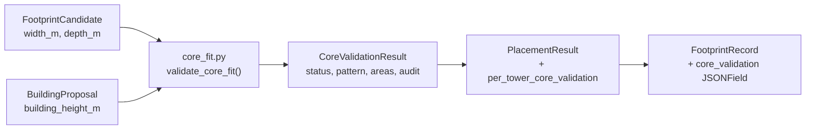

# Core Fit Validator — Technical Design

## A. Position in the System

The validator sits as a thin layer between `packer.py` and `PlacementResult`. It receives a `FootprintCandidate` (width_m, depth_m, building_height_m) and returns a `CoreValidationResult` dataclass. No Shapely geometry is used — all logic is pure dimensional arithmetic.




**Location**: `placement_engine/geometry/core_fit.py` — not a new Django app. No new models needed beyond a JSONField on the existing `FootprintRecord`.

---

## B. Core Dimension Table (NBC / GDCR Sources)

All values in metres. Sources:


| Component                              | Dimension          | Value         | Source                     |
| -------------------------------------- | ------------------ | ------------- | -------------------------- |
| Staircase minimum width                | `stair_width_m`    | 1.0 m         | GDCR Table 13.2            |
| Stair plan length (1 flight + landing) | `stair_run_m`      | 3.6 m         | NBC 2016 Part 3            |
| Stair landing depth                    | `landing_m`        | 1.0 m         | NBC 2016                   |
| Number of staircases, H <= 15 m        | `n_stairs`         | 1             | NBC Part 4, residential    |
| Number of staircases, H > 15 m         | `n_stairs`         | 2             | NBC Part 4, high-rise      |
| Lift shaft (single car)                | `lift_w × lift_d`  | 1.5 m × 1.5 m | NBC 2016 standard          |
| Lift lobby minimum depth               | `lift_lobby_m`     | 1.5 m         | NBC 2016                   |
| Lift required if H above               | `lift_threshold_m` | 10.0 m        | GDCR lift_requirement      |
| Minimum corridor width                 | `corridor_m`       | 1.2 m         | NBC 2016 egress            |
| Minimum unit depth (habitable slab)    | `min_unit_depth_m` | 4.5 m         | NBC habitable room + wall  |
| Minimum unit width per module          | `min_unit_width_m` | 3.0 m         | Practical minimum for 1BHK |
| Structural wall thickness (assumed)    | `wall_t_m`         | 0.23 m        | Standard 230 mm brick      |


These constants will live in a `CoreDimensions` dataclass (configurable — can be overridden per command call for future flexibility).

**Derived core module dimensions** (computed once from the above, given height):

```
lift_required     = building_height_m > lift_threshold_m     # > 10 m
n_stairs          = 2 if building_height_m > 15.0 else 1

# Core "package" width (all components side by side):
core_pkg_w = (n_stairs * stair_width_m)
           + wall_t_m                                        # between stairs and lift
           + (lift_w + wall_t_m if lift_required else 0)
           + 0.3                                             # operational clearance

# Core "package" depth (longest single component in the run direction):
core_pkg_d = stair_run_m                                     # 3.6 m — dominates
           # Lift lobby depth (1.5 m) always fits within stair run zone

# Corridor zone (added on top of core package for pattern selection):
corridor_w = 1.2 m
```

**Worked values for H = 16.5 m (FP 101):**

- lift_required = True (16.5 > 10)
- n_stairs = 2 (16.5 > 15)
- core_pkg_w = (2 × 1.0) + 0.23 + (1.5 + 0.23) + 0.3 = **4.26 m**
- core_pkg_d = **3.6 m**

---

## C. Core Layout Patterns

Three patterns are evaluated in sequence. The first one that passes ALL checks is selected.

### Pattern 1: DOUBLE_LOADED

Units on both sides of a central corridor; core package at one end of the building.

```
|<-- width_m ----------------------------------------------------->|

+--------+----+-------------------+-----------------+--------+
| unit   |    |                   |                 | unit   |
| (min   |corr| (open floor span) |  (open span)    | (min   |  depth
| 4.5m)  |    |                   |                 | 4.5m)  |
+--------+----+-------------------+-----------------+--------+
| CORE PACKAGE (one end, full depth of building)             |
+------------------------------------------------------------+
```

Depth check:  `depth_m >= 2 × min_unit_depth_m + corridor_m + 2 × wall_t_m`
             = 2 × 4.5 + 1.2 + 2 × 0.23 = **10.66 m minimum**

Width check:  `width_m >= core_pkg_w + 2 × min_unit_width_m`
             = 4.26 + 2 × 3.0 = **10.26 m minimum**

### Pattern 2: SINGLE_LOADED

Units along one side; core + corridor on the other. Core at one end.

```
|<-- width_m ------------------------->|

+--Core--+---------- Units (4.5m) ----+
| stair  |  room  |  room  |  room   |
| lift   |        |        |         |  depth_m
+--------+------ corridor 1.2m ------+
```

Depth check:  `depth_m >= min_unit_depth_m + corridor_m + wall_t_m × 2`
             = 4.5 + 1.2 + 0.46 = **6.16 m minimum**

Width check:  `width_m >= core_pkg_w + wall_t_m`
             = 4.26 + 0.23 = **4.49 m minimum**

### Pattern 3: END_CORE

Core occupies one end strip across the full depth; units fill the remaining width. Best for long, narrow slabs.

```
|core_pkg_w|<----------- remaining_w for units ---------->|

+----------+------------------------------------------+
| stair    |                                          |
| lift     |          Units (any depth)               | depth_m
| lobby    |                                          |
+----------+------------------------------------------+
              ^^ must be >= min_unit_width_m (3.0 m)
```

Width check:  `width_m >= core_pkg_w + min_unit_width_m`
             = 4.26 + 3.0 = **7.26 m minimum**

Depth check:  `depth_m >= core_pkg_d`
             = **3.6 m minimum**

Remaining usable width: `width_m - core_pkg_w` (must be >= min_unit_width_m)

### Fallback: NO_CORE_FIT

All three patterns failed. Footprint is geometrically placed but architecturally infeasible.

---

## D. Selection Algorithm

```
FUNCTION validate_core_fit(width_m, depth_m, building_height_m,
                            dims=CoreDimensions()):

  1. Compute derived values:
       lift_required, n_stairs, core_pkg_w, core_pkg_d, corridor_w

  2. Try DOUBLE_LOADED:
       depth_ok  = depth_m >= 2*dims.min_unit_depth + dims.corridor + 2*dims.wall_t
       width_ok  = width_m >= core_pkg_w + 2*dims.min_unit_width
       if depth_ok AND width_ok:
           remaining_area = (width_m - core_pkg_w) * depth_m
                          - (corridor_w * width_m)            # corridor strip
           return CoreValidationResult(VALID, DOUBLE_LOADED, ...)

  3. Try SINGLE_LOADED:
       depth_ok = depth_m >= dims.min_unit_depth + dims.corridor + 2*dims.wall_t
       width_ok = width_m >= core_pkg_w + dims.wall_t
       if depth_ok AND width_ok:
           remaining_area = (width_m - core_pkg_w) * (depth_m - dims.corridor)
           return CoreValidationResult(VALID, SINGLE_LOADED, ...)

  4. Try END_CORE:
       width_ok  = width_m >= core_pkg_w + dims.min_unit_width
       depth_ok  = depth_m >= core_pkg_d
       if width_ok AND depth_ok:
           remaining_area = (width_m - core_pkg_w) * depth_m
           return CoreValidationResult(VALID, END_CORE, ...)

  5. return CoreValidationResult(NO_CORE_FIT, NONE, ...)
```

**All checks are recorded in `audit_log`** regardless of which branch is taken, so every FAIL can be traced to a specific dimension shortage.

---

## E. CoreValidationResult Dataclass

```python
@dataclass
class CoreValidationResult:
    core_fit_status:        str          # "VALID" | "NO_CORE_FIT"
    selected_pattern:       str          # "DOUBLE_LOADED" | "SINGLE_LOADED" | "END_CORE" | "NONE"
    core_area_estimate_sqm: float        # area consumed by core package (approx)
    remaining_usable_sqm:   float        # footprint area minus core and corridor
    lift_required:          bool
    n_staircases_required:  int
    core_pkg_width_m:       float        # computed core package width
    core_pkg_depth_m:       float        # computed core package depth
    audit_log:              list[dict]   # one entry per pattern tried
```

Each `audit_log` entry:

```json
{
  "pattern":        "END_CORE",
  "depth_check":    { "required_m": 3.6,  "actual_m": 3.81, "pass": true },
  "width_check":    { "required_m": 7.26, "actual_m": 7.39, "pass": true },
  "outcome":        "SELECTED"
}
```

---

## F. FP 101 Example Walkthrough

Footprint: **7.39 m × 3.81 m** | Height: **16.5 m**

**Step 1 — Derived values:**

- lift_required = True (16.5 > 10.0)
- n_stairs = 2 (16.5 > 15.0)
- core_pkg_w = (2 × 1.0) + 0.23 + (1.5 + 0.23) + 0.30 = **4.26 m**
- core_pkg_d = **3.6 m**

**Step 2 — DOUBLE_LOADED:**

- depth check: 3.81 >= 10.66? **FAIL** (short by 6.85 m)
- width check: 7.39 >= 10.26? **FAIL** (short by 2.87 m)
- Outcome: SKIP

**Step 3 — SINGLE_LOADED:**

- depth check: 3.81 >= 6.16? **FAIL** (short by 2.35 m)
- width check: 7.39 >= 4.49? PASS
- Outcome: SKIP (depth fails)

**Step 4 — END_CORE:**

- width check: 7.39 >= (4.26 + 3.0) = 7.26? **PASS** (0.13 m to spare)
- depth check: 3.81 >= 3.6? **PASS** (0.21 m to spare)
- Outcome: **SELECTED**

**Step 5 — Remaining usable area:**

- core_area = 4.26 × 3.81 = 16.23 sq.m
- remaining_w = 7.39 − 4.26 = 3.13 m
- remaining_area = 3.13 × 3.81 = **11.92 sq.m** usable unit area
- This is enough for a very minimal 1-room unit but extremely tight.

**Final result:**

```
core_fit_status:  VALID
selected_pattern: END_CORE
core_area_sqm:    16.23
remaining_sqm:    11.92
n_staircases:     2
lift_required:    True
```

Note: The result is VALID but the remaining 11.92 sq.m is below a practical 1BHK (typically ≥ 25 sq.m net), which would be a future-phase unit-mix check. The core validator only confirms the CORE itself can fit, not that useful units remain.

---

## G. Integration Points

### 1. `placement_service.py` — call after packing

After `pack_towers()` returns, iterate the placed footprints and call `validate_core_fit()` for each:

```python
from placement_engine.geometry.core_fit import validate_core_fit, CoreDimensions

core_results = []
for fp in packing.footprints:
    cv = validate_core_fit(fp.width_m, fp.depth_m, building_height_m)
    core_results.append(cv)

# Upgrade status if any core fails
if any(cv.core_fit_status == "NO_CORE_FIT" for cv in core_results):
    status = "NO_FIT_CORE"
```

### 2. `PlacementResult` — add field

```python
per_tower_core_validation: list[CoreValidationResult] = field(default_factory=list)
```

### 3. `FootprintRecord` model — add JSONField (migration required)

```python
core_validation = models.JSONField(
    default=dict,
    help_text="CoreValidationResult dict: status, pattern, areas, audit_log."
)
```

### 4. `BuildingPlacement` model — add new status choice

```python
("NO_FIT_CORE", "No core fit — footprint placed but core cannot fit"),
```

### 5. `compute_placement` command — report core results in output

Add a `CORE VALIDATION` section to the printed report, showing pattern selected, core area, and remaining usable area per tower.

---

## H. Edge Case Handling


| Case                                                | Detection                                     | Handling                           |
| --------------------------------------------------- | --------------------------------------------- | ---------------------------------- |
| Extremely narrow slab (w < core_pkg_w + min_unit_w) | None of the 3 patterns pass                   | NO_CORE_FIT                        |
| High-rise, 2 staircases push core_pkg_w > width     | END_CORE width check fails                    | NO_CORE_FIT                        |
| Low-rise (H <= 10m): no lift, 1 staircase           | Computed core_pkg_w = ~1.5m                   | END_CORE fits almost any footprint |
| Single stair building (H <= 15m) + lift             | core_pkg_w = ~3.0m                            | END_CORE selects for most slabs    |
| Depth just barely passes END_CORE                   | remaining_usable_sqm may be very small        | VALID but audit notes tight margin |
| building_height_m <= 0 or dims inconsistent         | Raise InvalidInputError before pattern checks | Propagated up to placement_service |


---

## I. CoreDimensions Configurable Dataclass

All constants are encapsulated in a dataclass so they can be overridden per call (e.g., a different local authority may permit 0.9m staircases):

```python
@dataclass
class CoreDimensions:
    stair_width_m:      float = 1.0
    stair_run_m:        float = 3.6
    landing_m:          float = 1.0
    lift_w_m:           float = 1.5
    lift_d_m:           float = 1.5
    lift_lobby_m:       float = 1.5
    lift_threshold_m:   float = 10.0   # GDCR: lift required above this height
    highrise_threshold_m: float = 15.0 # NBC: 2nd staircase required above this
    corridor_m:         float = 1.2
    min_unit_depth_m:   float = 4.5
    min_unit_width_m:   float = 3.0
    wall_t_m:           float = 0.23
    clearance_m:        float = 0.30
```

---

## J. Future AI Hook

The function signature is:

```python
def validate_core_fit(
    width_m: float,
    depth_m: float,
    building_height_m: float,
    dims: CoreDimensions = CoreDimensions(),
) -> CoreValidationResult:
```

A future AI layout generator can replace the body with a learned model or SA optimizer, while the rest of the pipeline (`PlacementResult`, `FootprintRecord`, `compute_placement` command) remains unchanged. The interface is stable.

---

## K. Implementation Sequence

1. Write `placement_engine/geometry/core_fit.py` — `CoreDimensions` dataclass, `CoreValidationResult` dataclass, `validate_core_fit()` function with three-pattern selection logic and full audit log.
2. Extend `PlacementResult` in `placement_service.py` — add `per_tower_core_validation` field and upgrade-to-`NO_FIT_CORE` logic.
3. Update `FootprintRecord` in `models.py` — add `core_validation` JSONField and `NO_FIT_CORE` status choice in `BuildingPlacement`.
4. Update `save_placement()` in `placement_service.py` — persist `core_validation` dict per footprint.
5. Update `compute_placement` command — add CORE VALIDATION section to printed report.
6. Run `makemigrations` + `migrate`.
7. Test: FP 101 (END_CORE VALID), narrow strip NO_CORE_FIT, low-rise H=9m (no lift), high-rise H=25m (2 stairs + lift).

