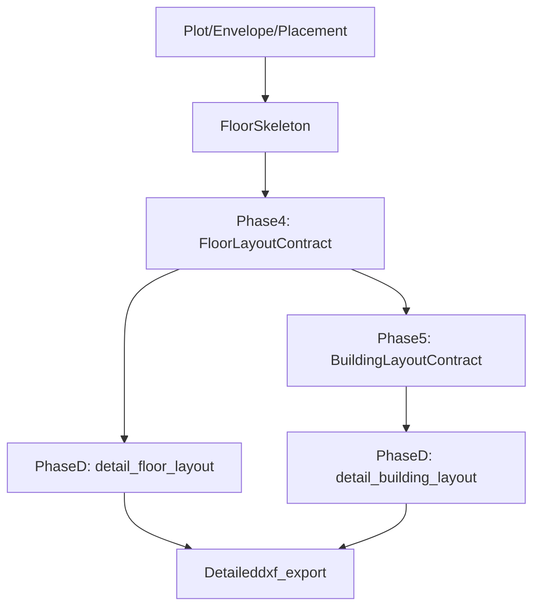

## Deterministic Architectural Detailing Engine (Phase D)

### Phase D Invariants

- **Topology preserved**:
  - Phase D never changes `FloorLayoutContract` or `BuildingLayoutContract` topology (no new rooms/units, no splits/merges).
- **Areas preserved**:
  - Room polygons from Phases 2/3 (used inside `FloorLayoutContract`) are treated as interior finished surface / clear usable area and are never shrunk by detailing.
  - Building/footprint areas from Phases 4/5 remain unchanged.
- **Counts & metrics preserved**:
  - Unit count, room count per unit, and total units per floor/building never change.
  - Efficiency and scalar metrics computed in Phases 4/5 are not recomputed or modified.
- **Engine & repetition logic untouched**:
  - No calls back into envelope, placement, skeleton, floor aggregation, or building aggregation to re-decide geometry.
  - Band slicing, module width, and repetition patterns are read-only inputs and are never mutated.
- **Deterministic output**:
  - Given the same Phase 4/5 contracts and the same `DetailingConfig`, Phase D produces identical `DetailedFloorLayoutContract` and `DetailedBuildingLayoutContract` (no randomness, no order-dependent heuristics).

### 1. Placement in the Existing Pipeline

- **Current pipeline** (high level):
  - Plot/Envelope/Placement/Core → Skeleton → **Phase 4** `FloorLayoutContract` → **Phase 5** `BuildingLayoutContract` → DXF exporter / presentation engine.
- **Phase D position**:
  - Primary entrypoints:
    - `detail_floor_layout(floor_contract: FloorLayoutContract, config: DetailingConfig) -> DetailedFloorLayoutContract`.
    - `detail_building_layout(building_contract: BuildingLayoutContract, config: DetailingConfig) -> DetailedBuildingLayoutContract` (thin wrapper that calls `detail_floor_layout` per floor, attaches floor index + building metadata).
  - **No changes** to Phase 4/5 contracts or generation logic; Phase D only **reads** them and constructs new detailing contracts.
- **Usage by DXF**:
  - Existing presentation DXF path remains (for backwards compatibility).
  - New path: for Phase D experiments and future default, DXF export can consume `DetailedFloorLayoutContract` and map its geometry layers/lineweights into DXF entities.

### 2. New Module & File Structure

- **New package**: `backend/detailed_layout/`
  - `models.py`
    - `DetailedWall`, `DetailedDoor`, `DetailedWindow`, `DetailedFixture`, `DetailedFurniture`, `DetailedGridLine`, `DetailedColumn`, `DetailedStair`, `DetailedCore`, `DetailedBalcony`, `DetailedAnnotation`.
    - `DetailedRoomGeometry`, `DetailedUnitGeometry`, `DetailedFloorLayoutContract`, `DetailedBuildingLayoutContract`.
  - `config.py`
    - `DetailingConfig` dataclass with all tunables (wall thickness, column size, door widths, feature toggles, text sizes, tolerances).
  - `geometry_utils.py`
    - Small 2D vector math helpers, robust offsetting wrappers around Shapely, snapping/rounding, segment merging, intersection tests.
  - `wall_engine.py`
    - Algorithms to derive wall centerlines and wall polygons from room polygons & footprint/core polygons.
  - `grid_column_engine.py`
    - Structural grid derivation and deterministic column placement.
  - `door_engine.py`
    - Rule-based door placement given adjacency graph and room types.
  - `window_engine.py`
    - Facade-aware window placement on external walls.
  - `wet_area_engine.py`
    - Toilet and kitchen fixtures, hatches, traps.
  - `furniture_engine.py`
    - Deterministic furniture layout given room polygon and door/window constraints.
  - `core_stair_engine.py`
    - Stair flights, lift shafts, shaft hatches within the `core_polygon`.
  - `balcony_engine.py`
    - Balcony detection and railing/drain representation.
  - `annotation_engine.py`
    - Text labels, north arrow, scale, title stub, room area tags.
  - `validation.py`
    - `_validate_detailed_geometry(detailed_floor: DetailedFloorLayoutContract) -> None`.
  - `service.py`
    - User-facing orchestration functions: `detail_floor_layout`, `detail_building_layout` delegating to above engines.

### 3. Contracts: Detailed Geometry Models

- **Room-level contract: `DetailedRoomGeometry`**
  - Fields:
    - `room_id: str` (reuse from `UnitLayoutContract` / band slice naming, e.g. `L0_0_1` + room type suffix).
    - `room_type: Literal["LIVING","BEDROOM","KITCHEN","TOILET", ...]` (from existing `RoomInstance.room_type`).
    - `footprint: Polygon` (room polygon as in Phase 2/3; unchanged).
    - `walls_ext: list[DetailedWall]` (external walls belonging to this room's perimeter segments).
    - `walls_int: list[DetailedWall]` (internal, shared or partition walls).
    - `doors: list[DetailedDoor]`.
    - `windows: list[DetailedWindow]`.
    - `fixtures: list[DetailedFixture]` (WC, basin, shower, kitchen counters, sinks, cooktops, traps).
    - `furniture: list[DetailedFurniture]`.
    - `annotations: list[DetailedAnnotation]` (room name, area tag anchors).
- **Unit-level contract: `DetailedUnitGeometry`**
  - Fields:
    - `unit_id: str` (from Phase 3/4 `UnitLayoutContract.unit_id`).
    - `rooms: dict[str, DetailedRoomGeometry]`.
    - `entry_door: DetailedDoor` (explicit main door for unit).
    - `unit_outline: Polygon` (union of room polygons; read-only from Phase 3/4 shapes).
- **Floor-level contract: `DetailedFloorLayoutContract`**
  - Fields:
    - `floor_id: str` (e.g. `L0`).
    - `units: dict[str, DetailedUnitGeometry]`.
    - `grid_lines: list[DetailedGridLine]`.
    - `columns: list[DetailedColumn]`.
    - `stairs: list[DetailedStair]`.
    - `cores: list[DetailedCore]`.
    - `balconies: list[DetailedBalcony]`.
    - `annotations: list[DetailedAnnotation]` (global items: north arrow, scale, floor title block).
- **Building-level contract: `DetailedBuildingLayoutContract`**
  - Fields:
    - `building_id: str`.
    - `floors: list[DetailedFloorLayoutContract]`.
- **Atomic geometry types** (in `models.py`):
  - `DetailedWall`:
    - `centerline: LineString` (primary geometric representation).
    - `polygon: Polygon` (offset by half thickness both sides, or one side depending on convention).
    - `wall_type: Literal["EXTERNAL","INTERNAL","SHAFT"]`.
  - `DetailedDoor`:
    - `opening_segment: LineString` (door width).
    - `frame_polygon: Polygon`.
    - `swing_arc: LineString` or approximate polyline.
    - `door_type: Enum(ENTRY,BEDROOM,TOILET,KITCHEN)`.
  - `DetailedWindow`:
    - `opening_segment: LineString`.
    - `frame_polygon: Polygon`.
    - `sill_height_m: float`.
  - `DetailedFixture`, `DetailedFurniture`, etc. with `outline: Polygon` and semantic attributes.

### 4. DetailingConfig Design

- `**DetailingConfig` (in `config.py`)**
  - Wall system:
    - `external_wall_thickness_m: float = 0.23`.
    - `internal_wall_thickness_m: float = 0.115`.
    - `shaft_wall_thickness_m: float = 0.23`.
  - Structure:
    - `column_size_m: tuple[float, float] = (0.3, 0.3)`.
    - `grid_module_width_m: Optional[float]` (preferred module width used for grid spacing; must be passed in from the same engine config / presets that drive repetition; Phase D does not infer this value itself).
  - Doors:
    - `door_widths_m = {"ENTRY": 1.0, "BEDROOM": 0.9, "TOILET": 0.75, "KITCHEN": 0.9}`.
    - `door_clearances_m = {"from_corner_min": 0.2, "between_doors_min": 0.2}`.
  - Windows:
    - `window_widths_m = {"LIVING": 1.5, "BEDROOM": 1.2, "TOILET_VENT": 0.6}`.
    - `window_sill_heights_m` per room type.
  - Furniture toggles:
    - `furniture_enabled: bool = True`.
    - `annotation_enabled: bool = True`.
    - `grid_enabled: bool = True`.
    - `hatch_enabled: bool = True`.
  - Annotation:
    - `room_text_height_m`, `title_text_height_m`, `scale_text_height_m`.
  - DXF styling hints (used by DXF adapter, not engine logic):
    - `lineweight_map = {layer_name: lineweight_mm}`.
    - `linetype_map = {layer_name: linetype}`.
    - `hatch_patterns = {"wet_area": "ANSI31", "core": "SOLID"}`.
  - Geometry:
    - `snap_tol_m: float = 1e-3` (snapping / rounding).
    - `min_segment_length_m: float = 1e-3` (drop micro segments).

### 5. Geometry Foundations & Clean-Up Rules

- **Sources of geometry**:
  - `FloorLayoutContract.footprint_polygon`, `core_polygon`, `corridor_polygon`.
    - In Phase D v1, `footprint_polygon` is treated as the **interior finished boundary** at the building exterior (same convention as room polygons), not the slab edge. External walls are allowed to extend outside this polygon; slab/overhang modelling is a separate concern.
  - `UnitLayoutContract.rooms[*].polygon` via `FloorLayoutContract.all_units`.
- **Utility functions (in `geometry_utils.py`)**:
  - `offset_polygon(poly, distance) -> Polygon` (wrap Shapely buffer with proper join style and rounding; note that for walls we generally offset edges, not full polygons—see below).
  - `extract_edges(poly: Polygon) -> list[LineString]` (ordered edges with direction).
  - `shared_edges(poly_a, poly_b, tol) -> list[LineString]` (find overlapping segments for internal walls and adjacency).
  - `merge_collinear_segments(segments, tol) -> list[LineString]` (remove micro-segments, join collinear runs).
  - `snap_point(pt, tol)`, `snap_linestring(ls, tol)`.
  - `is_external_edge(edge, footprint_polygon, other_rooms) -> bool` using side-of-line tests and adjacency.
  - `edge_key(p1, p2, tol) -> EdgeKey` where:
    - Endpoints are snapped with `snap_tol_m`.
    - `EdgeKey = (min(p1, p2), max(p1, p2))` (lexicographic) so (P1→P2) and (P2→P1) normalize to the same key.
- **Clean geometry contract** (enforced in `validation.py`):
  - No duplicate linework: deduplicate by snapped endpoints and layer/type key.
  - No overlapping collinear segments: always merge.
  - No zero-area polygons: filtered out in creation.
  - Tolerance-based snapping and cleaning executed **after** each subsystem (walls, doors, windows) and once globally before DXF.

### 6. Wall System (Advanced)

- **Goal**: Derive wall centerlines and thickness-based polygons from room and core/footprint geometry with no duplication, while preserving usable room area.
- **Room polygon semantics**:
  - `RoomInstance.polygon` and the polygons in `UnitLayoutContract.rooms` are treated as **interior finished surface / clear usable area** boundaries.
  - Phase D must never shrink these polygons; walls grow around them.
- **Algorithm outline** (in `wall_engine.py`):
  1. **Collect room and core boundaries**:
    - For each `UnitLayoutContract` / room polygon, extract directed edges.
    - For each edge with endpoints P1, P2, compute `EdgeKey = edge_key(P1, P2, snap_tol_m)`.
    - Build a **global edge map** keyed by `EdgeKey`, where each entry stores:
      - All directed occurrences (room/core/footprint membership, original direction).
      - Snapped endpoints used for further processing.
  2. **Classify edges**:
    - If `EdgeKey` lies on building footprint outer boundary only → candidate **external wall**.
    - If `EdgeKey` appears on two room polygons (shared edge) → **internal wall** (one wall, not two, regardless of original directions).
    - If `EdgeKey` lies on core/corridor boundary or shaft polygon only → **shaft/core wall**.
  3. **Generate wall centerlines**:
    - For each unique classified edge, create a `LineString` centerline along the shared segment.
    - For external walls, keep the centerline aligned with the interior finished boundary when later offsetting (no outward grow on the interior side).
  4. **Wall intersections & cleanup**:
    - At nodes where 3+ walls meet (T/L/X junctions), snap all endpoints and ensure a single junction point.
    - Construct wall polygons using a consistent join strategy (e.g. Shapely buffer around centerlines with `join_style=MITRE` and a bounded `mitre_limit`), so corners are cleanly mitered.
    - After all wall polygons are created, perform a union/cleanup pass to eliminate sliver overlaps at junctions:
      - Option A: use `unary_union(all_wall_polygons)` and treat the resulting merged geometry as the draw geometry (per-wall semantics live on metadata, not on polygon partitioning).
      - Option B: keep per-wall polygons but intersect/trim overlapping corners pairwise at snapped junctions so no two wall polygons overlap.
  5. **Compute wall polygons**:
    - For each centerline:
      - Choose thickness = `external_wall_thickness_m`/`internal_wall_thickness_m`/`shaft_wall_thickness_m`.
      - For **internal walls** (between two rooms): construct an orthogonal offset polygon around the centerline using ±thickness/2 so the wall thickness is split evenly between adjacent rooms (consistent with room polygons as interior-finish boundaries).
      - For **external walls** (on footprint boundary): construct the wall polygon such that thickness grows **outward** from the interior finished boundary:
        - The interior edge of the wall coincides with the room/footprint boundary.
        - The exterior edge is offset outward by `external_wall_thickness_m`.
      - Room polygons remain clear usable area; do not offset inward.
    - Clip wall polygons to building footprint if needed (only to trim outward portions).
  6. **Column void adjustment** (Phase D-advanced):
    - If later we introduce explicit columns overlapping walls, punch voids in wall polygons around column polygons to avoid double-thick wall–column overlap.
- **Layers & styling**:
  - Map `DetailedWall.wall_type` → DXF layer names: `A-WALL-EXT`, `A-WALL-INT`, `A-WALL-SHAFT`.
  - Use `lineweight_map` in `DetailingConfig` to ensure external > internal lineweights.

### 7. Structural Grid + Columns

- **Grid derivation** (in `grid_column_engine.py`):
  - **Single strategy for Phase D**: align the structural grid with the repetition/band slicing logic:
    - Use the band repeat axis from the skeleton/band frames and `grid_module_width_m` from `DetailingConfig` as the canonical grid orientation and spacing.
  - Steps:
    1. Determine band repeat axis and orthogonal depth axis from existing skeleton / band frames (no PCA needed).
    2. Along the repeat axis, place grid lines at multiples of `module_width_m` across the footprint extents (clipped to footprint).
    3. Optionally place a small number of depth-wise grid lines (e.g. at tower ends or first/last band), still aligned to the same axes.
    4. Intersect with footprint to keep grid within building.
- **Column placement**:
  - Place `DetailedColumn` at:
    - Grid intersections inside footprint, snapped away from core/corridor voids.
    - Core corners (four corners of `core_polygon`) if not already covered by a grid intersection.
  - Column polygon: centered rectangle of size `column_size_m`.
  - **Avoid conflicts (deterministic, bounded)**:
    - If a column polygon at a baseline grid intersection overlaps a door swing or toilet polygon:
      - Build a fixed candidate sequence of neighboring grid intersections, for example:
        1. One step along +repeat axis.
        2. One step along −repeat axis.
        3. One step along +depth axis.
        4. One step along −depth axis.
      - For each candidate in this list, in order:
        - Compute the candidate column polygon.
        - If it lies inside the footprint and does not intersect forbidden geometry (doors, swings, toilets), accept the **first** valid candidate.
      - If all candidates fail:
        - Either keep the original baseline position despite the minor overlap, or skip this column entirely (choose one policy and document it in implementation).
      - Do **not** perform radius-based or iterative spatial searches; ordering is index-based only.
- **Layers**:
  - Grid → `A-GRID` with dashed linetype.
  - Columns → `A-COLUMN` with solid medium lineweight.

### 8. Door System (Rule-Based)

- **Data needed**:
  - Room adjacency graph: for each room, track neighbours via shared walls and the room types.
  - Corridor polygon from `FloorLayoutContract.corridor_polygon`.
- **Placement rules** (in `door_engine.py`):
  - Entry door:
    - Find living room `LIVING` boundary segment that touches corridor polygon.
    - Place door centered on that edge, with width `DetailingConfig.door_widths_m["ENTRY"]`.
  - Bedroom door:
    - Identify shared wall between BEDROOM and LIVING; center door on that segment.
  - Toilet door:
    - Shared edge between TOILET and BEDROOM or corridor.
    - Place door such that its extents are at least `door_clearances_m["from_corner_min"]` away from corners and other doors on same wall.
  - Kitchen door (if configured):
    - Shared edge between KITCHEN and LIVING or corridor, subject to open-kitchen toggle.
- **Geometry**:
  - For each door:
    - Compute opening segment on wall centerline, then frame polygon offset normal to wall direction.
    - Swing arc: fixed radius (door width) drawn on the room side, determined by priority (e.g., prefer swinging into private space, not corridor).
- **DXF**:
  - All doors to layer `A-DOOR` with thin lineweight; swing arcs as polylines or arcs.

### 9. Window System (Facade Logic)

- **Identify external facades**:
  - Edges where one side is inside unit polygon and the other is outside footprint and corridor/core polygons.
- **Placement per room** (in `window_engine.py`):
  - For each room with at least one external wall segment:
    - For each candidate external edge, let `L = edge_length`, `w = window_widths_m[room_type]`, `c = window_clearance_min` (or reuse `door_clearances_m["from_corner_min"]`):
      - Only consider edges where `L >= w + 2 * c` (minimum edge length rule to avoid corner overlap).
    - LIVING: among qualifying edges, choose the longest; center a window (or two smaller ones) on that edge.
    - BEDROOM: similarly choose primary qualifying external edge, maintaining min distance from corners and doors.
    - TOILET: if any qualifying external wall remains, place a small ventilator window high on wall.
  - Do **not** place:
    - On corridor-facing internal walls.
    - On core walls (use adjacency check against `core_polygon`).
- **Geometry**:
  - Similar to doors: opening segment + frame polygon, but no swing.
  - Sill height stored, but only encoded indirectly in annotation or layer; geometry remains 2D.
- **Layer**: `A-WINDOW` with thin lineweight.

### 10. Wet Area Detailing (Toilet + Kitchen)

- **Toilets** (in `wet_area_engine.py`):
  - Identify TOILET polygons from `UnitLayoutContract.rooms`.
  - Determine wet wall: wall shared with shaft/core or external wall; fallback to longest wall.
  - Place:
    - WC block at one end of wet wall.
    - Basin opposite or adjacent, with clearances from door.
    - Shower rectangle in corner with minimum size; avoid door.
    - Floor trap symbol near shower or center.
  - Apply **tile hatch** inside toilet polygon (simple solid or ANSI pattern) on layer `A-HATCH-WET`.
- **Kitchen**:
  - KITCHEN polygon: identify wet wall (shared with shaft or external wall carrying plumbing).
  - Place:
    - Counter polygon (narrow rectangle along wet wall).
    - Sink block on counter near a side.
    - Cooktop block on counter with a min separation from sink.
    - Overhead cabinet dashed line offset inward from wall.
- **Layers**:
  - Fixtures: `A-FIXTURE` (WC, basin, sink, cooktop, traps).
  - Hatch: `A-HATCH-WET`.

### 11. Furniture Blocks

- **Living room** (in `furniture_engine.py`):
  - Determine primary orientation vector from longest dimension of LIVING polygon.
  - Place:
    - Sofa along longest internal wall that is not door- or window-heavy.
    - Center table polygon in front of sofa, leaving minimum circulation clearance.
    - TV unit on wall opposite sofa.
- **Bedroom**:
  - Bed:
    - Candidate sequence of walls (deterministic, no scoring):
      1. Longest solid wall (no windows/doors).
      2. Opposite wall (if solid).
      3. Next wall clockwise from (1).
      4. Next wall counterclockwise from (1).
    - For each candidate wall in order, attempt bed placement:
      - Oriented with headboard against that wall.
      - Use standard bed size (e.g. 1.8 x 2.0 m), optionally scaled if room small, and test for intersections with walls, doors, and windows.
      - Accept the first candidate that passes collision tests; if none pass, optionally try a smaller bed against (1), else skip bed for that room.
  - Wardrobe:
    - Similar fixed candidate sequence (e.g. next-best solid walls), always evaluated in deterministic order.
- **Dining**:
  - If living+ dining combined and area threshold exceeded, place dining table based on floor area heuristic (4 or 6 seats) while preserving door swing + circulation.
- **Collision avoidance**:
  - Before finalizing each furniture polygon, test intersection with walls + door swings (and optionally windows).
  - Use a **fixed, room-type-specific candidate list** of walls/poses only; for each candidate in order:
    - If intersection is detected, move to the next candidate.
  - If all candidates fail, either place a smaller fallback representation (if defined) or skip that furniture element; no dynamic search loops or scoring.
- **Layer**: `A-FURN` with thin lineweight.

### 12. Stair + Core Detailing

- **Input**: `core_polygon`, known stair and lift footprint relations from `FloorSkeleton` / `core_validation` if exposed; otherwise approximate using deterministic rules based on core proportions.
- **Assumptions**:
  - For Phase D v1, the core polygon is assumed rectangular or nearly rectangular as produced by the existing core fitter.
  - If future phases provide explicit stair/lift metadata, those will take precedence over geometric approximation.
- **Algorithm** (in `core_stair_engine.py`):
  - Compute the oriented bounding box of `core_polygon` aligned to the skeleton axes with width `W` and depth `D`.
  - Use a deterministic partition rule:
    - If `W >= D` (core wider than deep):
      - Stair rectangle occupies the **left 60%** of `W` across full depth `D`.
      - Lift shaft rectangle occupies a fixed fraction (e.g. `0.3W x 0.4D`) in the right-front corner.
    - Else (`D > W`):
      - Stair rectangle occupies the **bottom 60%** of `D` across full width `W`.
      - Lift shaft rectangle occupies a fixed fraction in the top-right corner.
  - Within the stair rectangle:
    - Draw stair flights as parallel treads with arrows indicating up direction, using a fixed riser height and computed number of treads from storey height.
    - Draw mid-landing if needed, using a simple deterministic layout (e.g. half-flight, landing, half-flight).
  - Apply hatch inside shaft/well area (e.g. `A-HATCH-CORE`).
- **Layers**:
  - Stairs: `A-STAIR`.
  - Core outlines: `A-CORE`.
  - Core hatch: `A-HATCH-CORE`.

### 13. Balcony + Railing

- **Balcony detection** (in `balcony_engine.py`):
  - Treat a space as balcony **only when explicitly tagged** (e.g. `room_type == "BALCONY"` from Phase 2/3 or equivalent contract metadata).
  - No geometry-only inference from footprint differences in Phase D v1.
  - For each balcony polygon:
    - Offset inside by small distance for railing line.
    - Insert sliding door representation between living/bedroom and balcony.
    - Add floor drain symbol near outer edge.
- **Layer**: `A-BALC` for balcony outlines & railings.

### 14. Annotations + Tags

- **Per-room annotations** (in `annotation_engine.py`):
  - Center-of-mass or label point of room polygon → place room name text (e.g. "BEDROOM").
  - Underneath name: area in sqm from Phase 2/3 `RoomInstance.area_sqm` or polygon area converted.
- **Per-unit annotations**:
  - Unit ID (e.g. from `UnitLayoutContract.unit_id`) near entry door.
- **Global annotations**:
  - North arrow: placed in free corner of floor bounding box (e.g. bottom-left margin, outside footprint).
  - Scale text: e.g. `SCALE 1:100` derived from config.
  - Floor title block stub with `TP`, `FP`, `floor_id`.
- **Layers**:
  - Text: `A-TEXT`.
  - Additional marker geometry (north arrow arrowhead, etc.) on `A-ANNOTATION`.

### 15. Line Weights, Layers, and DXF Integration

- **Layer catalogue** (mapping to existing `dxf_export.layers` or new detailing layer setup):
  - `A-WALL-EXT`, `A-WALL-INT`, `A-WALL-SHAFT`.
  - `A-GRID`, `A-COLUMN`.
  - `A-DOOR`, `A-WINDOW`.
  - `A-FIXTURE`, `A-HATCH-WET`.
  - `A-FURN`.
  - `A-STAIR`, `A-CORE`, `A-HATCH-CORE`.
  - `A-BALC`.
  - `A-TEXT`, `A-ANNOTATION`.
- **Lineweights & linetypes** from `DetailingConfig`:
  - External walls: heavy; internal: medium; furniture & fixtures: thin; grid: dashed.
- **DXF adapter** (future work / separate module):
  - Translate each `Detailed*` element into ezdxf entities with correct `layer`, `lineweight`, `linetype`, `hatch`.
  - Reuse the existing DXF geometry writer patterns but point them at Detailed contracts instead of skeleton-only.

### 16. Geometry Validation & Performance

- **Validation in `validation.py`**:
  - Check every `DetailedFloorLayoutContract`:
    - All polygons are valid (`is_valid`), positive area.
    - No two walls share identical centerline coordinates.
    - Door/window opening segments lie on an existing wall centerline.
    - On any given wall, door and window opening intervals do **not** overlap:
      - Let the wall centerline have start point `S` and direction vector `D`; normalize `D` to `D_norm`.
      - For each door/window endpoint `P`, compute parametric coordinate `t = dot(P - S, D_norm)` and clamp to `[0, L]`, where `L` is the wall length.
      - Snap `t` values to a 1D tolerance (e.g. `snap_tol_m`) before comparison to reduce floating-point noise.
      - Treat each opening segment as an interval `[t_min, t_max]`; for all door/window pairs on that wall, assert their intervals do not intersect beyond a small tolerance (door–window conflict rule).
    - For every room, the sum of associated wall centerline lengths is strictly greater than zero; if a room ends up with zero wall length due to misclassification, validation fails fast.
    - Fixtures/furniture polygons are within their containing room polygons and do not intersect walls.
  - Raise deterministic, human-readable errors tagged with unit/room IDs.
- **Performance constraints**:
  - Each subsystem loops **per room** or **per wall edge**; avoid all-pairs room checks.
  - For adjacency, build maps keyed by edge hash (snapped endpoints) to avoid O(N²) polygon intersection.
  - Use vectorized operations where possible (Shapely bulk operations) but preserve determinism by sorting inputs by ID/name before processing.

### 17. Testing Strategy

- **Unit tests** (`backend/architecture/tests/test_detailing_engine.py`):
  - Fixtures:
    - Synthetic small units: single-room studio, 1BHK, 2BHK; each with known polygons.
  - Wall tests:
    - `test_external_internal_wall_counts` for simple rectangular units.
    - `test_no_duplicate_walls_between_adjacent_rooms` using edge sharing.
  - Door tests:
    - `test_one_entry_door_per_unit`.
    - `test_bedroom_to_living_door_present`.
    - `test_toilet_door_clear_of_corners`.
  - Window tests:
    - `test_windows_only_on_external_walls` by checking that window opening segments are not on shared edges or core edges.
  - Wet area tests:
    - `test_toilet_has_wc_basin_trap`.
    - `test_kitchen_has_counter_sink_cooktop`.
  - Furniture tests:
    - `test_furniture_not_overlapping_walls_or_doors`.
  - Validation tests:
    - `test_validate_detailed_geometry_passes_on_known_good_unit`.
- **Integration tests** (extend `test_e2e_pipeline.py` later):
  - Run `detail_floor_layout` on TP14 FP126 contract and assert wall/door/window counts and determinism across repeated runs.

### 18. Implementation Order

1. **Models & Config**: Implement `models.py` and `config.py` with all contracts and config fields (no logic).
2. **Geometry Utils**: Implement robust helpers (including `edge_key`) and core snapping/merging utilities.
3. **Wall Engine**: Implement normalized edge map, classification, wall centerlines, and polygons.
4. **Door Engine**: Implement adjacency graph, rule-based door placement on wall centerlines.
5. **Window Engine**: Implement facade detection, minimum-edge-length/window rules, and room-specific window logic.
6. **Validation (first pass)**: Implement `_validate_detailed_geometry` skeleton for basic validity and duplication checks.
7. **Grid + Columns**: Implement module-width-based grid derivation and deterministic column placement.
8. **Wet Area Engine**: Implement fixtures and wet hatches for toilets and kitchens.
9. **Core & Balcony Engines**: Implement stair, lift, shaft, and balcony/railing logic.
10. **Furniture Engine**: Implement deterministic candidate sequences and collision-aware placement.
11. **Annotations**: Implement room/unit/global labels and markers.
12. **DXF Adapter**: Map `Detailed`* elements to DXF layers/lineweights/linetypes/hatches.
13. **Validation (full)**: Extend `_validate_detailed_geometry` with door–window conflict and furniture/wall/door overlap checks.
14. **Tests**: Implement unit tests per subsystem, then E2E tests on a small synthetic floor, then integrate with existing CLI-level E2E as needed.

### 19. Data Flow Summary

- **Inputs**: `FloorLayoutContract`, `BuildingLayoutContract`, `UnitLayoutContract`, polygons and room types from existing residential_layout models.
- **Processing**: Deterministic geometric enrichment based on simple rules and config, no changes to topology or counts.
- **Outputs**: Rich `DetailedFloorLayoutContract` and `DetailedBuildingLayoutContract` suitable for high-fidelity DXF export, with strict contracts and tests guarding against regressions.

