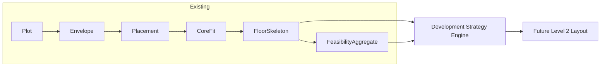

# Development Strategy Engine — Implementation Plan

## Pipeline position




The new layer consumes **FloorSkeleton** and **FeasibilityAggregate** only. It does not modify envelope, placement, core fit, or skeleton logic.

---

## Phase A — Slab metrics extractor

**Create:** [backend/development_strategy/slab_metrics.py](backend/development_strategy/slab_metrics.py)

**Dataclass** `SlabMetrics` with fields:

- `gross_slab_area_sqm`, `core_area_sqm`, `corridor_area_sqm`, `net_usable_area_sqm`, `efficiency_ratio`
- `band_lengths_m: list[float]`, `band_widths_m: list[float]`
- `band_orientation_axes: list[str]` (one per `UnitZone`, from `UnitZone.orientation_axis`)

**Source of values (no geometry recomputation):**

- Use [floor_skeleton/skeleton_evaluator.py](backend/floor_skeleton/skeleton_evaluator.py): `skeleton.area_summary` already has `footprint_area_sqm`, `core_area_sqm`, `corridor_area_sqm`, `unit_area_sqm`, `efficiency_ratio`, `unit_band_widths`, `unit_band_depths`.
- Map: `gross_slab_area_sqm = area_summary["footprint_area_sqm"]`, `net_usable_area_sqm = area_summary["unit_area_sqm"]`, etc.
- For band dimensions: use `area_summary["unit_band_widths"]` and `area_summary["unit_band_depths"]` (one entry per unit zone). Expose as `band_widths_m` and `band_lengths_m` (1:1 mapping from existing keys; order matches `skeleton.unit_zones`).
- For band orientation: collect `band_orientation_axes = [uz.orientation_axis for uz in skeleton.unit_zones]`. This lets the strategy layer choose the correct repeat axis per band.

**Function:** `compute_slab_metrics(skeleton: FloorSkeleton) -> SlabMetrics`  

- If `skeleton.area_summary` is empty (e.g. NO_SKELETON), either require caller to pass an already-evaluated skeleton or guard and return zeros/empty lists per product decision (recommended: require evaluated skeleton so we do not depend on evaluator internals).

**Package:** Add `backend/development_strategy/__init__.py` and export `SlabMetrics`, `compute_slab_metrics`. No dependency on Django; use `floor_skeleton.models.FloorSkeleton` only.

---

## Phase B — Strategy generator

**Create:** [backend/development_strategy/strategy_generator.py](backend/development_strategy/strategy_generator.py)

**UnitType enum:** `STUDIO`, `BHK1`, `BHK2`, `BHK3` with values `"STUDIO"`, `"1BHK"`, `"2BHK"`, `"3BHK"`.

**Unit template requirements (hardcoded dict or dataclass):**

- Per `UnitType`, define:
  - `unit_min_area_sqm` (strategy-level minimum super BUA): STUDIO 35, 1BHK 50, 2BHK 75, 3BHK 110.
  - `unit_frontage_m` (required width **along band**; must be ≥ `CoreDimensions.min_unit_width_m`).
  - `unit_depth_m` (required depth **across band**; must be ≥ `CoreDimensions.min_unit_depth_m`, higher for larger BHKs as needed).

**Dataclass** `DevelopmentStrategy`:  
`unit_type`, `units_per_floor`, `floors`, `total_units`, `avg_unit_area_sqm`, `total_bua_sqm`, `fsi_utilization`, `efficiency_ratio`, `feasible: bool`, `rejection_reason: Optional[str] = None`.

**Function:** `generate_strategies(slab: SlabMetrics, plot_area_sqm: float, max_fsi: float, floors: int) -> list[DevelopmentStrategy]`

**Tiling convention (explicit):**

- Each `UnitZone` is one **band**.
- `band_widths_m` and `band_lengths_m` come from `SlabMetrics`.
- `band_orientation_axes` come from `SlabMetrics.band_orientation_axes` and mirror `UnitZone.orientation_axis`.
- **Repeat axis rule (orientation-aware):**
  - If `band_orientation_axes[i] == AXIS_WIDTH_DOMINANT` → units repeat along `band_widths_m[i]`, depth check uses `band_lengths_m[i]`.
  - Else (`AXIS_DEPTH_DOMINANT`) → units repeat along `band_lengths_m[i]`, depth check uses `band_widths_m[i]`.
- Units are always tiled along the **repeat axis**; the other axis must satisfy the depth requirement.

**Logic (deterministic, band-aware):**

1. `max_total_bua_sqm = plot_area_sqm * max_fsi` (guard for `plot_area_sqm <= 0` or `max_fsi <= 0` → all strategies infeasible with appropriate reason).
2. For each `UnitType`:
  - Look up `unit_min_area_sqm`, `unit_frontage_m`, `unit_depth_m`.
  - Validate config once at startup: ensure `unit_min_area_sqm >= unit_frontage_m * unit_depth_m` (or explicitly document any intentional buffer if BUA > carpet).
  - For each band `i`:
    - Derive `repeat_len_i` and `depth_avail_i` from orientation rule above.
    - If `depth_avail_i < unit_depth_m` → this band cannot host this unit type; `units_in_band_i = 0`.
    - Else:
      - `units_in_band_i = floor(repeat_len_i / unit_frontage_m)` (units tiled along repeat axis).
  - `units_per_floor = sum(units_in_band_i for all bands)`.
  - If `units_per_floor == 0` → strategy infeasible (`feasible=False`, `rejection_reason="no_band_can_host_unit_type"`).
  - Else:
    - `total_units = units_per_floor * floors`.
    - `total_bua_sqm = units_per_floor * unit_min_area_sqm * floors`.
    - `avg_unit_area_sqm = unit_min_area_sqm`.
    - If `total_bua_sqm > max_total_bua_sqm` → strategy infeasible (`"fsi_exceeds_max"`).
    - Else:
      - `fsi_utilization = total_bua_sqm / max_total_bua_sqm` (no hard rejection for low utilization; low FSI is handled by scoring).
      - Strategy is **feasible**; efficiency will be computed per-strategy in Phase C.

Return one `DevelopmentStrategy` per unit type (four entries), each with geometric feasibility checked **per band** and FSI limits enforced only on `total_bua_sqm`.

---

## Phase C — Strategy evaluator

**Create:** [backend/development_strategy/evaluator.py](backend/development_strategy/evaluator.py)

**Weights (module-level defaults, must be configurable):**  
`W_FSI = 0.4`, `W_EFFICIENCY = 0.3`, `W_UNIT_AREA = 0.2`, `W_TOTAL_UNITS = 0.1`.  
Expose these via a small config/helper (or settings) so they can be tuned per project/market; they are **not** business truths, only initial defaults.

**Dataclass** `StrategyEvaluation`: `strategy: DevelopmentStrategy`, `score: float`, `rank: int`.

**Function:** `evaluate_strategies(strategies: list[DevelopmentStrategy]) -> list[StrategyEvaluation]`

**Scoring:**

- Consider only **feasible** strategies. If none feasible, return empty list (caller prints No feasible strategy).
- For each feasible strategy, compute **per-strategy efficiency**:
  - Let `bua_per_floor = units_per_floor * unit_min_area_sqm` for that strategy.
  - `effective_efficiency = bua_per_floor / slab.net_usable_area_sqm` — ratio of **used unit area** vs available habitable band area on a typical floor.
  - This value is stored in `strategy.efficiency_ratio` and used in scoring (do **not** reuse `slab.efficiency_ratio` for all strategies).
- Normalize each metric to [0, 1] **within the candidate list** using min–max with guards for constant values:
  - `fsi_utilization`, `efficiency_ratio`, `avg_unit_area_sqm`, `total_units`.
- Score:
  - `score = W_FSI * norm_fsi + W_EFFICIENCY * norm_eff + W_UNIT_AREA * norm_unit_area + W_TOTAL_UNITS * norm_total_units`.
- Sort by score descending; assign `rank = 1, 2, ...`.

---

## Phase D — Service layer

**Create:** [backend/development_strategy/service.py](backend/development_strategy/service.py)

**Function:** `resolve_development_strategy(skeleton: FloorSkeleton, feasibility: FeasibilityAggregate, height_limit_m: float, max_fsi: float, storey_height_m: float) -> StrategyEvaluation | None`

**Steps:**

1. `slab = compute_slab_metrics(skeleton)`.
2. Extract from `feasibility`: `plot_area_sqm = feasibility.plot_metrics.plot_area_sqm`.
3. **Floors:** Prefer regulatory-aware value:
  - If `feasibility.num_floors_estimated` is not None → use that as `floors`.
  - Else, compute a **theoretical** max:  
  `floors = max(1, floor(height_limit_m / storey_height_m))` (with `storey_height_m > 0`), and document this as non-regulatory capacity only.
4. `strategies = generate_strategies(slab, plot_area_sqm, max_fsi, floors)`.
5. `evaluations = evaluate_strategies(strategies)`.
6. Return **best** ranked: `evaluations[0]` if evaluations else `None` (caller prints No feasible strategy when `None`).

**Dependencies:** `development_strategy.slab_metrics`, `development_strategy.strategy_generator`, `development_strategy.evaluator`; types from `architecture.feasibility.aggregate`, `floor_skeleton.models`.

---

## Phase E — CLI integration

**File:** [backend/architecture/management/commands/simulate_project_proposal.py](backend/architecture/management/commands/simulate_project_proposal.py)

**Where:** After Step F (feasibility aggregate built) and before export/validation; after `agg = build_feasibility_from_pipeline(...)`.

**Actions:**

1. Import `resolve_development_strategy` from `development_strategy.service`.
2. Call:
  - `height_limit_m = agg.audit_metadata.building_height_m`
  - `max_fsi = agg.regulatory_metrics.max_fsi`
  - `storey_height_m = agg.storey_height_used_m or DEFAULT_STOREY_HEIGHT_M` (from `architecture.feasibility.constants`)
  - `result = resolve_development_strategy(skeleton, agg, height_limit_m, max_fsi, storey_height_m)`  
   Note: `FeasibilityAggregate` does **not** store the skeleton; the command must pass the live `skeleton` variable created earlier in the same run. `build_feasibility_from_pipeline` is already called with this skeleton, so slab metrics remain consistent.
3. In `_print_summary`, add a new block **after** the existing "PROJECT SIMULATION SUMMARY" block:

```
==============================
DEVELOPMENT STRATEGY
==============================
Recommended: 2BHK
Units per floor: 3
Floors: 9
Total units: 27
FSI usage: 94%
Efficiency: 72%
==============================
```

If `result is None`, print "No feasible strategy" (or "Recommended: — (no feasible strategy)").

**Skeleton availability:** The command currently has `skeleton` in scope when building `agg`. `FeasibilityAggregate` does not store the skeleton; it only uses it to populate buildability/efficiency. So the command must pass the same `skeleton` variable into `resolve_development_strategy(skeleton, agg, ...)`. No change to FeasibilityAggregate required.

---

## Tests

**Create:** [backend/architecture/tests/test_development_strategy.py](backend/architecture/tests/test_development_strategy.py)

Use small in-memory skeletons and feasibility-like inputs (no DB):

1. **Slab metrics:** Build a minimal `FloorSkeleton` (or mock with `area_summary` dict populated) and call `compute_slab_metrics`; assert `net_usable_area_sqm`, `efficiency_ratio`, and list lengths match.
2. **Small slab → only STUDIO feasible:** e.g. `net_usable_area_sqm = 40`, min STUDIO 35 → 1 unit/floor; 2BHK 75 → 0 units → infeasible. Assert only STUDIO (or STUDIO + 1BHK depending on numbers) is feasible.
3. **Medium slab → 1BHK + 2BHK feasible:** e.g. net usable ~80–100 sqm; assert at least 1BHK and 2BHK feasible.
4. **Large slab → 3BHK feasible:** e.g. net usable ~120+ sqm; assert 3BHK feasible.
5. **Height limit:** Reduce `height_limit_m` so `max_floors` drops; assert total_units and feasibility change accordingly.
6. **FSI cap:** Set `max_total_bua` low so that a strategy would exceed it; assert that strategy is marked infeasible with appropriate reason.
7. **Evaluator:** Given a list of feasible strategies, assert ordering by score and ranks 1, 2, ...
8. **Service:** Call `resolve_development_strategy` with skeleton + feasibility-like aggregate (construct minimal FeasibilityAggregate or use a small helper that builds one from test data); assert return type and that recommended strategy is feasible.

Use `floor_skeleton.models.FloorSkeleton` with minimal polygons and `area_summary` set (skeleton_evaluator is already tested elsewhere; for strategy tests, populating `area_summary` manually is acceptable to avoid full pipeline).

---

## File and dependency summary


| File                                                                    | Purpose                                                            |
| ----------------------------------------------------------------------- | ------------------------------------------------------------------ |
| `backend/development_strategy/__init__.py`                              | Package init; export public API                                    |
| `backend/development_strategy/slab_metrics.py`                          | SlabMetrics, compute_slab_metrics                                  |
| `backend/development_strategy/strategy_generator.py`                    | UnitType, DevelopmentStrategy, generate_strategies, unit min areas |
| `backend/development_strategy/evaluator.py`                             | StrategyEvaluation, evaluate_strategies, weights                   |
| `backend/development_strategy/service.py`                               | resolve_development_strategy                                       |
| `backend/architecture/management/commands/simulate_project_proposal.py` | Call service; print DEVELOPMENT STRATEGY block                     |
| `backend/architecture/tests/test_development_strategy.py`               | All test cases above                                               |


**Dependencies:** `floor_skeleton.models` (FloorSkeleton), `architecture.feasibility.aggregate` (FeasibilityAggregate), `architecture.feasibility.constants` (DEFAULT_STOREY_HEIGHT_M). No envelope/placement/skeleton internals modified; no DXF; no AI.

---

## Edge cases and constraints

- **Empty or NO_SKELETON:** Service may receive a skeleton that failed (e.g. `pattern_used == NO_SKELETON`). Command only calls strategy after a valid skeleton is produced; if we ever call with invalid skeleton, `compute_slab_metrics` should handle missing/empty `area_summary` (return zeros and empty lists or document that skeleton must be evaluated).
- **storey_height_m zero:** In generator, guard to avoid division by zero; e.g. `max_floors = max(1, int(height_limit_m / storey_height_m))` if `storey_height_m > 0` else 1.
- **plot_area_sqm or max_fsi zero:** In generator, avoid division by zero when computing `max_total_bua` and `fsi_utilization`; mark strategies infeasible or skip as appropriate.
- **Single-type strategies only (Phase 0):** This version generates **one unit type per strategy** (STUDIO-only, 1BHK-only, 2BHK-only, 3BHK-only). Mixed strategies (e.g. 2×2BHK + 1×3BHK) are explicitly out of scope for Phase 0 and can be added later once the core engine is stable.
- **Geometric-regulatory only:** Phase 0 is a **geometric capacity** strategy engine. It does not use `jantri_rate`, `zone_code`, `authority`, or `rah_scheme` for financial optimization. A separate financial/market layer should build on top of these outputs.
- All calculations derived from skeleton + feasibility only; no hardcoded plot-specific values; no layout slicing; no DXF; no AI. Output is deterministic and explainable (rejection reasons, scores, ranks).

