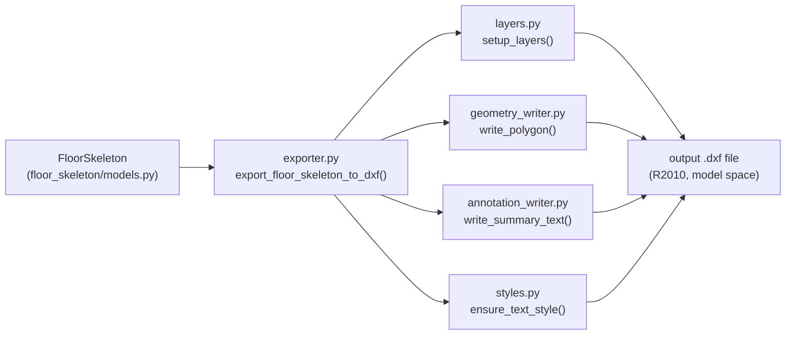

# DXF Exporter Module — Technical Design Plan

## 1. Position in the System




The exporter is a **pure function module** — no Django ORM, no DB writes, no Shapely mutation. Input is a `FloorSkeleton` instance; output is a `.dxf` file at `output_path`.

---

## 2. Folder Structure

```
backend/dxf_export/
├── __init__.py          # re-exports export_floor_skeleton_to_dxf
├── layers.py            # layer definitions and setup_layers()
├── styles.py            # minimal text style setup
├── geometry_writer.py   # Shapely Polygon → DXF LWPOLYLINE
├── annotation_writer.py # FloorSkeleton metrics → DXF MTEXT
└── exporter.py          # public API: export_floor_skeleton_to_dxf()
```

No new Django app registration required — this module has no models and no management commands in POC v1.

---

## 3. Layer Specification (`layers.py`)

Five active layers plus one reserved layer. All names are prefixed `A_` (Architecture standard).


| Layer name    | ACI color   | Linetype   | Purpose                                                       |
| ------------- | ----------- | ---------- | ------------------------------------------------------------- |
| `A_FOOTPRINT` | 7 (white)   | CONTINUOUS | Outer footprint boundary                                      |
| `A_CORE`      | 1 (red)     | CONTINUOUS | Core strip polygon                                            |
| `A_CORRIDOR`  | 3 (green)   | CONTINUOUS | Corridor strip polygon                                        |
| `A_UNITS`     | 2 (yellow)  | CONTINUOUS | Unit zone polygons (all)                                      |
| `A_TEXT`      | 6 (magenta) | CONTINUOUS | Summary annotation text                                       |
| `A_AUDIT`     | 8 (grey)    | DASHED     | **Reserved — intentionally empty in POC v1** (see note below) |


`setup_layers(doc)` creates all six layers unconditionally. Idempotent — safe to call on any new document.

`**A_AUDIT` layer policy:** The layer is created in every exported file so that downstream tooling (QGIS, AutoCAD scripts) can detect its presence and write debug overlays without modifying the exporter. No entities are written to `A_AUDIT` in POC v1. Its first planned use is envelope boundary overlay when the DXF exporter is extended to include site-frame back-transformation.

---

## 4. Geometry Conversion (`geometry_writer.py`)

### Core algorithm

```
FUNCTION write_polygon(msp, polygon, layer_name):

    # Improvement 2 — Defensive polygon guard
    if polygon is None:
        return                              # skip silently
    if not polygon.is_valid:
        raise ValueError(
            f"Invalid polygon passed to write_polygon (layer={layer_name}): "
            f"{polygon.explain_validity()}"
        )
    if polygon.area <= 0:
        return                              # skip degenerate zero-area polygon

    # Extract and round coordinates
    # Improvement 1 — Coordinate precision control
    raw_coords = list(polygon.exterior.coords)
    points = [
        (round(x, 6), round(y, 6))         # 6 d.p. eliminates Shapely float noise
        for x, y, *_ in raw_coords          # *_ safely drops Z if present
    ]
    # Shapely closes the ring by repeating the first vertex — remove duplicate
    # before handing to ezdxf, which handles closure via "closed": True
    if points and points[0] == points[-1]:
        points = points[:-1]

    msp.add_lwpolyline(points, dxfattribs={"layer": layer_name, "closed": True})
    # Interior rings (holes) are silently ignored in POC v1

FUNCTION write_floor_skeleton_geometry(msp, floor_skeleton):
    write_polygon(msp, floor_skeleton.footprint_polygon, "A_FOOTPRINT")
    write_polygon(msp, floor_skeleton.core_polygon,      "A_CORE")
    if floor_skeleton.corridor_polygon is not None:
        write_polygon(msp, floor_skeleton.corridor_polygon, "A_CORRIDOR")
    for unit_zone in floor_skeleton.unit_zones:
        write_polygon(msp, unit_zone.polygon, "A_UNITS")
```

### Coordinate rules

- All coordinates are already in **local metres frame** — no scaling applied.
- `ezdxf` default units header is set to metres (`doc.header["$INSUNITS"] = 4`).
- No rotation or translation is applied in POC v1.

### Coordinate precision (Improvement 1)

Shapely accumulates floating-point error during polygon construction, producing coordinates such as `7.390000000000002`. These are harmless geometrically but produce unreadable DXF coordinates and can cause diff noise in version-controlled output files. Rounding to **6 decimal places** (≈ 1 micrometre precision) eliminates this noise while preserving all architecturally meaningful precision (the smallest design feature is 100 mm = 5 significant figures at metre scale).

The duplicate-vertex strip (`points[0] == points[-1]`) is required because Shapely's `exterior.coords` always repeats the first vertex to close the ring, but `ezdxf`'s `add_lwpolyline(..., closed=True)` adds its own closure. Including both would produce a duplicate vertex in the DXF entity.

### Defensive guard (Improvement 2)

`write_polygon` applies three guards before writing:

1. **None check** — returns silently. Protects against optional `corridor_polygon = None` being passed by mistake from a future refactor.
2. `**is_valid` check** — raises `ValueError` with Shapely's own validity explanation. This surfaces upstream geometry bugs clearly rather than producing a corrupted DXF.
3. **Zero-area check** — returns silently. Protects against degenerate polygons (e.g., a line or point) that pass `is_valid` but would produce invisible entities.

These guards are **in addition to** the top-level guards in `exporter.py`. Belt-and-suspenders is appropriate here because `write_polygon` is a reusable internal function that may be called independently in future.

---

## 5. Text Style Setup (`styles.py`)

```
FUNCTION ensure_text_style(doc):
    if "ARCH_STANDARD" not in doc.styles:
        doc.styles.new("ARCH_STANDARD", dxfattribs={"font": "Arial.ttf", "height": 0.25})
```

Single style named `ARCH_STANDARD`. Height `0.25m`. Font `Arial.ttf` (standard DXF fallback). Called once before any annotation is written.

---

## 6. Annotation Placement (`annotation_writer.py`)

### Content

Five lines of MTEXT placed in layer `A_TEXT`:

```
Pattern:     {pattern_used}
Placement:   {placement_label}
Efficiency:  {efficiency_ratio * 100:.1f} %
Unit Area:   {unit_area_sqm:.2f} sqm
Core Area:   {core_area_sqm:.2f} sqm
```

Values are drawn from `floor_skeleton.area_summary` dict keys:

- `unit_area_sqm` → `area_summary["unit_area_sqm"]`
- `core_area_sqm` → `area_summary["core_area_sqm"]`

### Placement position

```
FUNCTION get_annotation_origin(floor_skeleton):
    minx, miny, maxx, maxy = floor_skeleton.footprint_polygon.bounds
    return (minx + 0.1, maxy - 0.1)   # top-left corner, 0.1m inset
```

### MTEXT call

```
FUNCTION write_summary_text(msp, floor_skeleton):
    origin = get_annotation_origin(floor_skeleton)
    content = build_mtext_content(floor_skeleton)   # concatenated with \P (MTEXT newline)

    # Improvement 3 — Dynamic text box width
    minx, miny, maxx, maxy = floor_skeleton.footprint_polygon.bounds
    footprint_width = maxx - minx
    text_width = min(5.0, footprint_width * 0.8)    # 80% of footprint width, capped at 5m

    msp.add_mtext(content, dxfattribs={
        "layer":            "A_TEXT",
        "char_height":       0.25,
        "style":            "ARCH_STANDARD",
        "insert":            origin,
        "attachment_point":  1,           # MTEXT constant: top-left
        "width":             text_width,  # dynamic, never exceeds footprint
    })
```

### Dynamic text box width (Improvement 3)

The fixed `5.0m` width caused the annotation block to overflow the footprint boundary on narrow slabs (e.g., FP101 at `W = 7.39m` — the text box would fill 68% of the width, acceptable, but a `4m`-wide slab would overflow by 25%).

The formula `min(5.0, footprint_width * 0.8)` ensures:

- The text block never exceeds **80% of the footprint width**, leaving a visible margin on both sides.
- It is capped at **5.0m** so wide slabs do not produce excessively spread-out text.
- No text wrapping logic is introduced — `ezdxf` handles soft-wrapping within the given box width automatically.

---

## 7. Public API (`exporter.py`)

```python
def export_floor_skeleton_to_dxf(
    floor_skeleton: FloorSkeleton,
    output_path: str,
) -> None:
```

### Guard checks (before any DXF work)

```
if not floor_skeleton.is_geometry_valid:
    raise ValueError("FloorSkeleton.is_geometry_valid is False — cannot export")

if floor_skeleton.pattern_used in ("NO_SKELETON", "NONE", ""):
    raise ValueError(f"Invalid pattern_used: {floor_skeleton.pattern_used!r}")
```

### Pipeline

```
1. doc = ezdxf.new("R2010")
2. doc.header["$INSUNITS"] = 4          # metres
3. setup_layers(doc)
4. ensure_text_style(doc)
5. msp = doc.modelspace()
6. write_floor_skeleton_geometry(msp, floor_skeleton)
7. write_summary_text(msp, floor_skeleton)
8. doc.saveas(output_path)
```

No return value. Raises `OSError` if `output_path` is not writable (standard `ezdxf` behaviour).

---

## 8. Data Read Map


| DXF output field       | Source in `FloorSkeleton`                             |
| ---------------------- | ----------------------------------------------------- |
| Footprint polyline     | `footprint_polygon.exterior.coords`                   |
| Core polyline          | `core_polygon.exterior.coords`                        |
| Corridor polyline      | `corridor_polygon.exterior.coords` (guarded for None) |
| Unit zone polylines    | `unit_zones[i].polygon.exterior.coords`               |
| Pattern label (text)   | `pattern_used`                                        |
| Placement label (text) | `placement_label`                                     |
| Efficiency % (text)    | `efficiency_ratio`                                    |
| Unit area (text)       | `area_summary["unit_area_sqm"]`                       |
| Core area (text)       | `area_summary["core_area_sqm"]`                       |


---

## 9. Known Limitations for POC v1

1. **No interior rings.** Polygon holes are ignored. All zones are simple convex rectangles in POC v1 so this is safe.
2. **Local metres frame only.** No back-transformation to DXF site coordinates. The exported file shows the skeleton in its own origin frame.
3. **No dimensioning.** Linear dimensions and leaders are not added.
4. **No block library.** Stair, lift, and furniture symbols are not drawn.
5. **Single floor only.** Repeated floor plates are not stacked. Each call exports one floor.
6. `**A_AUDIT` layer is empty.** The layer is created in every file but no entities are written to it in POC v1. Intentionally reserved — see Layer Specification section.
7. **Text character height is fixed at 0.25m.** On very small footprints the text may be large relative to the geometry. A future pass can compute `char_height` proportionally to footprint area.
8. **Coordinate precision is 6 decimal places.** This equals ~1 micrometre, which is more than sufficient for architectural work. Reducing further would reintroduce float noise; increasing is unnecessary.

---

## 10. Implementation Sequence

1. Create `backend/dxf_export/__init__.py` — re-export `export_floor_skeleton_to_dxf`
2. Write `layers.py` — `LAYER_DEFS` dict + `setup_layers(doc)`
3. Write `styles.py` — `ensure_text_style(doc)`
4. Write `geometry_writer.py` — `write_polygon()` + `write_floor_skeleton_geometry()`
5. Write `annotation_writer.py` — `build_mtext_content()` + `write_summary_text()`
6. Write `exporter.py` — guard checks + pipeline
7. Test: export FP101 skeleton → open in QGIS or AutoCAD viewer → verify 6 layers present, all polylines closed, text readable

