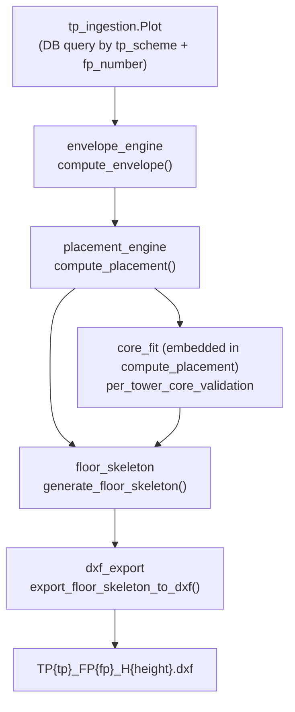

# End-to-End `generate_floorplan` Pipeline Command

## Module Dependency Map

All six modules already exist and are used as-is. No refactoring.




## New App: `architecture`

Create `backend/architecture/` — a minimal Django app (no models, no REST API) whose sole purpose is to host integration management commands.

```
backend/architecture/
├── __init__.py
├── apps.py
└── management/
    ├── __init__.py
    └── commands/
        ├── __init__.py
        └── generate_floorplan.py
```

Register in `INSTALLED_APPS` as `"architecture"`.

## Command Arguments

```
python manage.py generate_floorplan \
    --tp 14            (int, required)
    --fp 101           (int, required)
    --height 16.5      (float, required)
    --road-width 12.0  (float, default=9.0)
    --road-edges 0     (comma-separated ints, default="0")
    --n-towers 1       (int, default=1)
    --min-width 5.0    (float, default from placement_engine)
    --min-depth 4.0    (float, default from placement_engine)
    --export-dir ./outputs  (str, required)
```

`--road-edges` accepts `"0"` or `"0,1"` for corner plots. Parsed as `list[int]`.

## Data Flow (step by step)

### Step 1 — Load Plot

```python
plot = Plot.objects.get(
    tp_scheme=f"TP{tp}",
    fp_number=str(fp),
)
plot_wkt = plot.geom.wkt
```

Failure condition: `Plot.DoesNotExist` → print `ERROR: Plot TP{tp} FP{fp} not found in DB.`

### Step 2 — Compute Envelope

```python
from envelope_engine.services.envelope_service import compute_envelope, EnvelopeResult

result: EnvelopeResult = compute_envelope(
    plot_wkt=plot_wkt,
    building_height=height,
    road_width=road_width,
    road_facing_edges=road_edges,
)
```

Guard: `result.status != "VALID"` → stop with `result.error_message`.

Output line: `[2] Envelope Computed — Buildable: {area:.1f} sq.ft ({area_sqm:.1f} sq.m)`

The `envelope_polygon` is a Shapely Polygon (DXF feet). Pass its WKT to step 3:

```python
envelope_wkt = result.envelope_polygon.wkt
```

### Step 3 — Compute Placement (includes Core Fit)

```python
from placement_engine.services.placement_service import compute_placement, PlacementResult

pr: PlacementResult = compute_placement(
    envelope_wkt=envelope_wkt,
    building_height_m=height,
    n_towers=n_towers,
    min_width_m=min_width,
    min_depth_m=min_depth,
)
```

Guard: `pr.status not in ("VALID",)` → stop. Status values that indicate failure: `NO_FIT`, `TOO_TIGHT`, `INVALID_INPUT`, `NO_FIT_CORE`, `ERROR`.

Output line: `[3] Placement — Towers: {pr.n_towers_placed}, Mode: {pr.packing_mode}`

### Step 4 — Core Validation (already embedded)

`compute_placement` internally calls `validate_core_fit` and stores results in `pr.per_tower_core_validation`. No separate call needed.

Guard: check the first tower's core result:

```python
cv = pr.per_tower_core_validation[0]
if cv.core_fit_status == "NO_CORE_FIT":
    stop with "No architectural core can fit in the placed footprint."
```

Output line: `[4] Core Validation — {cv.core_fit_status}, Pattern: {cv.selected_pattern}`

### Step 5 — Generate Floor Skeleton

```python
from floor_skeleton.services import generate_floor_skeleton
from floor_skeleton.models import NO_SKELETON_PATTERN

skeleton = generate_floor_skeleton(
    footprint=pr.footprints[0],
    core_validation=pr.per_tower_core_validation[0],
)
```

Guard: `skeleton.pattern_used == NO_SKELETON_PATTERN` → stop.

Output line: `[5] Skeleton — Pattern: {skeleton.pattern_used}, Label: {skeleton.placement_label}, Efficiency: {skeleton.efficiency_ratio*100:.1f}%`

### Step 6 — Export DXF

```python
from dxf_export.exporter import export_floor_skeleton_to_dxf

filename = f"TP{tp}_FP{fp}_H{_fmt_height(height)}.dxf"
output_path = os.path.join(export_dir, filename)
os.makedirs(export_dir, exist_ok=True)

export_floor_skeleton_to_dxf(skeleton, output_path)
```

`_fmt_height(16.5)` → `"16.5"`, `_fmt_height(10.0)` → `"10"` (strips trailing `.0`).

Output line: `[6] DXF Exported → {output_path}`

## Failure Handling

Every step is wrapped in a try/except. All exceptions are caught and printed as:

```
ERROR at step N: <message>
```

then the command exits with `sys.exit(1)`. No step silently continues after a failure.

Explicit guard table:

- Step 1: `Plot.DoesNotExist` → `Plot TP{tp} FP{fp} not found`
- Step 2: `result.status != "VALID"` → `Envelope failed: {result.error_message}`
- Step 3: `pr.status != "VALID"` → `Placement failed: {pr.status} — {pr.error_message}`
- Step 4: `cv.core_fit_status == "NO_CORE_FIT"` → `Core does not fit in footprint {fp}`
- Step 5: `skeleton.pattern_used == "NO_SKELETON"` → `Floor skeleton could not be generated`
- Step 6: `OSError` from ezdxf → `DXF write failed: {exc}`

## Example Console Output (success)

```
Architecture AI — Floor Plan Generator
=======================================
TP: 14  FP: 101  H: 16.5m  Road: 12.0m  Edges: [0]  Towers: 1

[1] Plot Loaded         — Area: 151.7 sq.m (TP14, FP101)
[2] Envelope Computed   — Buildable: 30.4 sq.ft (2.8 sq.m)
[3] Placement           — Towers: 1, Mode: ROW_WISE, Footprint: 7.39m × 3.81m
[4] Core Validation     — VALID, Pattern: END_CORE (2 stairs, lift required)
[5] Floor Skeleton      — Pattern: END_CORE, Label: END_CORE_LEFT, Efficiency: 42.4%
[6] DXF Exported        → ./outputs/TP14_FP101_H16.5.dxf

Done.
```

## Example Console Output (failure at step 3)

```
Architecture AI — Floor Plan Generator
=======================================
TP: 14  FP: 101  H: 25.0m  Road: 9.0m  Edges: [0]  Towers: 1

[1] Plot Loaded         — Area: 151.7 sq.m (TP14, FP101)
[2] Envelope Computed   — Buildable: 14.4 sq.ft (1.3 sq.m)

ERROR at step 3: Placement failed: NO_FIT — Envelope area 14.4 sq.ft < minimum 215.0 sq.ft
```

## Key Implementation Notes

- `plot.geom` is a Django `GEOSGeometry`. Use `.wkt` to get a WKT string before passing to `compute_envelope`.
- `result.envelope_polygon` from `compute_envelope` is a Shapely Polygon. Use `.wkt` before passing to `compute_placement`.
- `pr.footprints[0]` is a `FootprintCandidate` dataclass — pass directly to `generate_floor_skeleton`.
- `pr.per_tower_core_validation[0]` is a `CoreValidationResult` dataclass — pass directly.
- The `export_dir` is created with `os.makedirs(exist_ok=True)` before writing.

