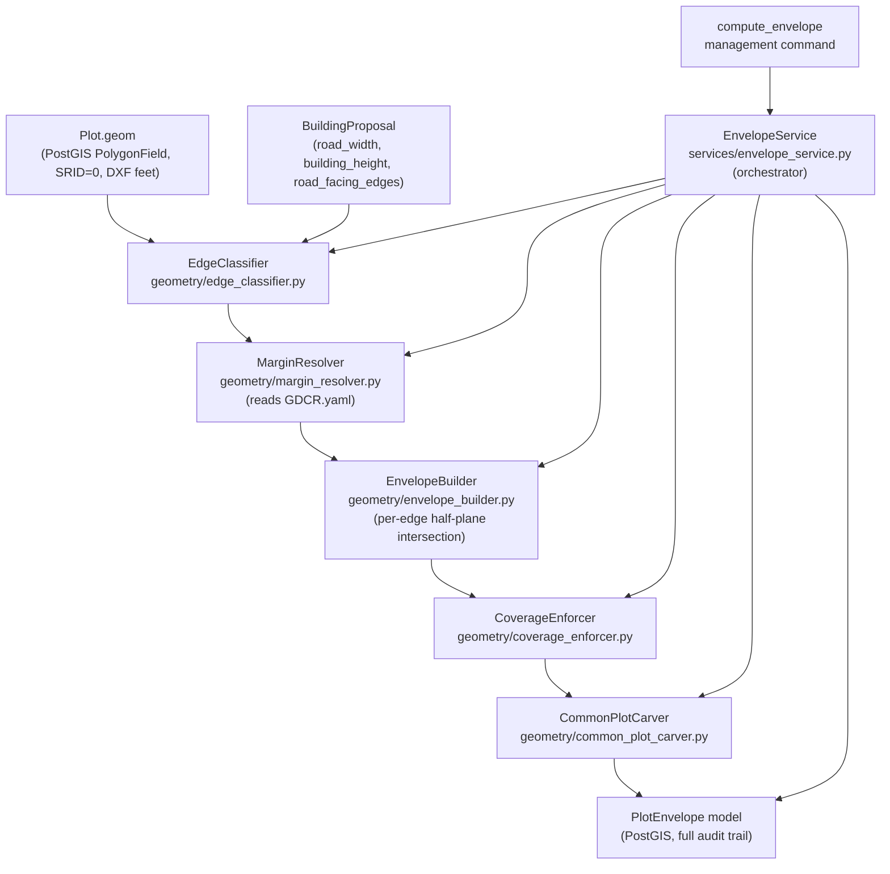
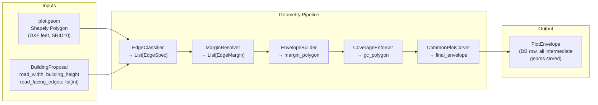

# Envelope Engine — Technical Design Plan

## 1. Architecture Overview




---

## 2. Folder Structure

```
backend/envelope_engine/
├── __init__.py
├── models.py                     ← PlotEnvelope (stores result + intermediates)
├── geometry/
│   ├── __init__.py
│   ├── edge_classifier.py        ← Classify each polygon edge: ROAD / SIDE / REAR
│   ├── margin_resolver.py        ← GDCR table lookups → required margin per edge
│   ├── envelope_builder.py       ← Core per-edge half-plane offset algorithm
│   ├── coverage_enforcer.py      ← Enforce max ground coverage percentage
│   └── common_plot_carver.py     ← Carve 10% common plot from rear
├── services/
│   ├── __init__.py
│   └── envelope_service.py       ← Orchestrates all geometry steps
└── management/
    └── commands/
        ├── __init__.py
        └── compute_envelope.py   ← CLI: compute + optionally save
```

The GDCR.yaml also requires one extension (see section 5).

---

## 3. Data Flow (detailed)




**Unit note:** The existing `Plot.geom` is stored in DXF coordinate units (feet, SRID=0). All GDCR margins are in metres. The envelope engine must apply:

```
margin_in_dxf_units = margin_metres / 0.3048
```

This conversion constant belongs in `geometry/__init__.py` as `DXF_UNIT = "feet"; METRES_TO_DXF = 1 / 0.3048`.

---

## 4. Why `polygon.buffer(-d)` Is Insufficient

`Shapely.buffer(-d)` applies an **identical offset on every edge**. GDCR mandates:

- **Road-facing edges** → road-side margin from Table 6.24 (road-width-based OR H/5, whichever is greater)
- **Side edges** → height-based margin from Table 6.26 (3m / 4m / 6m / 8m by height bracket)
- **Rear edges** → same table as side (same value in CGDCR 2017)
- **Corner plots** → 2 edges get road-side margin, 2 edges get side/rear margin

A plot on a 12 m road with H=16.5 m (margins: road-side ≈ 4.5 m, side/rear = 3.0 m) would be **incorrectly computed by buffer(-3.0)** — road-facing edge would be under-set by 1.5 m, making the entire building placement non-compliant.

The correct algorithm is **per-edge half-plane intersection**.

---

## 5. Margin Application Strategy

### 5a. GDCR.yaml Extension Required

`road_side_margin` in the current YAML contains only `logic: "road_width_based OR height_based_whichever_higher"`. Table 6.24 data must be added:

```yaml
road_side_margin:
  reference: "Table 6.24"
  logic: "road_width_based OR height_based_whichever_higher"
  road_width_margin_map:
    - road_max: 9
      margin: 3.0
    - road_max: 12
      margin: 4.5
    - road_max: 18
      margin: 6.0
    - road_max: 36
      margin: 9.0
    - road_max: 999
      margin: 12.0
  height_formula: "H / 5"
  minimum_road_side_margin: 1.5
```

*(Exact values need client verification against the Surat GDCR Table 6.24 document.)*

### 5b. EdgeSpec dataclass (in `geometry/edge_classifier.py`)

```python
@dataclass
class EdgeSpec:
    index: int            # edge index in polygon exterior (0-based)
    p1: tuple[float, float]
    p2: tuple[float, float]
    edge_type: str        # "ROAD" | "SIDE" | "REAR"
    road_width: float | None   # provided by user for ROAD edges
    gdcr_clause: str      # audit: e.g. "Table 6.24" or "Table 6.26"
    required_margin_m: float   # resolved margin in metres
    required_margin_dxf: float # = required_margin_m / 0.3048
```

### 5c. Edge Classification Logic (`edge_classifier.py`)

The user (or management command) supplies `road_facing_edges: list[int]` — a list of edge indices that face a road. This is the **declared input** from the architect, since road polygons are not yet in the DB.

- Edges in `road_facing_edges` → type `ROAD`
- For a regular plot: remaining edges are classified as `SIDE` (longer) or `REAR` (shortest / opposite the road)
- For a corner plot: 2 road-facing edges, the edge opposite the primary road = `REAR`, the remaining = `SIDE`
- Classification heuristic for SIDE vs REAR on non-road edges: the edge most nearly parallel to the primary road edge = `REAR`; the others = `SIDE`

**Future hook:** Replace declared `road_facing_edges` with spatial detection against a `RoadNetwork` table when road geometries are ingested.

### 5d. Core Algorithm (`envelope_builder.py`)

```
Input:  plot_polygon (Shapely Polygon), edge_specs (List[EdgeSpec])
Output: buildable_polygon (Shapely Polygon) or None if collapsed

For each EdgeSpec:
    1. Compute inward unit normal for this edge
       (for CCW polygon: rotate edge direction 90° left)
    2. Offset both endpoints inward by required_margin_dxf
    3. Build a "keep half-plane": a large rectangle on the inward side
       of the offset edge (extend ±1e6 along edge direction, then +1e6 inward)
    4. Intersect result_polygon with keep_half_plane

After all edges:
    if result_polygon.is_empty → status = COLLAPSED
    if result_polygon.area < minimum_buildable_area → status = TOO_SMALL
    else → status = VALID
```

This algorithm is:

- Correct for **convex and non-convex** polygons
- Correct for **corner plots** (2 road edges each get their own half-plane)
- Traceable: each step is tagged with its `gdcr_clause`
- Deterministic: no randomness, same input always produces same output

---

## 6. Height Integration Logic

Building height affects two things:

1. **Max height cap** (already checked in Rule Engine) — no geometry impact
2. **Side/rear margin** — looked up from `side_rear_margin.height_margin_map` in GDCR.yaml

`MarginResolver.resolve(edge_spec, building_height, road_width)`:

- For `ROAD` edges: `max(table_6_24_lookup(road_width), building_height / 5)`
- For `SIDE` / `REAR` edges: `height_margin_map` lookup (returns 3.0 / 4.0 / 6.0 / 8.0 m)

The `building_height` is always taken from `BuildingProposal.building_height` (the **proposed** height, not a regulatory cap). This means the envelope is computed for what the architect is actually proposing, and the Rule Engine independently confirms whether that height is permitted.

---

## 7. Ground Coverage Enforcement (`coverage_enforcer.py`)

The CGDCR does not explicitly cap ground coverage percentage for DW3 in the current YAML. Two enforcement strategies depending on whether a GC limit is found in GDCR:

- **If GC limit exists** (e.g. 40%): `max_footprint_area = gc_limit × plot_area`. If `envelope.area > max_footprint_area`, shrink the envelope symmetrically inward (uniform additional buffer) until it satisfies the constraint.
- **If GC limit is not defined** in GDCR.yaml: `CoverageEnforcer` passes through the margin-derived envelope unchanged, but records `ground_coverage_pct` in the `PlotEnvelope` row for audit.

The GDCR.yaml must be extended with a `ground_coverage` key before this enforcer does active clipping. Until then, it acts as a **measurement and audit step only**.

```python
# In GDCR.yaml (to be added):
ground_coverage:
  reference: "Table 6.22"
  max_percentage_dw3: 40    # placeholder — verify with client
```

---

## 8. Common Plot Carving (`common_plot_carver.py`)

CGDCR 2017 requires **10% of the plot area** to be set aside as a common open space / amenity plot. Strategy:

1. Compute `common_area_required = 0.10 × plot.area_geometry`
2. Identify the "rear zone" — the half of the plot furthest from the primary road edge
3. Carve a rectangular strip from the rear until the strip area ≈ `common_area_required`
4. Clip the carve zone against the post-margin envelope (the carve must stay within the original plot but outside the buildable envelope)
5. Store the carved polygon as `PlotEnvelope.common_plot_geom` for audit

**Carving algorithm:** compute the rear edge midpoint, then offset the rear boundary inward by a distance `d` such that the resulting rear strip area ≈ `common_area_required`. This is solved with a bisection search on `d`.

**Note:** If the margin already forces the building far enough from the rear edge, the common plot effectively already exists within the margin zone. The carver detects this and returns `NO_CARVE_NEEDED` status.

---

## 9. Models (`envelope_engine/models.py`)

```python
class PlotEnvelope(models.Model):
    STATUS = [
        ("VALID",                "Valid"),
        ("COLLAPSED",            "Envelope collapsed — margins exceed plot"),
        ("TOO_SMALL",            "Envelope too small — below minimum buildable area"),
        ("INVALID_GEOM",         "Input polygon is degenerate / self-intersecting"),
        ("INSUFFICIENT_INPUT",   "road_facing_edges not declared"),
    ]

    proposal      = ForeignKey(BuildingProposal, CASCADE, related_name="envelopes")
    status        = CharField(max_length=30, choices=STATUS)

    # All geometry fields SRID=0 (DXF feet) — mirrors Plot.geom
    envelope_geom    = PolygonField(srid=0, null=True)   # final buildable footprint
    margin_geom      = PolygonField(srid=0, null=True)   # after margin offsets only
    gc_geom          = PolygonField(srid=0, null=True)   # after GC enforcement
    common_plot_geom = PolygonField(srid=0, null=True)   # carved common plot

    # Scalar audit fields
    envelope_area_sqft    = FloatField(null=True)
    ground_coverage_pct   = FloatField(null=True)
    common_plot_area_sqft = FloatField(null=True)
    common_plot_status    = CharField(max_length=30, blank=True)

    # Full per-edge audit log (JSON)
    edge_margin_audit = JSONField(
        help_text="List of {edge_index, edge_type, margin_m, gdcr_clause}"
    )

    computed_at = DateTimeField(auto_now_add=True)
```

The `edge_margin_audit` JSON field makes every margin decision **fully traceable to a GDCR clause** without needing a separate table.

---

## 10. Error Handling Cases


| Case                              | Detection                                                  | Status               | Action                                                            |
| --------------------------------- | ---------------------------------------------------------- | -------------------- | ----------------------------------------------------------------- |
| Envelope collapses                | `result_polygon.is_empty` after intersection               | `COLLAPSED`          | Record status; raise `EnvelopeCollapseError`                      |
| Plot too small                    | `result.area < MIN_BUILDABLE` (configurable, e.g. 20 sq.m) | `TOO_SMALL`          | Record status; no geometry saved                                  |
| Polygon self-intersects           | `not plot_geom.is_valid` before starting                   | `INVALID_GEOM`       | Run `plot_geom.buffer(0)` repair attempt; if still invalid, abort |
| Margin overlap (width < 2×margin) | Detected via `COLLAPSED` after builder                     | `COLLAPSED`          | Note identifies the conflicting edges                             |
| road_facing_edges not declared    | `len(road_facing_edges) == 0`                              | `INSUFFICIENT_INPUT` | Raise `InsufficientInputError` immediately                        |
| Non-convex extreme indentation    | Post-intersection result is MultiPolygon                   | `VALID` with warning | Return largest component; log warning                             |


All errors are:

- Caught in `EnvelopeService.compute()`
- Recorded in `PlotEnvelope.status`
- Raised as typed exceptions (`EnvelopeCollapseError`, `InsufficientInputError`, `InvalidGeometryError`) in `geometry/__init__.py` for upstream handling

---

## 11. Management Command

```
python manage.py compute_envelope \
    --fp-number 101 \
    --tp-scheme TP14 \
    --city Surat \
    --road-width 12 \
    --building-height 16.5 \
    --road-edges 0 \       ← edge index(es) facing the road (comma-separated)
    [--save]               ← persist PlotEnvelope to DB
    [--export-geojson]     ← write envelope to .geojson for QGIS inspection
```

---

## 12. Testing Strategy (PAL TP14 Plots)

- **FP 101** — regular single-road plot, H=16.5 m, road_width=12 m: verify 4.5 m road margin, 3.0 m side/rear margins
- **Corner plot** (pick one from TP14 DB) — 2 road edges: verify both road-facing edges get road-side margin
- **Small plot** (plot area < 200 sq.m) — test `TOO_SMALL` / `COLLAPSED` detection
- **Height brackets** — run same FP 101 with H=10, 25, 45 m to verify margin table steps (3→4→6 m)
- **Road width brackets** — run same FP 101 with road_width=9, 12, 18 m to verify Table 6.24 steps
- **Degenerate geometry** — manually create a self-intersecting polygon; verify `INVALID_GEOM` path
- **GeoJSON export** — export all test envelopes and visually verify in QGIS against the original DXF

Assertions in each test:

- `envelope.area < plot.area` (always smaller)
- `envelope.within(plot.geom)` (always contained)
- Each edge of envelope is at least `required_margin_dxf` away from the corresponding plot edge

---

## 13. Future Extensibility Hooks


| Hook                    | Where                       | How                                                                                                                              |
| ----------------------- | --------------------------- | -------------------------------------------------------------------------------------------------------------------------------- |
| Road auto-detection     | `EdgeClassifier`            | Replace `road_facing_edges: list[int]` with `RoadNetwork` spatial query when road geometries are ingested                        |
| Multi-tower placement   | `EnvelopeService`           | Add `split_envelope(n_towers)` — subdivides the envelope polygon into N buildable zones                                          |
| GA-based layout         | `PlotEnvelope`              | Expose `edge_margin_audit` + `envelope_geom` as a structured JSON schema; GA engine reads constraints without touching GDCR.yaml |
| REST API                | `EnvelopeService.compute()` | Already Django-ORM-free until the save step; wrap in a DRF view                                                                  |
| OTS (Open-to-Sky) zones | Post-envelope step          | Add `OTSCarver` that reserves interior courtyard area from the envelope                                                          |
| Parking zone            | Post-envelope step          | Add `ParkingCarver` that reserves ground-floor parking strip                                                                     |
| Multi-SRID support      | `geometry/__init__.py`      | Make `DXF_UNIT_TO_METRES` configurable per `city` + `tp_scheme` (stored in a `SchemeMetadata` model)                             |


---

## 14. Implementation Sequence

1. Extend `GDCR.yaml` with Table 6.24 road-side margin table + ground coverage limit
2. Create `envelope_engine` app, register in `INSTALLED_APPS`
3. Write `geometry/` module — `edge_classifier`, `margin_resolver`, `envelope_builder`, `coverage_enforcer`, `common_plot_carver`
4. Write `models.py` — `PlotEnvelope`
5. Write `services/envelope_service.py` — orchestrator
6. Write `compute_envelope` management command
7. Run `makemigrations` + `migrate`
8. Test with TP14 plots (FP 101 + corner plot)
9. Export GeoJSON + verify in QGIS

