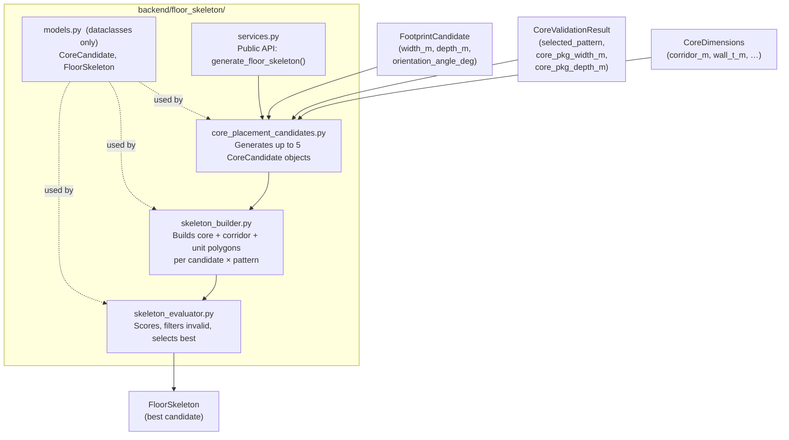

# Floor Skeleton Generator — Technical Design Plan

## Architecture Overview




## Folder Structure

```
backend/floor_skeleton/
├── __init__.py
├── models.py                    # dataclasses: CoreCandidate, FloorSkeleton
├── core_placement_candidates.py # generates 5 discrete candidate positions
├── skeleton_builder.py          # pattern-specific zone polygon construction
├── skeleton_evaluator.py        # scoring, validation, selection
└── services.py                  # public API: generate_floor_skeleton()
```

No Django ORM models in this module for POC v1. All geometry is Shapely in a **local metres frame** (origin at footprint bottom-left, X = width axis, Y = depth axis).

---

## Coordinate Convention

All skeleton geometry is produced in a **local 2-D metres frame**:

- Rectangle from `(0, 0)` to `(W, D)`, where `W = width_m`, `D = depth_m`
- `W >= D` (width is always the longer dimension, matching `FootprintCandidate.aspect_ratio`)
- This is independent of the DXF SRID=0 frame; the caller back-transforms if needed

---

## Dataclasses (models.py)

Three dataclasses live in `models.py`. All geometry is Shapely; no Django ORM.

### CoreCandidate

```python
@dataclass
class CoreCandidate:
    label:         str      # one of the 5 placement labels
    core_box:      Polygon  # Shapely box in local metres frame
    is_horizontal: bool     # True when core strip is parallel to X axis
```

### UnitZone (Improvement 1)

Wraps a unit polygon together with explicit orientation metadata so that downstream validation never has to infer axis direction from bounding-box ordering.

```python
AXIS_WIDTH_DOMINANT = "WIDTH_DOMINANT"   # long axis runs along X (width)
AXIS_DEPTH_DOMINANT = "DEPTH_DOMINANT"   # long axis runs along Y (depth)

@dataclass
class UnitZone:
    polygon:          Polygon  # Shapely polygon in local metres frame
    orientation_axis: str      # AXIS_WIDTH_DOMINANT | AXIS_DEPTH_DOMINANT
    zone_width_m:     float    # explicit dimension along X (bounding box xmax-xmin)
    zone_depth_m:     float    # explicit dimension along Y (bounding box ymax-ymin)
```

**Orientation rules by builder:**


| Builder produces                         | `orientation_axis` | `zone_width_m` | `zone_depth_m`          |
| ---------------------------------------- | ------------------ | -------------- | ----------------------- |
| Vertical-core unit band (spans full Y)   | `DEPTH_DOMINANT`   | `W - cpw`      | `D` (or sub-zone depth) |
| Horizontal-core unit band (spans full X) | `WIDTH_DOMINANT`   | `W`            | `D - cpd`               |


**Rationale:** For POC v1 all unit zones are axis-aligned rectangles, so `zone_width_m` and `zone_depth_m` could be derived from `polygon.bounds`. The explicit fields exist to (a) make validation readable without axis-inference logic and (b) allow a future release to handle rotated or non-rectangular zones by updating the builder alone, not the validator.

### FloorSkeleton

```python
@dataclass
class FloorSkeleton:
    # ── Geometry ───────────────────────────────────────────────────
    footprint_polygon:    Polygon             # (0,0)→(W,D) box
    core_polygon:         Polygon
    corridor_polygon:     Optional[Polygon]   # None for END_CORE pattern
    unit_zones:           list[UnitZone]      # replaces bare unit_polygons list

    # ── Identity ───────────────────────────────────────────────────
    pattern_used:         str                 # DOUBLE_LOADED / SINGLE_LOADED / END_CORE
    placement_label:      str                 # which of the 5 candidates won

    # ── Metrics (see Area Summary section) ─────────────────────────
    area_summary:         dict
    efficiency_ratio:     float               # unit_area / footprint_area

    # ── Feasibility flags (Improvement 3) ──────────────────────────
    is_geometry_valid:        bool   # structural checks (4a) all pass
    passes_min_unit_guard:    bool   # dimensional habitability (4b) satisfied
    is_architecturally_viable: bool  # efficiency_ratio >= VIABILITY_THRESHOLD

    # ── Audit ──────────────────────────────────────────────────────
    audit_log:            list[dict]           # one entry per candidate tried
```

`is_architecturally_viable` is a **flag only** — it does not affect scoring or selection. The threshold constant `VIABILITY_THRESHOLD = 0.35` is defined in `models.py` so it can be overridden per project.

The three flags express distinct concepts:


| Flag                        | Question answered                       | Computed in                     |
| --------------------------- | --------------------------------------- | ------------------------------- |
| `is_geometry_valid`         | Are the polygons mathematically sound?  | `skeleton_evaluator.py` step 4a |
| `passes_min_unit_guard`     | Are the unit zones genuinely habitable? | `skeleton_evaluator.py` step 4b |
| `is_architecturally_viable` | Is enough floor plate usable?           | `skeleton_evaluator.py` step 4c |


Only skeletons where `is_geometry_valid AND passes_min_unit_guard` enter the scoring pool. `is_architecturally_viable` is always computed but never used as a filter.

---

## Step 1 — Core Placement Candidates (core_placement_candidates.py)

**Inputs:** `W`, `D`, `cpw = core_pkg_width_m`, `cpd = core_pkg_depth_m`

**Five discrete positions** (all in local metres frame):


| Label                        | Core box                       | Strip direction            | Valid when                                   |
| ---------------------------- | ------------------------------ | -------------------------- | -------------------------------------------- |
| `END_CORE_LEFT`              | `(0, 0, cpw, D)`               | Vertical (parallel to Y)   | `W - cpw >= min_unit_width_m`                |
| `END_CORE_RIGHT`             | `(W-cpw, 0, W, D)`             | Vertical                   | same                                         |
| `CENTER_CORE`                | `((W-cpw)/2, 0, (W+cpw)/2, D)` | Vertical, centred          | `(W-cpw)/2 >= min_unit_width_m` (both sides) |
| `SIDE_CORE_ALONG_LONG_EDGE`  | `(0, 0, W, cpd)`               | Horizontal (parallel to X) | `D - cpd >= min_unit_depth_m`                |
| `SIDE_CORE_ALONG_SHORT_EDGE` | `(0, D-cpd, W, D)`             | Horizontal, opposite edge  | same                                         |


Candidates that fail the validity check are **excluded** before building begins.

### Candidate × Pattern Applicability Matrix

Not all candidate positions are meaningful for every core pattern. This table defines which combinations are built by `skeleton_builder.py`. Combinations marked — are never attempted.


| Candidate                    | DOUBLE_LOADED | SINGLE_LOADED | END_CORE                |
| ---------------------------- | ------------- | ------------- | ----------------------- |
| `END_CORE_LEFT`              | YES           | YES           | YES                     |
| `END_CORE_RIGHT`             | YES           | YES           | YES                     |
| `CENTER_CORE`                | YES           | YES           | YES                     |
| `SIDE_CORE_ALONG_LONG_EDGE`  | —             | —             | **YES (END_CORE only)** |
| `SIDE_CORE_ALONG_SHORT_EDGE` | —             | —             | **YES (END_CORE only)** |


**Rationale (Improvement 3):** Applying DOUBLE_LOADED or SINGLE_LOADED corridor logic to a horizontal core strip requires transposing axes, re-validating unit zone depths, and introducing a new corridor orientation (horizontal strip between two vertical unit bands) that has no precedent in the NBC habitable-corridor model used here. The complexity cost is high and the practical gain is negligible — for any footprint where a horizontal core could plausibly produce more area than a vertical candidate, the vertical candidates will already win on `total_unit_area`. Restricting horizontal candidates to END_CORE keeps the builder's pattern dispatch simple and auditable.

**Additional validity guard for horizontal candidates:**

Because horizontal candidates are END_CORE only, their remaining zone must satisfy the END_CORE unit width check:


| Candidate                    | Validity condition                                                                   |
| ---------------------------- | ------------------------------------------------------------------------------------ |
| `SIDE_CORE_ALONG_LONG_EDGE`  | `D - cpd >= dims.min_unit_width_m` (remaining depth = unit "width" in rotated sense) |
| `SIDE_CORE_ALONG_SHORT_EDGE` | same                                                                                 |


The `min_unit_depth_m` check is **not** applied to horizontal END_CORE units (same exception as vertical END_CORE — unit runs the full width dimension without sub-division).

---

## Step 2 — Skeleton Builder (skeleton_builder.py)

For each valid `CoreCandidate`, apply the `selected_pattern` to produce zone polygons.

### Pattern: END_CORE

```
+-------+------------------+
|       |                  |
| CORE  |   UNIT ZONE      |  height = D
| cpw×D | (W-cpw)×D        |
+-------+------------------+
0      cpw                 W
```

- `core_polygon` = `core_box`
- `corridor_polygon` = `None`
- `unit_polygons` = `[box(cpw, 0, W, D)]` (for LEFT; mirrored for RIGHT)

No corridor in END_CORE — staircase lands directly into the habitable floor.

### Pattern: SINGLE_LOADED

```
+-------+------------------+
|       | CORRIDOR  1.2m   |
| CORE  +------------------+  depth = D
| cpw×D |   UNIT ZONE      |
|       | (W-cpw)×(D-corr) |
+-------+------------------+
0      cpw                 W
```

- `core_polygon` = `core_box`
- `corridor_polygon` = `box(cpw, 0, W, corridor_m)` (corridor at near edge, adjacent to core)
- `unit_polygons` = `[box(cpw, corridor_m, W, D)]`

### Pattern: DOUBLE_LOADED

```
+-------+------------------+
|       |  UNIT ZONE A     |
|       |  (D-corr)/2      |
| CORE  +------------------+  depth = D
| cpw×D |  CORRIDOR        |
|       +------------------+
|       |  UNIT ZONE B     |
|       |  (D-corr)/2      |
+-------+------------------+
0      cpw                 W
```

- `core_polygon` = `core_box`
- Corridor centred at `D/2`:
  - `y0 = (D - corridor_m) / 2`
  - `y1 = (D + corridor_m) / 2`
- `corridor_polygon` = `box(cpw, y0, W, y1)`
- `unit_polygons` = `[box(cpw, 0, W, y0), box(cpw, y1, W, D)]`

### Horizontal core variants — END_CORE only (Improvement 3)

Horizontal candidates (`SIDE_CORE_ALONG_LONG_EDGE`, `SIDE_CORE_ALONG_SHORT_EDGE`) are **always built using the END_CORE pattern only**, regardless of which pattern `CoreValidationResult` selects.

**Rationale:** Applying DOUBLE_LOADED or SINGLE_LOADED logic to a horizontal core strip requires transposing axes and re-validating unit zone depths, doubling complexity with near-zero practical gain. For typical TP plots where `D >= 8.1m` (required for horizontal candidates to even pass the validity guard), the vertical candidates (END_CORE_LEFT / RIGHT) will produce more unit area and always outscore horizontal ones. Restricting horizontal candidates to END_CORE logic keeps the builder deterministic and auditable.

For a horizontal core at the bottom (`SIDE_CORE_ALONG_LONG_EDGE`):

```
+------------------------------+
|     UNIT ZONE (W × (D-cpd)) |  height = D - cpd
+------------------------------+
|     CORE     (W × cpd)       |  height = cpd
+------------------------------+
0                              W
```

- `core_polygon` = `core_box` (horizontal strip)
- `corridor_polygon` = `None`
- `unit_polygons` = `[box(0, cpd, W, D)]`

`SIDE_CORE_ALONG_SHORT_EDGE` is the mirror (core at top):

- `core_polygon` = `box(0, D-cpd, W, D)`
- `unit_polygons` = `[box(0, 0, W, D-cpd)]`

---

## Step 3 — Area Summary (Improvement 2)

Computed for every skeleton before validation and scoring. All ratios are in `[0.0, 1.0]`. All areas in sq.m.

```python
area_summary = {
    # ── Base areas ──────────────────────────────────────────────────
    "footprint_area_sqm":    W * D,
    "core_area_sqm":         core_polygon.area,
    "corridor_area_sqm":     corridor_polygon.area if corridor_polygon else 0.0,
    "unit_area_sqm":         sum(z.polygon.area for z in unit_zones),
    "n_unit_zones":          len(unit_zones),

    # ── Primary ratios ──────────────────────────────────────────────
    "efficiency_ratio":      unit_area / footprint_area,
    "core_ratio":            core_area / footprint_area,
    "circulation_ratio":     corridor_area / footprint_area,
    "non_habitable_ratio":   (core_area + corridor_area) / footprint_area,

    # ── Per-zone dimensional breakdown ──────────────────────────────
    "unit_band_widths":      [round(z.zone_width_m, 3) for z in unit_zones],
    "unit_band_depths":      [round(z.zone_depth_m, 3) for z in unit_zones],

    # ── Integrity check ─────────────────────────────────────────────
    "area_check_passes":     abs((core_area + corridor_area + unit_area)
                                 - footprint_area) < 1e-6,
}
```

**Purpose of added fields:**


| Field                          | Downstream use                                                                |
| ------------------------------ | ----------------------------------------------------------------------------- |
| `core_ratio`                   | Structural cost indicator; large core ratio on small plot flags infeasibility |
| `circulation_ratio`            | Code compliance audit (excessive corridor area)                               |
| `non_habitable_ratio`          | Combined overhead = `1 - efficiency_ratio`; used in feasibility reports       |
| `unit_band_widths` / `_depths` | Per-zone dimensional detail for AI scoring, optimisation, and UI display      |


`non_habitable_ratio + efficiency_ratio == 1.0` always (verified by `area_check_passes`).

---

## Step 4 — Validation (skeleton_evaluator.py)

Three sequential sub-checks set the three `FloorSkeleton` flags. Checks 4a and 4b act as gates (failure excludes from scoring). Check 4c is informational only.

### 4a — Structural checks → sets `is_geometry_valid`

All five conditions must hold:

1. All zone polygons are non-empty and valid (`polygon.is_valid and not polygon.is_empty`)
2. No pairwise overlaps: `union(all_zones).area ≈ footprint_area` within 1e-6 tolerance
3. All zones fully inside footprint: `zone.within(footprint_polygon)`
4. No negative dimension in any bounding box (`zone_width_m > 0`, `zone_depth_m > 0`)
5. `area_summary["area_check_passes"] == True`

`is_geometry_valid = True` iff all five pass.

### 4b — Minimum unit geometry guard → sets `passes_min_unit_guard` (Improvement 1 + 2)

Uses the explicit `UnitZone.zone_width_m` and `UnitZone.zone_depth_m` fields — **no bounding-box inference**. The `orientation_axis` tag from the builder determines which dimension maps to "short side" and "long side".

**Rule table:**


| Pattern               | `orientation_axis` | Short-side check                        | Long-side check                         |
| --------------------- | ------------------ | --------------------------------------- | --------------------------------------- |
| `DOUBLE_LOADED`       | `DEPTH_DOMINANT`   | `zone_width_m >= dims.min_unit_width_m` | `zone_depth_m >= dims.min_unit_depth_m` |
| `SINGLE_LOADED`       | `DEPTH_DOMINANT`   | `zone_width_m >= dims.min_unit_width_m` | `zone_depth_m >= dims.min_unit_depth_m` |
| `END_CORE` vertical   | `DEPTH_DOMINANT`   | `zone_width_m >= dims.min_unit_width_m` | — (full slab depth, no sub-division)    |
| `END_CORE` horizontal | `WIDTH_DOMINANT`   | `zone_depth_m >= dims.min_unit_width_m` | — (full slab width, no sub-division)    |


Applied to every `UnitZone` in the skeleton. `passes_min_unit_guard = True` iff all zones pass their respective rule.

**Rationale:** Without this guard, a DOUBLE_LOADED candidate on a footprint that barely satisfies the `dl_depth_req` threshold produces unit zones of exactly `(D - corridor_m)/2 = (10.66 - 1.2)/2 = 4.73m` depth. After subtracting wall thickness implicitly, the effective room depth falls below the NBC minimum. Using explicit `zone_width_m` / `zone_depth_m` fields (set by the builder at construction time) makes this check readable and avoids axis-inference bugs that arise from calling `polygon.bounds` and assuming a specific ordering.

### 4c — Architectural viability flag → sets `is_architecturally_viable` (Improvement 3)

```
is_architecturally_viable = (efficiency_ratio >= VIABILITY_THRESHOLD)
```

`VIABILITY_THRESHOLD = 0.35` (configurable constant in `models.py`). This flag is **always computed** — it is never used as a scoring filter or validity gate. Its purpose is to enable feasibility reporting and future AI scoring without affecting determinism.

**Three-tier terminology:**


| Term         | Definition                                    | Used as gate?                               |
| ------------ | --------------------------------------------- | ------------------------------------------- |
| **Feasible** | `is_geometry_valid AND passes_min_unit_guard` | YES — only feasible skeletons enter scoring |
| **Viable**   | `is_architecturally_viable == True`           | NO — informational flag only                |
| **Optimal**  | Highest-scoring feasible candidate            | YES — the single selected skeleton          |


Skeletons failing 4a or 4b are excluded from scoring. If **all** candidates are infeasible, return a `NO_SKELETON` result.

---

## Step 5 — Deterministic Sort + Scoring + Selection (skeleton_evaluator.py)

### 5a — Pre-sort (Improvement 4)

Before applying the scoring tuple, sort the feasible-skeleton list deterministically:

```
sort key: (total_unit_area DESC, efficiency_ratio DESC, label_index ASC)
```

This pre-sort is applied with `sorted(..., reverse=False)` using a key that negates the first two fields and uses positive label_index. It guarantees that the iteration order of the list is stable even if Python's internal dict ordering or floating-point precision varies between runs.

**Rationale:** Python's `max()` on a list of tuples is deterministic when all elements are distinct, but floating-point equality can cause non-determinism in edge cases (two candidates with areas that differ by < `1e-10`). The pre-sort collapses any such ties before the tuple comparison runs, ensuring the same skeleton is always selected regardless of the order in which candidates were generated.

### 5b — Scoring key

```python
score = (
    total_unit_area,     # 1. Absolute usable area (sq.m) — primary quality metric
    efficiency_ratio,    # 2. % of footprint that is habitable — secondary quality metric
    n_unit_zones,        # 3. Architectural bonus for two independent unit bands
    -label_index,        # 4. Deterministic tie-break by canonical label order
)
```

Highest tuple wins.

**Rationale:** `total_unit_area` first ensures the candidate that delivers the most habitable floor space wins outright. `efficiency_ratio` second rewards compact layouts. `n_unit_zones` is demoted to a tertiary bonus — it still tips the balance when unit areas are equal (e.g. symmetric slab) but cannot override a candidate with superior usable area.

### 5c — Canonical label order (tie-break)

```
END_CORE_LEFT(0) > END_CORE_RIGHT(1) > CENTER_CORE(2)
> SIDE_CORE_ALONG_LONG_EDGE(3) > SIDE_CORE_ALONG_SHORT_EDGE(4)
```

The skeleton with the highest `score` tuple after the pre-sort is the **optimal** result.

---

## Step 6 — Public API (services.py)

```python
def generate_floor_skeleton(
    footprint:       FootprintCandidate,
    core_validation: CoreValidationResult,
    dims:            CoreDimensions | None = None,
) -> FloorSkeleton:
```

**Guard:** If `core_validation.core_fit_status == NO_CORE_FIT`, return a `NO_SKELETON` sentinel immediately. The sentinel has `is_geometry_valid = is_architecturally_viable = passes_min_unit_guard = False` and an empty `unit_zones` list.

Internal call sequence:

1. `candidates = generate_candidates(W, D, cpw, cpd, dims)` — up to 5, filtered by geometry guard
2. `skeletons  = [build_skeleton(c, pattern, W, D, dims) for c in candidates]` — all 5 attempted
3. Compute `area_summary` and all three flags for each skeleton
4. `feasible   = [s for s in skeletons if s.is_geometry_valid and s.passes_min_unit_guard]`
5. Pre-sort `feasible` deterministically (Step 5a)
6. `return select_best(feasible)` — or `NO_SKELETON` if `feasible` is empty

---

## FP101 Example Walkthrough

**Inputs:**

- `W = 7.39m`, `D = 3.81m` (from `FootprintCandidate`)
- `selected_pattern = END_CORE`
- `cpw = 4.26m`, `cpd = 3.6m` (H=16.5m, lift+stairs)
- `corridor_m = 1.2m`, `min_unit_width_m = 3.0m`, `min_unit_depth_m = 4.5m`

**Candidate generation:**


| Label                      | Valid? | Reason                                      |
| -------------------------- | ------ | ------------------------------------------- |
| END_CORE_LEFT              | YES    | `W - cpw = 3.13m >= 3.0m`                   |
| END_CORE_RIGHT             | YES    | same                                        |
| CENTER_CORE                | NO     | each side = `(7.39-4.26)/2 = 1.565m < 3.0m` |
| SIDE_CORE_ALONG_LONG_EDGE  | NO     | `D - cpd = 0.21m < 3.0m`                    |
| SIDE_CORE_ALONG_SHORT_EDGE | NO     | same                                        |


**Two valid candidates: END_CORE_LEFT, END_CORE_RIGHT**

**END_CORE_LEFT skeleton:**

- `core_polygon` = box(0, 0, 4.26, 3.81) → area = **16.23 sq.m**
- `corridor_polygon` = None
- `unit_polygons` = [box(4.26, 0, 7.39, 3.81)] → area = 3.13 × 3.81 = **11.93 sq.m**
- `footprint_area` = 7.39 × 3.81 = **28.15 sq.m**
- `efficiency_ratio` = 11.93 / 28.15 = **42.4%**

**END_CORE_RIGHT skeleton:** symmetric → identical scores.

**Tie-break:** END_CORE_LEFT (index 0) > END_CORE_RIGHT (index 1) → **END_CORE_LEFT selected**.

---

## Forward Compatibility (Improvement 5)

`FloorSkeleton` is designed to be nested inside a future `TowerSkeleton` or `SiteSkeleton` container without modification. The following constraints ensure this:

**No global state.** Every `FloorSkeleton` is a self-contained immutable dataclass. The `generate_floor_skeleton()` function is a pure function of its inputs — no module-level caches, no class instances, no singletons.

**No static geometry.** All polygons are in the **local metres frame** of the individual footprint. There is no assumption about where the footprint sits on the site. Translation into the site coordinate frame is the responsibility of the calling layer (future `TowerSkeleton`).

**No single-tower assumptions.** `FloorSkeleton` does not reference `FootprintRecord`, `BuildingPlacement`, or any Django ORM model. It accepts a `FootprintCandidate` (a pure-Python dataclass) and returns a pure-Python dataclass. This makes it usable in a multi-tower loop where each tower's placement is processed independently.

**Planned nesting structure (not implemented in POC v1):**

```
SiteSkeleton
  └── TowerSkeleton[ ]   (one per placed tower)
        ├── footprint_candidate: FootprintCandidate
        ├── floor_skeleton:      FloorSkeleton
        └── n_floors:            int
```

No code changes to `FloorSkeleton` will be needed to support this structure. The `TowerSkeleton` wrapper layer will handle coordinate back-transformation, floor repetition, and inter-tower relationships.

---

## Known Limitations for POC v1

1. **Single tower only.** Multi-tower skeleton is out of scope; forward-compatibility hook is in place (see Forward Compatibility section).
2. **Rectangular footprints only.** Non-rectangular inscribed footprints are not handled. The `UnitZone.orientation_axis` tag prepares the system for arbitrary polygons in a future release.
3. **Corridor position is fixed.** SINGLE_LOADED corridor is always at the near/core-adjacent edge. No "far corridor" variant.
4. **DOUBLE_LOADED corridor is always centred.** No asymmetric variants.
5. **No wall thickness shown in polygons.** All zones are gross (structural walls implicit). `zone_width_m` and `zone_depth_m` in `UnitZone` are gross dimensions.
6. **Horizontal candidates restricted to END_CORE.** `SIDE_CORE_ALONG_LONG/SHORT_EDGE` are only built under the END_CORE pattern. They also require `D - cpd >= min_unit_width_m` (= `D >= 3.6 + 3.0 = 6.6m`), which is rarely satisfied for typical TP plots.
7. **No coordinate back-transform.** The `FloorSkeleton` polygons are in the local metres frame. DXF frame output is a future task delegated to `TowerSkeleton`.
8. **No Django models.** Persistence is out of scope for this phase.
9. **CENTER_CORE requires wide footprint.** Both residual zones must each be `>= min_unit_width_m`, so `W >= cpw + 2 × min_unit_width_m` = 10.26m minimum for highrise.
10. `**is_architecturally_viable` uses a fixed threshold.** `VIABILITY_THRESHOLD = 0.35` is a practical default. It is not derived from any regulatory standard and should be reviewed with the client for production use.

