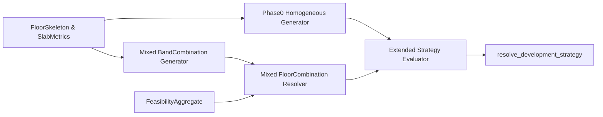

# Mixed Unit Strategy Engine — Phase 1 Design

## 1. Architecture Overview

- **Goal**: Extend the existing homogeneous Development Strategy Engine to support **mixed unit-type strategies per floor** (e.g. 2×2BHK + 1×3BHK), while preserving:
  - Determinism
  - Tight combinatorial bounds
  - FSI and geometry consistency
  - Batch performance on all TP14 plots
- **Position in pipeline** (unchanged up/downstream):
  - `FloorSkeleton` + `FeasibilityAggregate` → **Development Strategy (Phase 0/1)** → CLI / reporting
- **New internal layers** (all under `backend/development_strategy/`):
  - `mixed_generator.py` — per-band discrete packing of multiple unit types
  - `mixed_resolver.py` — cross-band combination and global pruning
  - Extended evaluator — Phase 1 metrics (diversity, luxury, density) added to existing evaluator
  - Service layer upgrade — orchestrates homogeneous vs mixed strategies depending on mode

- **Phase 1 scope**: Add mixed unit support **beside** homogeneous strategies; do not change slab metric extraction, FSI math, or external contracts.

**Phase 1 non-goals — no market awareness:** This layer does **not** use `jantri_rate`, `zone_code`, `authority`, RAH scheme, or any market preference. It is **geometry-driven optimization** only (slab metrics, FSI, efficiency, diversity, luxury/density). Do not position it as "development intelligence"; a future Phase 2 (AI or financial) can sit on top of `MixedDevelopmentStrategy` with market inputs.

## 2. Data Structures

### 2.1 Existing (Phase 0)

- `UnitType` (Enum): `STUDIO`, `BHK1`, `BHK2`, `BHK3`.
- `DevelopmentStrategy` (homogeneous):
  - `unit_type: UnitType`
  - `units_per_floor: int`
  - `floors: int`
  - `total_units: int`
  - `avg_unit_area_sqm: float`
  - `total_bua_sqm: float`
  - `fsi_utilization: float`
  - `efficiency_ratio: float`
  - `feasible: bool`
- `SlabMetrics` (already defined in `slab_metrics.py`).
- `StrategyEvaluation`: wraps a `DevelopmentStrategy` + score + rank.

### 2.2 New Phase 1 band-level types

Add in `mixed_generator.py`:

- `**BandCombination`** — a single-band mixed packing result:
  - `units: dict[UnitType, int]` — count per type; keys only for positive counts, max 3 distinct keys.
  - `total_units: int` — sum of unit counts.
  - `used_length_m: float` — total frontage actually occupied along the repeating axis.
  - `remainder_m: float` — `band_length_m - used_length_m` (non-negative within tolerance).
  - `bua_per_floor_sqm: float` — `sum(count_t * unit_min_area_sqm_t)`. **Phase 1 assumption:** Template area is treated as BUA proxy; actual BUA may differ when real layout slicing is integrated. Document in code: "Template area treated as BUA proxy in Phase 1."
  - `band_index: int` — index of the band in `SlabMetrics` / `FloorSkeleton` (for traceability).
  - `orientation_axis: str` — `"WIDTH_DOMINANT"` or `"DEPTH_DOMINANT"` (copied from `UnitZone`).
  - `allowed_unit_types: list[UnitType]` — cached list of types that geometrically fit this band.

Band combinations will be **Pareto-pruned** and capped per band.

### 2.3 New Phase 1 floor-level types

Add in `mixed_resolver.py`:

- `**FloorCombination`** — per-floor mixed configuration, potentially across two bands:
  - `band_a: BandCombination`
  - `band_b: BandCombination | None` — `None` for single-band skeletons.
  - `total_units: int` — sum of units across bands.
  - `bua_per_floor_sqm: float` — `band_a.bua_per_floor_sqm + (band_b.bua_per_floor_sqm if band_b else 0.0)`.
  - `mix_signature: str` — canonical string summarizing counts per unit type across all bands; e.g. `"2x1BHK+1x2BHK"`. Types sorted in fixed `UnitType` enum order.
  - `per_type_counts: dict[UnitType, int]` — total counts across bands.
- `**MixedDevelopmentStrategy`** — Phase 1 generalization of `DevelopmentStrategy`:
  - `mix: dict[UnitType, int]` — total units per floor by type.
  - `floors: int`
  - `total_units: int`
  - `avg_unit_area_sqm: float` — weighted average of template areas across types.
  - `total_bua_sqm: float`
  - `fsi_utilization: float`
  - `efficiency_ratio: float`
  - `mix_diversity_score: float` — precomputed raw metric (0–1 range before normalization, see below).
  - `luxury_bias_score: float` — raw metric (higher for larger average unit sizes).
  - `density_bias_score: float` — raw metric (higher for more units)
  - `feasible: bool`
  - `rejection_reason: Optional[str]` — FSI/geometry reasons if infeasible.

### 2.4 Evaluator weights extension

In `evaluator.py`, extend or add:

- `**EvaluatorWeights`** (Phase 1 signature):
  - `w_fsi: float = 0.35`
  - `w_efficiency: float = 0.25`
  - `w_total_units: float = 0.15`
  - `w_mix_diversity: float = 0.10`
  - `w_luxury_bias: float = 0.15`

This supersedes or extends existing defaults; homogeneous strategies can set diversity/luxury to degenerate values that normalize to 1.0 when all are identical.

### 2.5 Phase 1 evaluation wrapper

- `**MixedStrategyEvaluation`** (parallel to `StrategyEvaluation`):
  - `strategy: MixedDevelopmentStrategy`
  - `score: float`
  - `rank: int`

Service layer may unify both via a union type or a shared interface for downstream consumers.

## 3. Mixed Combination Generator (Band Level)

File: `[backend/development_strategy/mixed_generator.py](backend/development_strategy/mixed_generator.py)`

### 3.1 Inputs and band geometry contract

- Inputs per band derived from existing `SlabMetrics` + `FloorSkeleton`/`UnitZone`:
  - `band_length_m` — repeating axis in metres (width or depth depending on `orientation_axis`).
  - `band_depth_m` — slab depth orthogonal to repeating axis.
  - `orientation_axis` — `WIDTH_DOMINANT` or `DEPTH_DOMINANT`.
  - `unit_templates` — as in Phase 0: `unit_min_area_sqm`, `unit_frontage_m`, `unit_depth_m` (geometry-consistent: `min_area >= frontage * depth`).
  - Global **caps** (configurable constants, documented in this module):
    - `MAX_UNITS_PER_BAND = 6`
    - `MAX_UNIT_TYPES_PER_BAND = 3`
    - `MAX_COMBINATIONS_PER_BAND = 20`
  - **Design note — MAX_UNITS_PER_BAND is a strategic cap:** 6 is arbitrary but reasonable. On **large slabs** (e.g. 40 m frontage) it prevents high-density studio projects and artificially flattens density options; on small slabs the cap is irrelevant. Acceptable for architectural realism; it **limits optimization completeness** if the objective were to explore all density options. For Phase 1 the deterministic constant stands; document as a strategic constraint. A later refinement could use a dynamic bound (e.g. `floor(repeat_len_m / min_frontage)`).

### 3.2 Eligibility filter per unit type

For each band and each `UnitType`:

1. Compute **depth feasibility**:
  - If `orientation_axis == WIDTH_DOMINANT`:
    - `repeat_len_m = band_width_m`
    - `depth_avail_m = band_length_m`
  - Else:
    - `repeat_len_m = band_length_m`
    - `depth_avail_m = band_width_m`
  - Require `unit_depth_m <= depth_avail_m` (else type is **not allowed** in this band).
2. Compute **max integer count along repeat axis**:
  - `max_by_frontage = floor(repeat_len_m / unit_frontage_m)`.
  - Cap by `MAX_UNITS_PER_BAND`.
  - If `max_by_frontage <= 0` → exclude type.
3. The set of `allowed_unit_types` is the subset that passes depth + frontage tests.

If `allowed_unit_types` is empty → return a single **empty BandCombination** with `total_units=0`, `bua_per_floor_sqm=0`, flagged later as infeasible.

**Combination-level depth constraint (mixed types):** Unit templates in Phase 0 have **varying depths** (e.g. STUDIO/1BHK 4.5 m, 2BHK 6 m, 3BHK 7.5 m in `strategy_generator.py`). The band depth must accommodate the **deepest unit in the combination**: for any emitted `BandCombination`, require `max(unit_depth_m for types present in combination) <= depth_avail_m`. Because eligibility is computed per type, every type in `allowed_unit_types` already satisfies `unit_depth_m <= depth_avail_m`; therefore any combination built only from `allowed_unit_types` automatically satisfies this combined constraint. The plan **explicitly** requires that the generator only emit combinations whose types are all in `allowed_unit_types`; no separate post-check is needed unless future templates relax per-type depth or allow types with depth greater than some bands. Document in implementation: "Combination depth = max depth of units in mix; enforced by only combining allowed types."

### 3.3 Combination enumeration strategy

We must support up to 3 types per band and at most 20 combinations per band.

Algorithm outline (deterministic, integer loops only):

1. **One-type combos** (homogeneous within band):
  - For each `UnitType t in allowed_unit_types`:
    - For `n` from 1 to `max_n_t`:
      - `used_len = n * frontage_t`
      - `remainder = repeat_len_m - used_len` (must be `>= 0` within tolerance, else break loop).
      - Compute `bua_per_floor_sqm = n * unit_min_area_t`.
      - Append `BandCombination` if `n <= MAX_UNITS_PER_BAND`.
2. **Two-type combos** (ordered pairs but canonicalized to avoid duplicates):
  - For unit types `t1`, `t2` with `t1 < t2` in enum order (to enforce canonical ordering):
    - For `n1` from 0..`max_n_t1`:
      - Compute remaining length `L1 = repeat_len_m - n1 * frontage_t1`.
      - If `L1 < frontage_t2` → break inner loop.
      - Compute `max_n2 = min(MAX_UNITS_PER_BAND - n1, floor(L1 / frontage_t2))`.
      - For `n2` from 1..`max_n2`:
        - Require `n1 + n2 <= MAX_UNITS_PER_BAND` and at least one of `n1`, `n2` > 0.
        - Compute `used_len = n1 * frontage_t1 + n2 * frontage_t2`.
        - Compute `remainder = repeat_len_m - used_len`.
        - Compute `bua_per_floor_sqm = n1 * area_t1 + n2 * area_t2`.
        - Emit `BandCombination`.
        - **Stop early** if count of combinations reaches `MAX_COMBINATIONS_PER_BAND`.
3. **Three-type combos** (tighter loops, only if still below combo cap):
  - For triplets `t1 < t2 < t3`:
    - For `n1` in 0..`max_n_t1` (small cap due to `MAX_UNITS_PER_BAND`):
      - Compute `L1` as above; if `L1 < min(frontage_t2, frontage_t3)` → break.
      - For `n2` in 0..`max_n_t2`:
        - `L2 = L1 - n2 * frontage_t2`; if `L2 < frontage_t3` → break.
        - `max_n3 = min(MAX_UNITS_PER_BAND - (n1 + n2), floor(L2 / frontage_t3))`.
        - For `n3` in 1..`max_n3`:
          - Check total units ≤ `MAX_UNITS_PER_BAND`.
          - Compute `used_len`, `remainder`, `bua_per_floor_sqm`.
          - Emit combination.
          - Stop if `MAX_COMBINATIONS_PER_BAND` reached.

This approach ensures **polynomial and bounded** enumeration; loops are short because MAX_UNITS_PER_BAND and number of unit types are small.

### 3.4 Local Pareto pruning and ordering

After enumeration for a band:

1. **Discard dominated combos**:
  - A combination `A` is dominated by `B` if:
    - `B.bua_per_floor_sqm >= A.bua_per_floor_sqm`, and
    - `B.total_units >= A.total_units`, and
    - At least one inequality is strict.
  - Keep only non-dominated combinations to reduce list size and improve quality.
2. **Deterministic sorting** of remaining combinations:
  - Primary: `bua_per_floor_sqm` (descending)
  - Secondary: `total_units` (descending)
  - Tertiary: `remainder_m` (ascending — prefer tighter packing)
  - Quaternary: lexicographic order of `(unit_type, count)` pairs inside `units` dict.
3. **Enforce cap**: if still more than `MAX_COMBINATIONS_PER_BAND`, truncate the list **after sorting**.

**Design decision — remainder not in final scoring:** `remainder_m` is used only for band-level ordering (tie-break). It is **not** fed into the evaluator; two strategies with similar BUA and units but different remainder can rank equally. If geometric discipline is needed later, consider a small penalty (e.g. `remainder / repeat_len`) or folding remainder into efficiency. Phase 1 keeps scoring independent of remainder by design.

## 4. Multi-Band Combination Resolver

File: `[backend/development_strategy/mixed_resolver.py](backend/development_strategy/mixed_resolver.py)`

### 4.1 Single-band skeletons

- If `SlabMetrics`/`FloorSkeleton` indicates a single usable unit band:
  - Each `BandCombination` lifts directly to a `FloorCombination` with `band_b=None`.
  - `total_units = band_a.total_units`.
  - `bua_per_floor_sqm = band_a.bua_per_floor_sqm`.
  - `per_type_counts = band_a.units`.
  - `mix_signature` built by summing units across bands (here just band A) and normalizing order.

### 4.2 Double-loaded (two-band) skeletons

Constraints:

- `MAX_FLOOR_COMBINATIONS = 100` globally per plot.

Algorithm:

1. Assume we have two band lists `A` and `B` from `mixed_generator` (each already pruned + sorted).
2. Sort each list as already defined (no extra work).
3. Initialize an empty list `floor_combos` and a counter.
4. For each `comb_a in A` (outer loop):
  - For each `comb_b in B` (inner loop):
    - Compose a candidate:
      - `total_units = comb_a.total_units + comb_b.total_units`.
      - `bua_per_floor_sqm = comb_a.bua_per_floor_sqm + comb_b.bua_per_floor_sqm`.
      - `per_type_counts` = sum of dicts over unit types.
      - `mix_signature` from `per_type_counts`.
    - Append to `floor_combos`.
    - Increment global counter; if `counter >= MAX_FLOOR_COMBINATIONS`: **break inner loop**.
  - If `counter >= MAX_FLOOR_COMBINATIONS`: break outer loop.

This is a bounded cross-product (at most 100 considered regardless of `len(A)*len(B)`).

**Design decision — cross-band symmetry and deduplication:** For double-loaded slabs, (Band A: 2×2BHK, Band B: 1×3BHK) and (Band A: 1×3BHK, Band B: 2×2BHK) yield the same `mix_signature` and same per-floor BUA/units. **Deduplicate by `mix_signature`** (or by `(total_units, bua_per_floor_sqm, mix_signature)`) before FSI and evaluation so the evaluator does not process duplicate candidates. This is an efficiency choice, not a correctness requirement.

### 4.3 Floor-level processing order: FSI first, then Pareto

**Order is critical.** Do **not** Pareto-prune at floor level before FSI filtering. A combination with lower BUA and fewer units may be FSI-valid while a dominant one (higher BUA, more units) may exceed FSI and be rejected; pruning first would incorrectly drop the valid candidate.

1. **First:** Apply FSI & floor-count validation (Section 5) to the full set of `FloorCombination` objects; retain only FSI-feasible candidates and map them to `MixedDevelopmentStrategy`.
2. **Second:** Optionally apply **Pareto pruning** to the FSI-valid set (on `bua_per_floor_sqm` and `total_units`) to reduce the number of candidates before evaluation. This keeps only non-dominated trade-offs among **feasible** strategies.

## 5. FSI & Floor Count Validation (Phase 1 Reuse)

FSI validation is applied **before** any floor-level Pareto pruning (see 4.3). It runs on the full set of `FloorCombination` objects right after assembly.

Given each `FloorCombination` and inputs:

- `floors = feasibility.num_floors_estimated` (preferred), else fallback as in Phase 0 service.
- `plot_area_sqm` and `max_fsi` from feasibility/regulatory metrics.
- `bua_per_floor_sqm` from `FloorCombination`.

Compute:

- `total_bua_sqm = bua_per_floor_sqm * floors`.
- `max_total_bua_sqm = plot_area_sqm * max_fsi`.
- **Reject** candidate when `total_bua_sqm > max_total_bua_sqm`.
- Compute `fsi_utilization = total_bua_sqm / max_total_bua_sqm` for surviving candidates.

No new FSI formulas are introduced; this layer strictly reuses existing Phase 0 semantics. **BUA used here is the same proxy:** `bua_per_floor_sqm` is from template areas (template area treated as BUA proxy in Phase 1). **Provisional results:** When layout slicing is integrated in Phase 2, actual BUA will differ and mixed-strategy ranking may shift. Phase 1 is optimization on **approximated BUA**; treat Phase 1 results as provisional for downstream use.

Each surviving `FloorCombination` is wrapped into `MixedDevelopmentStrategy` with:

- `mix` from `per_type_counts`.
- `floors`, `total_units`, `avg_unit_area_sqm` from templates.
- `total_bua_sqm`, `fsi_utilization`.
- `efficiency_ratio = bua_per_floor_sqm / slab.net_usable_area_sqm` (same as Phase 0, clamped to 1.0 upstream).

## 6. Evaluator Extension (Phase 1 Metrics)

File: extend `[backend/development_strategy/evaluator.py](backend/development_strategy/evaluator.py)`.

### 6.1 Raw metric definitions

For each `MixedDevelopmentStrategy` candidate:

1. **FSI metric (`fsi_value`)** — reuse existing `fsi_utilization` (0–1 range).
2. **Efficiency metric (`eff_value`)** — reuse existing `efficiency_ratio` (0–1, already clamped).
3. **Total units metric (`units_value`)** — simply `total_units` (per building) before normalization.
4. **Mix diversity metric (`diversity_value`)**:
  - Let `k = number of unit types with positive counts in mix`.
  - Let `k_max = min(MAX_UNIT_TYPES_PER_BAND, number_of_all_unit_types)` (typically 3 or 4).
  - Define `diversity_value = (k - 1) / (k_max - 1)` if `k_max > 1`; else 0.
  - Thus homogeneous (k=1) → 0; maximum diversity (k=k_max) → 1.
  - **Design decision — linear diversity:** This treats 2-type vs 3-type as a linear improvement. In practice, 2-type mixes may be ideal and 3-type not always better. Linear scaling is intentionally simple for Phase 1; a more nuanced diversity metric can be added later if needed.
5. **Luxury bias metric (`luxury_value`)**:
  - Compute average unit area: `avg_area = total_bua_sqm / total_units` when `total_units > 0`, else 0.
  - Define raw `luxury_value = avg_area / max_template_area_sqm` where `max_template_area_sqm` is the maximum `unit_min_area_sqm` across all unit types (e.g. 3BHK ≈ 110). This normalizes luxury to a stable 0–1 scale relative to the largest template.
  - **Implicit bias:** Favors fewer large units and penalizes dense small-unit strategies.
  - **Volatility note:** When the slab allows only 1 or 2 unit types, the luxury range across candidates shrinks; normalization still handles degeneracy, but behavior may feel unintuitive. Observe during TP14 batch; not a bug.
6. **Density bias metric (`density_value`)**:
  - Reuse `units_value` or define separate as `total_units / floors` (units per floor). For simplicity, use `units_per_floor` as raw metric.

### 6.2 Normalization and clamping

For each metric list across all candidates (`fsi_value`, `eff_value`, `units_value`, `diversity_value`, `luxury_value`, `density_value`):

- Use a standard helper `_normalize(values: list[float]) -> list[float]`:
  - If `not values`: return `[]`.
  - `vmin, vmax = min(values), max(values)`.
  - If `vmax - vmin < tol` (e.g. `1e-6`): return `[1.0 for _ in values]` (degenerate case).
  - Else: `norm_i = (v_i - vmin) / (vmax - vmin)`.
  - Clamp each `norm_i` to `[0.0, 1.0]`.

This ensures deterministic, numerically safe normalization and matches the degenerate-case handling already used in Phase 0.

### 6.3 Weighted scoring and ranking

- Compute normalized metric lists: `nfsi`, `neff`, `nunits`, `ndiv`, `nlux`, `ndens`.
- For each candidate index `i`, compute:

score_i = w_{fsi} \cdot nfsi_i +
          w_{efficiency} \cdot neff_i +
          w_{totalunits} \cdot nunits_i +
          w_{mixdiversity} \cdot ndiv_i +
          w_{luxurybias} \cdot nlux_i

- **Design decision — density implicit:** There is no explicit `w_density`; density pressure comes from `w_total_units`, `w_fsi`, and `w_efficiency`. Phase 1 does not define separate "luxury mode" or "affordable mode" weight presets. A later phase can introduce dynamic weight presets (e.g. luxury vs affordable) if needed.
- Assign ranks by sorting candidates **descending** on:
  1. `score`
  2. `fsi_utilization`
  3. `efficiency_ratio`
  4. `total_units`
  5. Lexicographic `mix_signature`

This yields deterministic ordering.

- For homogeneous `DevelopmentStrategy` (Phase 0), map into equivalent `MixedDevelopmentStrategy` metrics with:
  - Single unit type (diversity=0), constant luxury across homogenous set; normalization will give consistent values.

**Design note — Phase 1 is FSI-maximizing by design (triple-counting BUA):** The weights `w_fsi`, `w_efficiency`, and `w_total_units` do not merely correlate with BUA — they **triple-count** it: higher units → usually higher BUA; higher BUA → higher FSI utilization; higher BUA → often higher efficiency ratio. So a dense configuration is rewarded three times. Phase 1 is therefore **strongly density-biased**. The engine will almost always prefer max density, prefer full FSI usage, and penalize boutique low-unit strategies. This is intentional but **must be explicit** in all documentation and in the evaluator module. Do not present Phase 1 as neutral between luxury and density; it is FSI-maximizing by design.

**Design note — diversity vs luxury and weight stability:** Candidates such as 3×3BHK (high luxury, low diversity) vs 1×1BHK+1×2BHK+1×3BHK (medium luxury, high diversity) can flip rank under small changes in weights. This is expected. `EvaluatorWeights` must not be hardcoded forever; a later step should consider configurable presets, e.g. `WEIGHT_PRESETS = { "balanced": {...}, "luxury": {...}, "affordable": {...} }`. Not required for Phase 1 but document as an inevitable next step.

### 6.4 Output type

- `evaluate_mixed_strategies(strategies: list[MixedDevelopmentStrategy], slab: SlabMetrics, weights: Optional[EvaluatorWeights]) -> list[MixedStrategyEvaluation]`.
- Phase 0 evaluator continues to exist for backward compatibility or can be unified via an adapter.

## 7. Strategy Selection and Service Integration

File: `[backend/development_strategy/service.py](backend/development_strategy/service.py)`

### 7.1 Service API extension

- Extend existing `resolve_development_strategy` to accept a mode flag, or introduce:
  - `resolve_mixed_development_strategy(skeleton, feasibility, height_limit_m, max_fsi, storey_height_m) -> Optional[MixedStrategyEvaluation]` (returns best only), **or**
  - A variant or optional parameter that returns `(best, top_k_ranked)` so the CLI can write top 10 to `--export-mixed-strategies-json` (e.g. `top_k=10`). Implementation may always compute the full ranked list and return best + slice for export.

Service responsibilities:

1. Compute `SlabMetrics` (reuse Phase 0 logic).
2. Determine floors and FSI bounds from `FeasibilityAggregate`.
3. Call `mixed_generator` per band to generate `BandCombination`s.
4. Call `mixed_resolver` to assemble `FloorCombination`s.
5. Apply FSI validation; map FSI-feasible `FloorCombination`s to `MixedDevelopmentStrategy` objects (FSI before any floor-level Pareto).
6. Optionally Pareto-prune the FSI-valid strategies to reduce candidate count.
7. Pass to extended evaluator to obtain ranked `MixedStrategyEvaluation` list.
8. Return `best` or `None` if no feasible mixed combination exists.

### 7.2 Fallback rules

- If **no** mixed strategies are feasible (or if skeleton has no usable bands):
  - Return `None` from mixed resolver; CLI then:
    - In mixed mode: prints "No feasible mixed strategy" and optionally falls back to displaying the Phase 0 homogeneous best.
- Mixed mode must **not** silently change Phase 0 results; it is additive.

## 8. CLI Integration (`simulate_project_proposal`)

File: `[backend/architecture/management/commands/simulate_project_proposal.py](backend/architecture/management/commands/simulate_project_proposal.py)`

### 8.1 New flag

- Add arguments:
  - `--mixed-strategy` (boolean flag, default `False`).
  - `--export-mixed-strategies-json` (optional path, e.g. `./mixed_strategies.json`). When set and mixed mode is used, dump **top 10** ranked strategies per plot (for the current FP) with raw metrics (mix_signature, total_units, bua_per_floor_sqm, fsi_utilization, efficiency_ratio, score, rank). One file per run; structure: `{ "tp": 14, "fp": 101, "height": 16.5, "strategies": [ ... ] }`. Enables batch analysis to check whether weights are skewed toward density.

### 8.2 Command behavior

1. Run the existing pipeline: plot → envelope → placement → core → skeleton → rules → feasibility aggregate.
2. Compute **homogeneous** strategy via existing `resolve_development_strategy` (Phase 0), as today.
3. If `--mixed-strategy` is **not** set:
  - Behavior unchanged: print Phase 0 `DEVELOPMENT STRATEGY` block only.
4. If `--mixed-strategy` is set:
  - Call `resolve_mixed_development_strategy`.
  - If a mixed strategy exists:
    - Print an additional block:
      - Header: `DEVELOPMENT STRATEGY (MIXED)`.
      - `Mix: {mix_signature}` (e.g. `2x2BHK + 1x3BHK`).
      - `Units/Floor: {sum(mix.values())}`.
      - `Floors: {floors}`.
      - `Total Units: {total_units}`.
      - `FSI Utilization: {fsi_utilization:.2f}`.
      - `Efficiency: {efficiency_ratio:.2f}`.
  - If no mixed strategy is feasible:
    - Print `DEVELOPMENT STRATEGY (MIXED): — (no feasible mixed strategy)` and optionally show the Phase 0 homogeneous recommendation as a fallback reference.
  - If `--export-mixed-strategies-json` is set: write top 10 strategies (with raw metrics) to the given path. Use only when `--mixed-strategy` is enabled; no-op otherwise.

No changes to DXF or other output formats.

## 9. Failure Handling and Determinism

### 9.1 Failure modes

- **Band-level:**
  - No `allowed_unit_types` for a band → generator returns zero-unit band; multi-band resolver likely rejects due to 0 BUA or FSI; service returns `None`.
  - Band combination enumeration hits `MAX_COMBINATIONS_PER_BAND` early → remaining combinations are safely ignored; ordering deterministic.
- **Floor-level:**
  - Cross-product size > `MAX_FLOOR_COMBINATIONS` → hard cap reached; loops break deterministically; remaining candidate pairs never considered.
  - All combinations fail FSI check → mixed service returns `None`.
- **Evaluator:**
  - Empty candidate list → return `[]` (no evaluations) and `None` at service layer.
  - Degenerate normalization (all metrics equal) → metric normalized to 1.0 for all, avoiding NaNs and unstable ordering.

### 9.2 Determinism guarantees

- All loops iterate over unit types in **fixed enum order**.
- Band and floor combinations are always **sorted** before truncation.
- Mix signatures use consistent type ordering, ensuring reproducibility of string outputs.
- No randomization or floating-point non-deterministic operations beyond basic arithmetic.

## 10. Complexity and Performance

### 10.1 Per-band

- Number of unit types ≤ 4.
- Loops bounded by `MAX_UNITS_PER_BAND` (e.g. 6) and `MAX_COMBINATIONS_PER_BAND` (20).
- Complexity per band: O(T^3 \cdot U^3) in a very small constant space; practically < a few hundred operations.

### 10.2 Floor-level

- Single-band: `O(N_band)` candidates, N ≤ 20.
- Two-band: cross-product up to `min(|A| * |B|, 100)`; each candidate processed in O(1) for FSI and metric calculation.
- Evaluator: linear in candidate count (≤ 100) per metric.

### 10.3 Batch performance

- For ~171 plots in TP14, worst-case candidates per plot ≤ 100.
- Total number of evaluated mixed strategies: ≤ 17,100 → trivial compared to geometry engines.
- CPU cost dominated by upstream geometry, not this discrete layer.

## 11. Testing Plan (Test Matrix)

File: `[backend/architecture/tests/test_mixed_strategy.py](backend/architecture/tests/test_mixed_strategy.py)`

### 11.1 Unit-level tests (generator)

- **TestBandGeneratorSmallSlabStudioOnly**:
  - Slab band so narrow that only `STUDIO` fits depth/frontage.
  - Assert:
    - `BandCombination`s only involve `STUDIO`.
    - Total units per band respect `MAX_UNITS_PER_BAND`.
- **TestBandGeneratorMediumSlabMultiType**:
  - Band dimensions allow 1BHK and 2BHK; verify presence of:
    - Homogeneous 2BHK-only configs.
    - Mixed `1BHK + 2BHK` configs.
    - Combination count ≤ `MAX_COMBINATIONS_PER_BAND`.
- **TestBandGeneratorParetoPruning**:
  - Crafted case where some combos are strictly dominated in BUA and units; assert they are pruned.

### 11.2 Floor resolver tests

- **TestSingleBandFloorCombination**:
  - Single-band skeleton; ensure `FloorCombination` list matches band-level combos.
- **TestDoubleLoadedAsymmetricMix**:
  - Two bands with different allowed types (e.g. band A supports 2BHK,3BHK; band B supports STUDIO,1BHK).
  - Verify cross-combinations exist and that `mix_signature` aggregates counts across both bands.
  - Verify total number of floor combinations ≤ 100.

### 11.3 FSI and feasibility

- **TestFSIRejection**:
  - Construct `FloorCombination` with huge BUA such that `total_bua_sqm > plot_area_sqm * max_fsi`.
  - Assert mapped `MixedDevelopmentStrategy.feasible == False` and that it is excluded from evaluator inputs.
- **TestHeightLimitRejection**:
  - Use small height or large `storey_height_m` so `floors` is very small; confirm high-density combos still obey FSI and that `floors` is taken from `FeasibilityAggregate`.

### 11.4 Evaluator tests

- **TestDeterministicRanking**:
  - Create 3 artificial `MixedDevelopmentStrategy` instances with known metrics.
  - Verify scores and ranking order are deterministic and consistent over multiple runs.
- **TestDiversityAndLuxuryTradeoff**:
  - Candidate A: homogeneous 3BHK (high luxury, low diversity).
  - Candidate B: mix of 1BHK+2BHK+3BHK (higher diversity, lower luxury).
  - Confirm that changing `w_mix_diversity` vs `w_luxury_bias` in `EvaluatorWeights` deterministically changes which candidate ranks first.

### 11.5 Service and CLI tests

- **TestMixedServiceSmallSlabStudioOnly**:
  - Use mock `SlabMetrics` and `FeasibilityAggregate` such that only studios fit.
  - Assert that mixed service returns a studio-only mix identical or equivalent to Phase 0.
- **TestMixedServiceMediumSlab2BHK1BHK**:
  - Slab large enough for `2×2BHK + 1×1BHK` mix.
  - Ensure best mixed strategy corresponds to this mix and respects FSI constraints.
- **TestMixedServiceLargeSlab3BHK2BHK**:
  - Large slab; expect `3BHK+2BHK`-dominated solution.
- **TestCLIMixedFlag**:
  - Use Django test client for management commands to run `simulate_project_proposal` with `--mixed-strategy`.
  - Parse stdout; ensure `DEVELOPMENT STRATEGY (MIXED)` block is printed and contains a `Mix:` line.
- **TestBatchNoExplosion** (integration smoke test):
  - Run `simulate_tp_batch` (or an equivalent small batch harness) on first 10 TP14 plots with mixed service invoked within tests or a dev-only command.
  - Assert command completes within a reasonable time budget and that for each row, mixed metrics (if present) are within expected bounds.

## 12. Summary

Phase 1 adds a **bounded, deterministic mixed unit strategy layer** on top of the existing homogeneous Development Strategy Engine by:

- Introducing band-level `BandCombination` packing, floor-level `FloorCombination` aggregation, and Pareto pruning.
- Reusing established FSI and efficiency math while extending the evaluator with diversity and luxury metrics.
- Maintaining strict caps on combinations (≤ 20 per band, ≤ 100 per floor) to preserve performance on full TP14 batches.
- Integrating via an opt-in `--mixed-strategy` CLI flag, with clear fallbacks and no impact on existing Phase 0 outputs.

### 12.1 Post-implementation validation (do not skip)

Do **not** move to a Phase 2 AI layer before validating Phase 1 empirically. After implementation:

1. Run TP14 full batch with `--mixed-strategy` and `--export-mixed-strategies-json` (e.g. extend batch command or run single-plot with export for a sample).
2. Analyze: % homogeneous vs mixed chosen; average diversity score; average FSI utilization; unit-type distribution frequency; % plots where mixed improves score vs homogeneous.
3. Use the exported top-10 JSON to check whether weights are skewed toward density and whether luxury/diversity behavior is as intended.

Optimization engines are validated by **empirical behavior**, not design alone.

