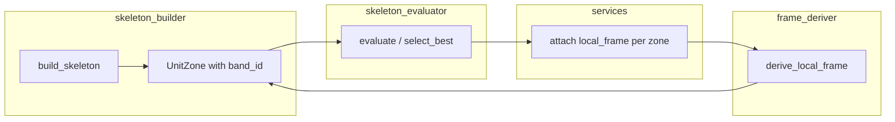

# Phase 1.5 — Spatial Contract Stabilization

## Scope

- **In scope:** `backend/floor_skeleton/`* only (new + modified files). New test file under `backend/architecture/tests/`.
- **Out of scope:** No changes to `development_strategy/`*, `presentation_engine/`*, `placement_engine/*`, `envelope_engine/*`. No Phase 2 (UnitComposer). No slab_metrics or scoring changes.
- **Contract:** Each `UnitZone` gains stable identity, repeat/depth axes, core- and corridor-facing edge segments, and explicit band origin/length/depth. Frame derivation uses **geometry only** (boundary intersection); no use of `placement_label` for edges.

---

## Data flow (high level)

---

## PART A — UnitLocalFrame abstraction

**New file:** [backend/floor_skeleton/unit_local_frame.py](backend/floor_skeleton/unit_local_frame.py)

- Define frozen dataclass `UnitLocalFrame` with:
  - `band_id: int`
  - `origin: tuple[float, float]` — **purely geometric**: min corner of zone bounds (deterministic). Not functional; Phase 2 must not assume semantic meaning (e.g. core-facing corner or repeat-start corner). Document in docstring.
  - `repeat_axis: tuple[float, float]` — normalized direction (1,0) or (0,1). **Axis vectors are aligned with footprint coordinate frame only; rotated footprints are not supported in Phase 1.5.** Document in docstring.
  - `depth_axis: tuple[float, float]` — perpendicular, normalized
  - `band_length_m: float`, `band_depth_m: float` — match strategy repeat/depth semantics
  - `core_facing_edge: tuple[tuple[float, float], tuple[float, float]] | None` — segment as (start, end), normalized (see PART D)
  - `corridor_facing_edge: tuple[tuple[float, float], tuple[float, float]] | None`
- Use `typing` for `tuple` if needed for Python 3.8 compatibility; codebase uses 3.10+ style elsewhere.
- No logic in this file; pure data.

---

## PART B — Extend UnitZone

**File:** [backend/floor_skeleton/models.py](backend/floor_skeleton/models.py)

- Add to `UnitZone` (after existing fields):
  - `band_id: int = 0` — default preserves existing callers that do not pass it.
  - `local_frame: UnitLocalFrame | None = None`
- Import `UnitLocalFrame` from `unit_local_frame` (or use `TYPE_CHECKING` if circular import risk; see below).
- **Backward compatibility:** All existing constructors `UnitZone(polygon=..., orientation_axis=..., zone_width_m=..., zone_depth_m=...)` remain valid; `band_id` and `local_frame` get defaults. [test_development_strategy.py](backend/architecture/tests/test_development_strategy.py) builds `UnitZone` without `band_id` — no change required there.
- Do **not** freeze `UnitZone`; `local_frame` is attached in-place in services after selection.
- **Read-only contract:** Once `local_frame` is attached, treat it as read-only. `UnitLocalFrame` is frozen; downstream must not mutate or replace `zone.local_frame`. Document in models and in plan.

---

## PART C — Band identity in skeleton_builder

**File:** [backend/floor_skeleton/skeleton_builder.py](backend/floor_skeleton/skeleton_builder.py)

- Assign `band_id` in **build order** at every `UnitZone(...)` call site (7 call sites total):
  - **END_CORE vertical (two zones):** left zone `band_id=0`, right zone `band_id=1`.
  - **END_CORE vertical (single zone):** `band_id=0`.
  - **SINGLE_LOADED:** one zone, `band_id=0`.
  - **DOUBLE_LOADED:** unit_a `band_id=0`, unit_b `band_id=1`.
  - **END_CORE horizontal:** one zone, `band_id=0`.
- Add `band_id` as the first keyword argument after existing args for clarity (e.g. `UnitZone(band_id=0, polygon=..., ...)`).
- Do **not** reorder `unit_zones`; only add the new field so that **`unit_zones[i].band_id == i`** for the returned list. Tests must assert this invariant.

---

## PART D — Frame derivation logic

**New file:** [backend/floor_skeleton/frame_deriver.py](backend/floor_skeleton/frame_deriver.py)

- **Function:** `derive_local_frame(skeleton: FloorSkeleton, zone: UnitZone) -> UnitLocalFrame`.
- **Repeat/depth axes (deterministic):**
  - If `zone.orientation_axis == AXIS_WIDTH_DOMINANT`: `repeat_axis = (1.0, 0.0)`, `depth_axis = (0.0, 1.0)`.
  - Else (DEPTH_DOMINANT): `repeat_axis = (0.0, 1.0)`, `depth_axis = (1.0, 0.0)`.
- **band_length_m / band_depth_m:** Same convention as strategy: for WIDTH_DOMINANT, repeat is along X so `band_length_m = zone.zone_width_m`, `band_depth_m = zone.zone_depth_m`; for DEPTH_DOMINANT, `band_length_m = zone.zone_depth_m`, `band_depth_m = zone.zone_width_m`.
- **Origin:** `minx, miny = zone.polygon.bounds[0], zone.polygon.bounds[1]`; `origin = (round(minx, 6), round(miny, 6))`. No use of `placement_label`. **Document:** origin is purely geometric (min corner); not functional.

- **Edge detection (strict, tolerance-aware):**
  - **Tolerance:** `tol = 1e-6`. Ignore any segment with length &lt; tol (filter zero-length and near-zero segments).
  - **Inputs:** Boundary intersection can return `LineString`, `MultiLineString`, or `GeometryCollection`. Extract all LineString segments; compute length for each; drop segments with length &lt; tol.
  - **Longest segment:** Among remaining segments, pick the one with largest length.
  - **Normalize segment direction:** Define (start, end) consistently so that the same physical edge always yields the same tuple order (e.g. lexicographic order by (x, y): if `(x1,y1) < (x2,y2)` then start=(x1,y1), end=(x2,y2); else start=(x2,y2), end=(x1,y1)). This guarantees stability across runs and floating-point variation.
  - **Round coordinates:** Both endpoints rounded to 6 decimal places.
  - **Core-facing edge:** Compute `zone.polygon.boundary.intersection(skeleton.core_polygon.boundary)`. If empty or no segment passes length &gt;= tol, `core_facing_edge = None`. Else apply the rules above (filter, longest, normalize, round).
  - **Corridor-facing edge:** Same algorithm with `skeleton.corridor_polygon`; if `skeleton.corridor_polygon is None`, return `None`.
- **Edge representation:** `tuple[tuple[float, float], tuple[float, float]]` = `((x1,y1), (x2,y2))` for the segment, with normalized ordering.
- **Robustness:** Guard against invalid/empty geometries (`.is_empty`, `.is_valid`); on any failure to get a valid segment, use `None` for that edge. Segment logic is geometry-based; zone shape is not assumed rectangular for edge extraction. **Axis vectors** are axis-aligned by construction (skeleton_builder produces axis-aligned zones); docstring must state rotated footprints are not supported in Phase 1.5.
- **Imports:** Use only `floor_skeleton.models` (UnitZone, FloorSkeleton, AXIS_*) and Shapely; avoid importing from `unit_local_frame` before defining it if needed to prevent cycles (typically `unit_local_frame` imports nothing from `frame_deriver`, so no cycle).

---

## PART E — Attach frames in services

**File:** [backend/floor_skeleton/services.py](backend/floor_skeleton/services.py)

- After `best = select_best(feasible)` and before `best.audit_log = audit_log` / `return best`:
  - Import `derive_local_frame` from `frame_deriver`.
  - For each `zone` in `best.unit_zones`: set `zone.local_frame = derive_local_frame(best, zone)`.
- Do **not** change evaluation, filtering, or selection logic. Do not run frame derivation for the NO_SKELETON sentinel (sentinel has `unit_zones=[]`).
- Ensure `derive_local_frame` is only called when `best` is a real skeleton (has non-empty `unit_zones`).

---

## PART F — Backward compatibility

- **skeleton_evaluator:** Uses `UnitZone.polygon`, `zone_width_m`, `zone_depth_m`, `orientation_axis` only; no reference to `band_id` or `local_frame`. No change.
- **slab_metrics:** Reads `skeleton.unit_zones` order and `uz.orientation_axis`, `uz.zone_width_m`, `uz.zone_depth_m` via getattr. New fields are ignored. No change to [development_strategy/slab_metrics.py](backend/development_strategy/slab_metrics.py).
- **Strategy / mixed strategy:** Consume SlabMetrics and skeleton.unit_zones order only; no change.
- **Presentation:** Uses `skeleton.unit_zones`, `uz.polygon`, `uz.zone_width_m`, `skeleton.placement_label` (room_splitter). No change to presentation code; `placement_label` remains for toilet placement; frame derivation does not replace that in this phase.
- **simulate_project_proposal / simulate_tp_batch:** Only call `generate_floor_skeleton`; no API change. Confirmation: run these commands after implementation and assert they complete successfully.

---

## PART G — Tests

**New file:** [backend/architecture/tests/test_unit_local_frame.py](backend/architecture/tests/test_unit_local_frame.py)

- **Fixtures:** Build minimal `FloorSkeleton` + `UnitZone` lists that match real patterns (use Shapely boxes and explicit core/corridor/unit geometry) so that:
  - **band_id equals list index:** For any skeleton returned by the builder or used in tests, assert `skeleton.unit_zones[i].band_id == i` for all i.
  - END_CORE vertical (1 band): one zone, core on one side; expect `repeat_axis == (0,1)`, origin = min corner of zone, `core_facing_edge` non-None (shared edge with core).
  - DOUBLE_LOADED: two zones, corridor between them; `band_id` 0 and 1; correct axes. **Edge detection matches geometry:** if zone shares boundary with core then `core_facing_edge` is set; if with corridor then `corridor_facing_edge` is set. Both may be non-None when a band touches both; no exclusivity invariant.
  - SINGLE_LOADED: one zone; corridor between core and zone; assert `corridor_facing_edge` present where zone touches corridor.
  - **Geometry-only contract:** Phase 1.5 exposes geometric adjacencies. It does not enforce semantic exclusivity. A band may touch both core and corridor; Phase 2 uses these edges for wet-wall vs entry semantics.
  - **Frame stability:** Build same skeleton twice, derive frames both times; assert `local_frame` values are identical (origin, axes, edge coordinates match). Tolerance-based edge detection and normalized segment ordering make this stable.
  - **No core case / robustness:** Either a sentinel skeleton with empty core or a zone that does not touch core; `derive_local_frame` must not crash and `core_facing_edge` should be `None`.
- Use `unittest` or `pytest` consistent with [architecture/tests](backend/architecture/tests). Do not modify existing test files.

---

## PART H — Safety and constraints

- **No polygon mutation:** Frame derivation only reads boundaries and computes intersections; no `.buffer` or in-place geometry change.
- **No recomputation of skeleton geometry:** Builder and evaluator unchanged; only post-hoc attachment of `local_frame`.
- **area_summary:** Unchanged; still filled by evaluator from existing logic.
- **Imports:** Keep `unit_local_frame` free of imports from `frame_deriver` or `services`; `frame_deriver` imports `unit_local_frame` and `models`; `models` can import `UnitLocalFrame` from `unit_local_frame` (no cycle). If `models` importing `UnitLocalFrame` causes a cycle (e.g. `unit_local_frame` imports `models`), use `TYPE_CHECKING` and string annotation for `local_frame: "UnitLocalFrame | None"` and avoid importing `UnitLocalFrame` in `models` at runtime if necessary; otherwise a simple import in models is sufficient since `unit_local_frame` does not import `models`.
- **Performance:** Single pass over zones and O(1) boundary intersection per zone; no heavy recomputation. If batch regression is observed, profile; target <5% regression.

---

## File summary

| Action       | Path                                                                                                                                   |
| ------------ | -------------------------------------------------------------------------------------------------------------------------------------- |
| **New**      | [backend/floor_skeleton/unit_local_frame.py](backend/floor_skeleton/unit_local_frame.py)                                               |
| **New**      | [backend/floor_skeleton/frame_deriver.py](backend/floor_skeleton/frame_deriver.py)                                                     |
| **New**      | [backend/architecture/tests/test_unit_local_frame.py](backend/architecture/tests/test_unit_local_frame.py)                             |
| **Modified** | [backend/floor_skeleton/models.py](backend/floor_skeleton/models.py) — add `band_id`, `local_frame` to UnitZone                        |
| **Modified** | [backend/floor_skeleton/skeleton_builder.py](backend/floor_skeleton/skeleton_builder.py) — pass `band_id` at all UnitZone() call sites |
| **Modified** | [backend/floor_skeleton/services.py](backend/floor_skeleton/services.py) — attach `local_frame` after select_best                      |

---

## How frame derivation avoids placement_label

- **Origin:** Defined as the minimum corner of `zone.polygon.bounds` (minx, miny). This is uniquely determined by geometry and does not depend on placement label.
- **Repeat/depth axes:** Taken from `zone.orientation_axis` (WIDTH_DOMINANT vs DEPTH_DOMINANT), which is already set by the builder from pattern/candidate geometry. No placement_label involved.
- **Core- and corridor-facing edges:** Obtained by `zone.polygon.boundary.intersection(skeleton.core_polygon.boundary)` (and same for corridor). The longest shared segment is chosen. This is purely geometric adjacency; placement_label is never read in frame_deriver.

Thus room_splitter can continue to use `placement_label` for toilet side; Phase 1.5 does not change that. Future phases can optionally switch to `zone.local_frame.core_facing_edge` if desired.

---

## What Phase 1.5 does NOT solve (and that is correct)

Phase 1.5 does **not**:

- Add façade tagging
- Add shaft abstraction
- Add wet wall logic
- Add stacking intelligence
- Change room_splitter
- Remove placement_label dependency in room_splitter

Do not mix these into Phase 1.5.

---

## Verification checklist (post-implementation)

1. Run `architecture/tests/test_unit_local_frame.py` — all new tests pass.
2. Run existing tests: `skeleton_evaluator` (if any), `test_development_strategy`, `test_mixed_strategy`, presentation tests — all pass without modification.
3. Run `simulate_project_proposal` for one plot (e.g. TP14 FP101) — completes successfully.
4. Run `simulate_tp_batch --tp 14 --height 16.5 ...` (with or without `--mixed-strategy`) — completes; no new failures.
5. Print: `"PHASE 1.5 COMPLETE — Spatial Contract Stabilized"` when done.

