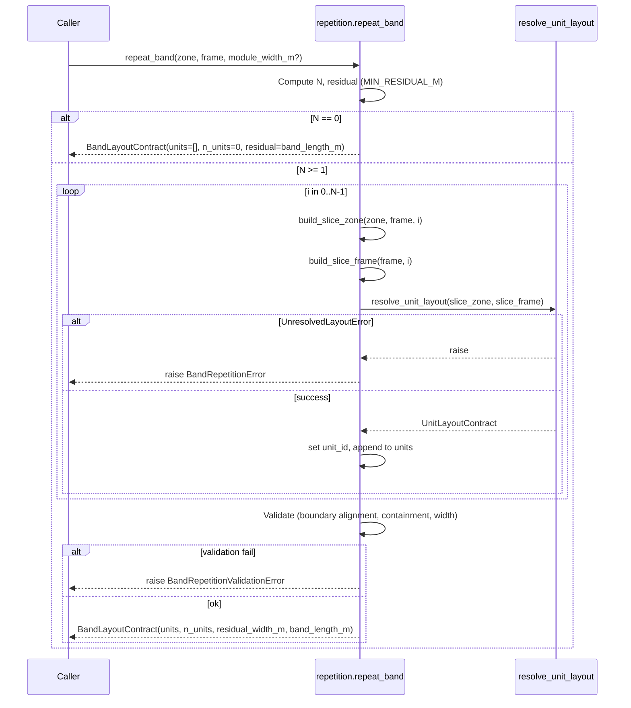

# Phase 3 — Band Repetition Engine: Architectural Design Plan

## 1. Objective of Phase 3

**Inputs (unchanged from Phase 2):**

- One **UnitZone** (polygon + zone_width_m, zone_depth_m, orientation_axis, band_id)
- One **ComposerFrame** for that zone (from [residential_layout/frames.py](backend/residential_layout/frames.py): origin, repeat_axis, depth_axis, band_length_m, band_depth_m, frontage_edge, wet_wall_line, corridor_edge, core_edge, band_id)
- Phase 2 API: **resolve_unit_layout(zone: UnitZone, frame: ComposerFrame) -> UnitLayoutContract** ([residential_layout/orchestrator.py](backend/residential_layout/orchestrator.py))

**Phase 3 must:**

1. Determine **N** = number of unit slices that fit in the band (deterministic, no search).
2. Slice the band along **band_axis** into N segments of width **module_width_m** (origin-aligned; residual at far end).
3. For each slice **i** (0 .. N-1): build **slice_zone** and **slice_frame** (translation-only from parent), call **resolve_unit_layout(slice_zone, slice_frame)**, collect **UnitLayoutContract** (with unit_id set).
4. Return **BandLayoutContract**: band_id, units (list of UnitLayoutContract), n_units, residual_width_m, band_length_m.
5. **No mutation** of the original zone or any skeleton; no reading of placement_label or skeleton internals.

---

## 2. Hard Decisions (Fixed — Do Not Change)


| Decision            | Rule                                                                                                                                                                                                                                                                                                                                                  |
| ------------------- | ----------------------------------------------------------------------------------------------------------------------------------------------------------------------------------------------------------------------------------------------------------------------------------------------------------------------------------------------------- |
| **Alignment**       | Units start at band coordinate 0; stack along band_axis; residual gap only at far end. No centering, no symmetry.                                                                                                                                                                                                                                     |
| **Residual**        | MIN_RESIDUAL_M (e.g. 0.4 m). N_raw = floor(band_length_m / module_width_m). **Option B:** If residual < MIN_RESIDUAL_M **and N_raw >= 2**, then N := N_raw - 1, recompute residual. If **N_raw == 1**, N = 1 always (residual rule does not apply). If N_raw == 0, band yields zero units. Never leave sub-threshold residual when stacking 2+ units. |
| **Mixed templates** | Allowed. Each slice calls resolve_unit_layout(slice_zone, slice_frame) independently; no band-level template choice.                                                                                                                                                                                                                                  |


---

## 3. Module Structure and Public API

**New module:** [backend/residential_layout/repetition.py](backend/residential_layout/repetition.py) (no new package; same `residential_layout`).

**Configuration (constants):**

- **MIN_RESIDUAL_M** (float, e.g. 0.4): minimum residual at band end when stacking 2+ units; if residual < this and N_raw >= 2, reduce N by 1 (Option B). Not applied when N_raw == 1.
- **DEFAULT_MODULE_WIDTH_M** (float): used only when caller passes None; 3.6 so any slice can fit STANDARD. **Phase 3 is not responsible for economic density decisions**—caller must pass module_width_m when density matters. **Future-proofing:** consider defining as `max(template.min_width_m for template in all_templates)` so the default tracks template changes; not required for current implementation. Fixed-width design; see Section 4.1.
- **MAX_UNITS_PER_BAND** (int, e.g. 64): hard cap on N. If computed N > this, set N = MAX_UNITS_PER_BAND. Prevents runaway when module_width_m is very small.

**Public API:**

- **repeat_band(zone: UnitZone, frame: ComposerFrame, module_width_m: float | None = None) -> BandLayoutContract**
  - Single entry point. Caller should pass explicit module_width_m when density matters; None is fallback only. Computes N, builds N slice zones and slice frames, calls resolve_unit_layout per slice, aggregates into BandLayoutContract. Raises on any slice UnresolvedLayoutError (abort-band policy).
- **BandLayoutContract** (dataclass): band_id, units: list[UnitLayoutContract], n_units: int, residual_width_m: float, band_length_m: float.

**Dependencies:** Phase 2 orchestrator (resolve_unit_layout), Phase 2 frames (ComposerFrame), floor_skeleton (UnitZone only). No dependency on strategy engine, skeleton builder, or placement.

---

## 4. Unit Count Determination (A)

### 4.1 Module width strategy (fixed-width; explicit)

**Design choice: fixed-width modules (Option A), not adaptive-width.**

- **Phase 3 uses a single module_width_m for every slice.** All slices have the same width. There is no per-slice or per-template width adjustment.
- **Implication:** Phase 3 uses **repetition width = worst-case width** (when defaulted): DEFAULT_MODULE_WIDTH_M = 3.6 m so that every slice can theoretically fit STANDARD. This is **conservative and density-limiting**: e.g. band_length_m = 10 m gives N = 2 and residual 2.8 m; slice 1 might resolve to STUDIO (needs 3.0 m) but still occupies 3.6 m, leaving **unused width inside the slice** (0.6 m). That internal waste is accepted.
- **Document explicitly:** Phase 3 uses fixed module width independent of per-slice resolution; unused width inside a slice is accepted. Do not later "optimize" by making slice width depend on resolved template—that would break determinism and require re-running resolution after width choice.
- **Alternative (not adopted):** Adaptive-width (Option B) would assign slice width after resolution (e.g. 3.6 for STANDARD, 3.0 for STUDIO). That would increase density but require iterative or search behaviour and is out of scope for this design.

**How module_width_m is chosen:**

- **Ownership:** **Caller** owns module width. Phase 3 treats it as a required numeric input. If None, Phase 3 uses DEFAULT_MODULE_WIDTH_M as a fallback for compatibility; Phase 3 does **not** own or optimize for density. Document this so Phase 4 / strategy can pass explicit width without coupling repetition to template assumptions.
- **Source:** Phase 3 takes **module_width_m** as an optional argument; caller is expected to pass an explicit value when density is a concern. If not provided, use **DEFAULT_MODULE_WIDTH_M** (currently 3.6; if templates change, this or its derivation must stay ≥ max of template min_width_m from [residential_layout/templates.py](backend/residential_layout/templates.py)—e.g. define default as `max(t.min_width_m for t in templates)` to future-proof).
- **Strategy engine:** If a future strategy layer exists, it may pass a different module_width_m (e.g. 3.0 for more units); Phase 3 does **not** read strategy. It treats module_width_m as a numeric input only.
- **Relationship:** N and slice width are fixed by module_width_m; template type per slice is decided by Phase 2 resolver only.

**Deterministic formula:**

```
module_width_m = input or DEFAULT_MODULE_WIDTH_M  # must be >= 3.6 for STANDARD-capable slices
N_raw = floor(band_length_m / module_width_m)
residual_raw = band_length_m - N_raw * module_width_m
if N_raw == 0:
    N = 0
    residual_width_m = band_length_m
elif residual_raw < MIN_RESIDUAL_M and N_raw >= 2:
    N = N_raw - 1
    residual_width_m = band_length_m - N * module_width_m   # >= MIN_RESIDUAL_M when N_raw>=2
else:
    N = N_raw
    residual_width_m = residual_raw
N = min(N, MAX_UNITS_PER_BAND)   # hard cap
residual_width_m = band_length_m - N * module_width_m   # recompute if N was capped
```

**N upper bound (hard cap):** After computing N, apply **MAX_UNITS_PER_BAND**. If N > MAX_UNITS_PER_BAND, set N = MAX_UNITS_PER_BAND and recompute residual_width_m. Prevents runaway when module_width_m is mis-set (e.g. 0.1 m). **Residual rule is applied before the hard cap; after the hard cap, residual is not re-evaluated against MIN_RESIDUAL_M** (avoids double-threshold logic). **Do not** re-apply MIN_RESIDUAL_M to residual_width_m after capping: if N was reduced by MAX_UNITS_PER_BAND, residual may exceed MIN_RESIDUAL_M significantly and is left as-is. This avoids double application of the threshold.

**Edge cases:** band_length_m < module_width_m => N = 0. **N_raw == 1:** N = 1 regardless of residual (Option B). residual exactly MIN_RESIDUAL_M => no reduction when N_raw >= 2. Use a small tolerance (e.g. 1e-6) when comparing residual to MIN_RESIDUAL_M to avoid float noise.

---

## 5. Slice Geometry and Slice Frame (B)

**Slice i (0-indexed):**

- **Band extent:** [slice_start, slice_end] with slice_start = i * module_width_m, slice_end = slice_start + module_width_m (in band-axis units).
- **Slice zone polygon:** In parent (band, depth) local coords: rectangle [slice_start, slice_end] x [0, band_depth_m]. Convert to world using parent origin and axes:  
  - corners (band, depth): (slice_start, 0), (slice_end, 0), (slice_end, band_depth_m), (slice_start, band_depth_m).  
  - world = origin + band * repeat_axis + depth * depth_axis.  
  - Build Shapely Polygon from these four world points.
- **Slice UnitZone:** New UnitZone(polygon=slice_polygon, orientation_axis=parent zone’s orientation_axis, zone_width_m=module_width_m, zone_depth_m=band_depth_m, band_id=parent zone.band_id). Do **not** attach local_frame; Phase 3 does not use it.

**Slice frame (ComposerFrame) — translation-only from parent:**

- **origin_slice** = parent_origin + slice_start * repeat_axis (world coords).
- **repeat_axis, depth_axis:** unchanged (same vectors).
- **band_length_m** = module_width_m; **band_depth_m** = parent band_depth_m (unchanged).
- **band_id:** same as parent.
- **wet_wall_line:** Axis-aligned line at depth=0 in slice local. In slice local, depth=0 is at slice origin. So in world: line through origin_slice along repeat_axis. So: if band_axis == "X", wet_wall_line = ("y", origin_slice[1]); else ("x", origin_slice[0]).
- **frontage_edge:** Segment of zone at depth = band_depth_m between slice_start and slice_end. World: from (origin + slice_start*R + band_depth_m*D) to (origin + slice_end*R + band_depth_m*D). Store as tuple of two (x,y) points.
- **core_edge:** Segment at depth=0 for slice: (origin + slice_start*R) to (origin + slice_end*R).
- **corridor_edge:** Clip in **band-axis scalar space** only; do not clip in world space with float comparison (tolerance bugs). Procedure: (1) Parent corridor_edge is a world segment (p0, p1). (2) Project both endpoints onto the band axis: band coordinate = dot(point - parent_origin, repeat_axis) — i.e. scalar parameter along repeat_axis. Call these b0, b1; order so b0 <= b1. (3) Intersect the 1D interval [b0, b1] with [slice_start, slice_end]. Clipped interval [c0, c1] = [max(b0, slice_start), min(b1, slice_end)]. If c0 >= c1 (within tolerance), slice has no corridor edge: corridor_edge = None. (4) Convert back to world: the corridor edge lies at constant depth (one side of the zone). Compute depth of the parent corridor edge: e.g. depth_c = dot(p0 - parent_origin, depth_axis). Then slice corridor_edge world points = (parent_origin + c0*repeat_axis + depth_c*depth_axis, parent_origin + c1*repeat_axis + depth_c*depth_axis). Use the same depth for both endpoints. Result: deterministic, tolerance-safe clip.

**Implementation note:** Phase 3 does **not** call derive_unit_local_frame(skeleton, ...) for slices; it has no skeleton for a slice. It must construct ComposerFrame from the parent ComposerFrame + (slice_start, slice_end, module_width_m) using only geometry and translation. The internal UnitLocalFrame inside ComposerFrame can be built from the same axes and slice origin/dimensions (band_length_m = module_width_m, band_depth_m unchanged).

**No recomputation from skeleton; no placement_label.**

---

## 6. Composition Loop and Failure Policy (C)

**Loop:**

```
units = []
for i in range(N):
    slice_zone = build_slice_zone(zone, frame, i, module_width_m)
    slice_frame = build_slice_frame(frame, i, module_width_m)
    try:
        contract = resolve_unit_layout(slice_zone, slice_frame)
        contract.unit_id = f"{band_id}_{i}"   # or caller-defined scheme
        units.append(contract)
    except UnresolvedLayoutError:
        # Abort entire band
        raise BandRepetitionError(...)  # or re-raise with context
```

**Failure policy (deterministic):** If any slice raises **UnresolvedLayoutError**, **abort the entire band**: do not return partial results, do not skip the slice. Phase 3 raises a single exception (e.g. **BandRepetitionError** wrapping the UnresolvedLayoutError and band_id/slice_index). Caller decides whether to treat the band as zero units or to retry with different inputs. **Deliberate rigidity:** no partial BandLayoutContract (e.g. 4 good units and 1 failed) is ever returned; all-or-nothing keeps the engine simple and consistent with Phase 2’s compiler philosophy—alternative policies (e.g. return successful slices) are out of scope.

**Optional logging:** Log each slice resolution (band_id, slice_index, resolved_template_name from contract) for analytics. Do not log inside Phase 2; Phase 3 may log after each resolve_unit_layout return.

---

## 7. Output Contract (D)

**BandLayoutContract:**

```python
@dataclass
class BandLayoutContract:
    band_id: int
    units: list[UnitLayoutContract]   # length n_units
    n_units: int
    residual_width_m: float
    band_length_m: float
```

- **units[i].unit_id** set by Phase 3 (e.g. f"{band_id}_{i}"). Callers may prefix with FP or global zone index upstream; Phase 3 does not know about FP or skeleton.
- No geometry merging; each unit’s rooms and entry_door_segment remain in slice-local world coords (same frame as the slice zone).
- **residual_width_m** is the gap at the far end of the band (band_length_m - N * module_width_m).

---

## 8. Validation Invariants (E)

**Overlap is guaranteed by construction; do not use O(N²) geometry intersection.**

Each slice occupies [slice_start_i, slice_end_i] with slice_end_i = slice_start_{i+1}. Units are strictly inside their slice zone. So **cross-slice overlap cannot occur** unless slice geometry is wrong. Validation must not do pairwise room-polygon intersection (that would be O(N² × rooms²) and is unnecessary).

**Structural invariants (O(N)):**

1. **Slice boundary alignment:** For i in 0 .. N-2: slice_start_{i+1} == slice_end_i within tolerance (e.g. 1e-6). So slice_end_i = (i+1)*module_width_m and slice_start_{i+1} = (i+1)*module_width_m; check that consecutive slice boundaries coincide. This ensures no gap and no overlap between slice extents.
2. **Slice zones disjoint:** By construction, slice polygons use intervals [i*module_width_m, (i+1)*module_width_m]; they are adjacent and non-overlapping. Optionally assert that slice_zone[i].polygon.intersection(slice_zone[j].polygon).area < tol for i != j (O(N²) on slice polygons only, not rooms); or omit if boundary alignment is trusted.
3. **Containment:** Every room of every unit is inside its **slice** zone (Phase 2 guarantees this). Optionally verify every slice zone is inside the **parent** zone polygon (buffer tolerance 1e-6).
4. **Width accounting:** | (n_units * module_width_m + residual_width_m) - band_length_m | <= tolerance (1e-6).

**Not re-validated here:** Wet-wall and entry-door placement (Phase 2 already did per slice). No pairwise room intersection across slices.

On any failure, raise **BandRepetitionValidationError** with a clear reason; do not return the contract.

---

## 9. Edge Cases — Explicit Handling


| Case                                                     | Handling                                                                                                                                                                             |
| -------------------------------------------------------- | ------------------------------------------------------------------------------------------------------------------------------------------------------------------------------------ |
| **band_length_m < module_width_m**                       | N = 0; residual_width_m = band_length_m; return BandLayoutContract(band_id, [], 0, band_length_m, band_length_m). No call to Phase 2.                                                |
| **band_length_m just above module_width_m (N_raw == 1)** | N = 1 regardless of residual (Option B). Single unit kept.                                                                                                                           |
| **residual exactly MIN_RESIDUAL_M**                      | Compare with tolerance (e.g. residual >= MIN_RESIDUAL_M - 1e-6) to avoid float; do not reduce N.                                                                                     |
| **Floating-point accumulation**                          | Use slice_start = i * module_width_m and slice_end = slice_start + module_width_m; do not accumulate slice_start += module_width_m.                                                  |
| **Very large band (10+ units)**                          | O(N) loop. **Hard cap:** N is capped at MAX_UNITS_PER_BAND (e.g. 64). If computed N > 64, set N = 64 to avoid runaway (e.g. if module_width_m is mis-set to 0.1). Required constant. |
| **Different templates per slice**                        | No special handling; each resolve_unit_layout returns possibly different resolved_template_name.                                                                                     |
| **N == 0 after residual reduction**                      | Return BandLayoutContract with units=[], n_units=0, residual_width_m = band_length_m.                                                                                                |


---

## 10. Performance and Forbidden List

**Performance:** O(N) per band; no recursion; no geometry union; no search or optimization loops.

**Explicitly forbidden:** Centering units; stretching rooms or adjusting template dimensions; re-running strategy inside repetition; AI or combinatorial search; mutating parent zone; modifying Phase 2 logic or templates; reading skeleton internals or placement_label.

---

## 11. Failure and Logging Policy

- **BandRepetitionError:** Raised when any slice raises UnresolvedLayoutError. Message includes band_id, slice_index, and the underlying failure_reasons (or summary). No partial BandLayoutContract.
- **BandRepetitionValidationError:** Raised when post-loop validation fails (slice boundary alignment, containment, or width accounting). Message includes reason (e.g. "slice boundary misalignment at i").
- **Logging:** Optional structured log per band: band_id, n_units, residual_width_m, list of (slice_index, resolved_template_name). No logging inside Phase 2 from Phase 3.

---

## 12. Sequence Diagram




---

## 13. Test Matrix (Phase 3)


| #   | Scenario                                                             | Expected                                                                   |
| --- | -------------------------------------------------------------------- | -------------------------------------------------------------------------- |
| 1   | Narrow band: band_length_m < module_width_m                          | N = 0, units = [], residual = band_length_m                                |
| 2   | Exact fit: band_length_m = K * module_width_m                        | N = K, residual = 0                                                        |
| 3   | Residual below threshold: residual_raw < MIN_RESIDUAL_M (N_raw >= 2) | N = N_raw - 1, residual >= MIN_RESIDUAL_M; if N_raw == 1, N = 1 (Option B) |
| 4   | Mixed templates per slice                                            | All units returned; units[i].resolved_template_name may differ             |
| 5   | One slice unresolved                                                 | BandRepetitionError; no BandLayoutContract returned                        |
| 6   | Double-loaded slab, one band                                         | repeat_band(zone, frame) yields N units, all valid                         |
| 7   | Single-loaded slab, one band                                         | Same                                                                       |
| 8   | Large band (e.g. band_length_m for 6+ units)                         | N >= 6, validation passes, no overlap                                      |
| 9   | Residual exactly at threshold                                        | N unchanged, residual_width_m >= MIN_RESIDUAL_M (tolerance)                |
| 10  | N = 1                                                                | One unit, residual = band_length_m - module_width_m                        |


---

## 14. Deliverables Summary

- **Module:** [backend/residential_layout/repetition.py](backend/residential_layout/repetition.py) with repeat_band, BandLayoutContract, BandRepetitionError, BandRepetitionValidationError; slice construction and frame translation helpers (internal).
- **Config:** MIN_RESIDUAL_M, DEFAULT_MODULE_WIDTH_M (or read from a small config module).
- **Sequence:** As in diagram above.
- **Failure:** Abort band on first UnresolvedLayoutError; validation exception on invariant failure.
- **Tests:** Cover all 10 test-matrix rows plus optional regression with real TP14 band (one zone, repeated).

Phase 2 remains a black box: only **resolve_unit_layout(zone, frame)** and the types UnitZone, ComposerFrame, UnitLayoutContract are used. If Phase 2 changes (e.g. new template or new reason_code), Phase 3 does not require change unless the contract signature or semantics change.

---

## 15. System-level milestone

Together, **Phase 2** (deterministic unit compiler: resolve_unit_layout) and **Phase 3** (deterministic repetition engine: repeat_band) form a **deterministic floor layout compiler per band**. This crosses from "geometry experiment" into "architectural engine": one band zone + one ComposerFrame in → N unit layouts out, with no search and no skeleton coupling in the layout step.