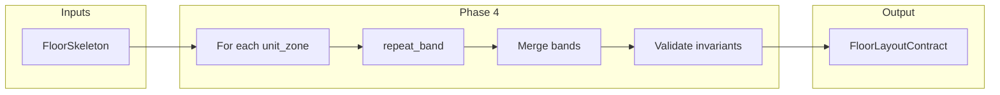
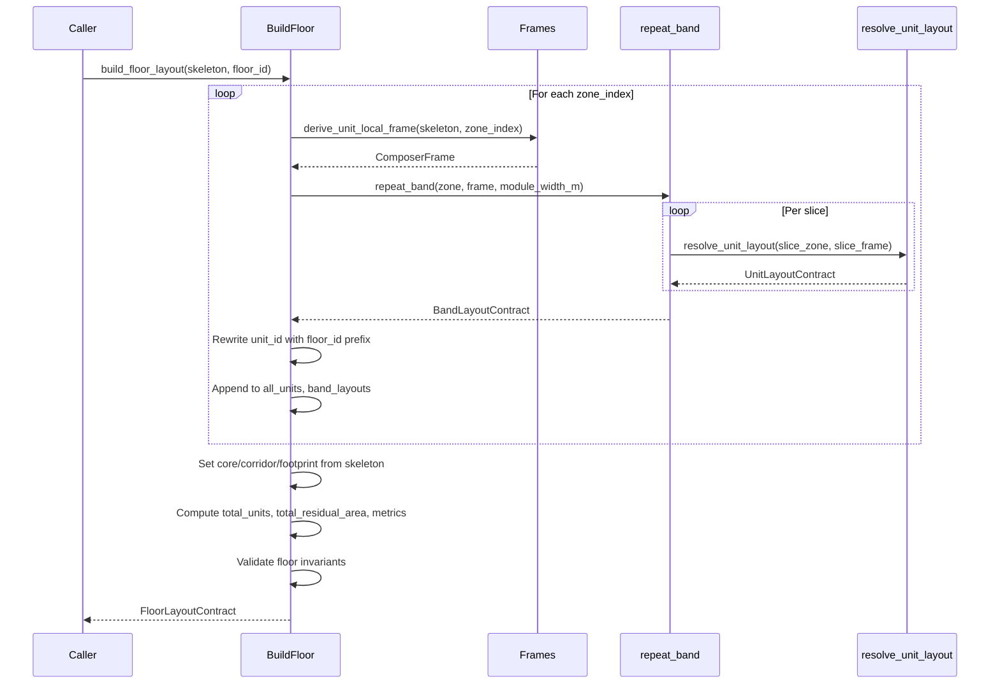

# Phase 4 — Floor Aggregation Engine: Architectural Plan

## 1. High-Level Architecture

Phase 4 is a **single-purpose aggregation layer** between skeleton (Phase 1) + band repetition (Phase 3) and future floor stacking (Phase 5). It does not replace or mutate Phase 2 or Phase 3.




**Data flow:**

- **Input:** One `FloorSkeleton` (with `unit_zones`, `footprint_polygon`, `core_polygon`, `corridor_polygon`).
- **Per band:** `zone = skeleton.unit_zones[zone_index]`, `frame = derive_unit_local_frame(skeleton, zone_index)`, `band_contract = repeat_band(zone, frame, module_width_m)`.
- **Output:** One `FloorLayoutContract` containing all band contracts, merged unit list, floor polygons, and floor-level metrics.

**Design principles:** Deterministic; layered (no strategy, no template choice); geometry-safe (no skeleton mutation); O(total_units); no combinatorial search.

---

## 2. FloorLayoutContract Definition

**Module:** New dataclass in [backend/residential_layout/floor_aggregation.py](backend/residential_layout/floor_aggregation.py) (or in a shared [backend/residential_layout/models.py](backend/residential_layout/models.py) if preferred for contract visibility).

```python
@dataclass
class FloorLayoutContract:
    floor_id: str
    band_layouts: list[BandLayoutContract]
    all_units: list[UnitLayoutContract]
    core_polygon: Polygon
    corridor_polygon: Optional[Polygon]   # None for END_CORE
    footprint_polygon: Polygon
    total_units: int
    total_residual_area: float
```

**Clarifications:**


| Question                               | Decision                                                                                                                                                                                                                                                              |
| -------------------------------------- | --------------------------------------------------------------------------------------------------------------------------------------------------------------------------------------------------------------------------------------------------------------------- |
| **Unit polygons: separate or merged?** | **Separate.** Each item in `all_units` is one `UnitLayoutContract` (one per slice). No union of room polygons across units.                                                                                                                                           |
| **Room geometries**                    | **Slice-local.** Phase 2/3 output room polygons in the slice’s local frame. Phase 4 does not transform or merge them; they remain per-unit, slice-local.                                                                                                              |
| **Unit ID format**                     | **Prefix with floor_id:** `unit_id = f"{floor_id}_{band_id}_{slice_index}"`. Phase 3 currently sets `unit_id = f"{band_id}_{i}"`; Phase 4 rewrites when building `all_units` so that IDs are globally unique across floors (e.g. `"L0_0_0"`, `"L0_0_1"`, `"L0_1_0"`). |
| **Residual storage**                   | **No residual geometry polygons.** Store only `total_residual_area` (sum over bands of `residual_width_m * band_depth_m`). Per-band residual width is already in `BandLayoutContract.residual_width_m`; no need for polygon representation.                           |
| **band_index on units**                | **Implicit.** Do not add a `band_index` field to `UnitLayoutContract`. Band is encoded in `unit_id` (`floor_id_band_id_slice_index`). Callers can parse or keep a parallel list; Phase 4 keeps the contract minimal.                                                  |
| **corridor_polygon type**              | **Optional[Polygon].** Match `FloorSkeleton.corridor_polygon`: `None` for END_CORE. Avoids inventing an “empty” polygon and keeps contract aligned with skeleton.                                                                                                     |


**Rationale for Optional corridor:** [backend/floor_skeleton/models.py](backend/floor_skeleton/models.py) defines `corridor_polygon: Optional[Polygon]`; END_CORE has no corridor. FloorLayoutContract should mirror that.

---

## 3. Design Questions — Answered


| #   | Question                                          | Answer                                                                                                                                                                                                                                                                                 |
| --- | ------------------------------------------------- | -------------------------------------------------------------------------------------------------------------------------------------------------------------------------------------------------------------------------------------------------------------------------------------- |
| 1   | **Is FloorSkeleton sufficient for aggregation?**  | **Yes.** It provides `unit_zones`, `footprint_polygon`, `core_polygon`, `corridor_polygon`, and (via `derive_unit_local_frame(skeleton, zone_index)`) everything needed to call `repeat_band(zone, frame)`. No extra fields required.                                                  |
| 2   | **Are zones guaranteed non-overlapping?**         | **Yes.** Skeleton builder produces axis-aligned, boundary-meeting zones (no overlap). DOUBLE_LOADED = two zones (unit_a, unit_b); SINGLE_LOADED / END_CORE = one or two zones. Documented in [backend/floor_skeleton/skeleton_builder.py](backend/floor_skeleton/skeleton_builder.py). |
| 3   | **How should floor_id be defined?**               | **Caller-provided.** Signature: `build_floor_layout(skeleton: FloorSkeleton, floor_id: str = "", module_width_m: float                                                                                                                                                                 |
| 4   | **Should we store residual geometry polygons?**   | **No.** Only scalar residual: `total_residual_area` and per-band `BandLayoutContract.residual_width_m`. Reduces complexity and avoids O(bands) polygon construction.                                                                                                                   |
| 5   | **Should we attach band_index to units?**         | **No.** Unit identity is `unit_id == f"{floor_id}_{band_id}_{slice_index}"`. Band index = `band_id` (same as zone index). No new field on UnitLayoutContract.                                                                                                                          |
| 6   | **Should validation run after full aggregation?** | **Yes.** Run floor-level validation once all bands have been aggregated and `FloorLayoutContract` is built. This allows checks that need full context (e.g. total_units, footprint containment, no cross-band overlap).                                                                |


---

## 4. Aggregation Logic — Step-by-Step Algorithm

**Public API:**

```text
build_floor_layout(
    skeleton: FloorSkeleton,
    floor_id: str = "",
    module_width_m: float | None = None,
) -> FloorLayoutContract
```

**Deterministic algorithm:**

1. **Initialize**
  - `module_width_m = module_width_m or DEFAULT_MODULE_WIDTH_M` (from Phase 3 constant).
  - `band_layouts: list[BandLayoutContract] = []`
  - `all_units: list[UnitLayoutContract] = []`
2. **Skeleton assertions (mandatory, before any band work)**
  - **Band-overlap:** For all pairs `(i, j)` with `i < j`, assert `skeleton.unit_zones[i].polygon.intersection(skeleton.unit_zones[j].polygon).area <= tol`. On failure: raise `FloorAggregationValidationError(reason="band_overlap")`.
  - **Band inside footprint:** For each `zone` in `skeleton.unit_zones`, assert `zone.polygon` is contained in `skeleton.footprint_polygon`. On failure: raise `FloorAggregationValidationError(reason="band_not_in_footprint")`.
  - Very cheap (O(B²) + O(B)); very safe. Do not skip.
3. **Iterate bands (strict order)**
  - For `zone_index` in `range(len(skeleton.unit_zones))`:
    - `zone = skeleton.unit_zones[zone_index]`
    - `frame = derive_unit_local_frame(skeleton, zone_index)`
    - Call `band_contract = repeat_band(zone, frame, module_width_m)`.
    - On **BandRepetitionError**: apply failure policy (see Section 6).
    - Append `band_contract` to `band_layouts`.
    - For each `unit` in `band_contract.units`: set `unit.unit_id = f"{floor_id}_{band_contract.band_id}_{slice_i}"` (slice_i = index in `band_contract.units`), then append to `all_units`.
4. **Geometry (no recomputation)**
  - `core_polygon = skeleton.core_polygon`
  - `corridor_polygon = skeleton.corridor_polygon`
  - `footprint_polygon = skeleton.footprint_polygon`
5. **Totals**
  - `total_units = len(all_units)`
  - `total_residual_area = sum(b.residual_width_m * (frame for that band’s depth) for b in band_layouts)`. Band depth for band `i` is `derive_unit_local_frame(skeleton, i).band_depth_m` (or from `band_layouts[i].units[0]` slice if n_units > 0; if n_units == 0, use zone from `skeleton.unit_zones[i].zone_depth_m`).
   **Formula for total_residual_area:**  
   `total_residual_area = sum(b.residual_width_m * band_depth_m(b) for b in band_layouts)`, where `band_depth_m(b)` is the depth of that band (from frame at zone_index = b.band_id). So: when building the list, we have the frame per band; store depth once per band or compute from `skeleton.unit_zones[b.band_id].zone_depth_m` (same value). So: `total_residual_area = sum(b.residual_width_m * skeleton.unit_zones[b.band_id].zone_depth_m for b in band_layouts)`.
6. **Build contract**
  - Construct `FloorLayoutContract(floor_id=..., band_layouts=..., all_units=..., core_polygon=..., corridor_polygon=..., footprint_polygon=..., total_units=..., total_residual_area=...)`.
7. **Validation (after aggregation)**
  - Run floor-level validation (Section 7). On failure: raise a dedicated exception (e.g. `FloorAggregationValidationError`); do not return a partial contract.

**Failure policy:** See Section 6 (abort entire floor on first band failure).

**Logging rules:** Log at start (skeleton pattern, number of zones), per band (band_id, n_units, residual_width_m), and on success (total_units, total_residual_area). On BandRepetitionError, log band_id and slice_index before re-raising.

**Validation rules:** See Section 7.

---

## 5. Double-Loaded Considerations

**Finding:** DOUBLE_LOADED is already represented as **two** UnitZones in the skeleton ([backend/floor_skeleton/skeleton_builder.py](backend/floor_skeleton/skeleton_builder.py) lines 234–248: `unit_a` band_id=0, `unit_b` band_id=1). Zones are positioned by the skeleton builder; they are non-overlapping, adjacent rectangles (unit_a, corridor strip, unit_b).

**Implications for Phase 4:**

- **No mirroring.** Phase 4 does not mirror one side. Each zone is processed independently: `derive_unit_local_frame(skeleton, 0)` and `derive_unit_local_frame(skeleton, 1)` produce correct frames for each band; `repeat_band` runs once per zone.
- **No symmetry logic.** Repetition does not need to enforce symmetry; the skeleton already defines two separate bands. Phase 4 simply runs Phase 3 twice (once per zone).
- **Unit IDs.** Units get IDs like `"L0_0_0"`, `"L0_0_1"` (first band) and `"L0_1_0"`, `"L0_1_1"` (second band). No special case for DOUBLE_LOADED.

**Document explicitly:** Phase 4 assumes the skeleton builder has already positioned all unit zones (including both sides of DOUBLE_LOADED). Phase 4 only aggregates; it does not duplicate or mirror geometry.

---

## 6. Failure Policy

**Decision: (A) Abort entire floor if any band fails.**

**Reasoning:**

- **Consistency with Phase 3.** Phase 3 aborts the whole band on first slice failure (no partial BandLayoutContract). Phase 4 mirrors that at floor level: one failed band implies no FloorLayoutContract.
- **Determinism and predictability.** A floor is either fully laid out or not; no “partial floor” with missing bands, which would complicate downstream (e.g. Phase 5, export, metrics).
- **Simplicity.** No need to define semantics for “which bands are valid,” no masking of band_layouts or all_units.
- **Contract integrity.** `FloorLayoutContract` promises “all bands for this floor”; partial results would break that promise.

**Mechanism:** On `BandRepetitionError` from `repeat_band`, do not catch and skip; re-raise (or wrap in `FloorAggregationError` with band_id/slice_index and cause) and do not return. Caller (strategy or Phase 5) may retry with another skeleton or different parameters.

**Partial bands:** Phase 4 must **not** return a floor with failed bands skipped. All-or-nothing only.

---

## 7. Geometry Validation — Floor-Level Invariants

Run **after** full aggregation, before returning. Use small tolerance (e.g. 1e-6) for float comparisons.

### 7a. Mandatory skeleton assertions (do not trust without check)

**Structural risk:** Relying on the skeleton without verification will bite future maintainers. Phase 4 must **not** assume the builder never regresses or that callers never pass a malformed skeleton. Two explicit, cheap checks run **before** the band loop (fail fast).


| Assertion                 | What to check                                                                                                                                                                                                                                                   | Cost                                         |
| ------------------------- | --------------------------------------------------------------------------------------------------------------------------------------------------------------------------------------------------------------------------------------------------------------- | -------------------------------------------- |
| **Band-overlap**          | For every pair of unit zones `(i, j)` with `i < j`: `skeleton.unit_zones[i].polygon.intersection(skeleton.unit_zones[j].polygon).area <= tol`. If any pair has intersection area > tol, raise `FloorAggregationValidationError` (e.g. reason `"band_overlap"`). | O(B²); B is 1 or 2 in practice — very cheap. |
| **Band inside footprint** | For every unit zone: `zone.polygon` contained in `skeleton.footprint_polygon` (e.g. `footprint.contains(zone.polygon)` with tolerance). If any zone is not contained, raise `FloorAggregationValidationError` (e.g. reason `"band_not_in_footprint"`).          | O(B) — very cheap.                           |


**When to run:** At the very start of `build_floor_layout`, after resolving `module_width_m` and before the loop over `zone_index` (algorithm step 2). No band is processed until both assertions pass. Very safe; future you will thank present you.


| Invariant                         | Check                                                                                                                                                                                                                                                                                                                                                                                                                                                                                         | Cost                                 |
| --------------------------------- | --------------------------------------------------------------------------------------------------------------------------------------------------------------------------------------------------------------------------------------------------------------------------------------------------------------------------------------------------------------------------------------------------------------------------------------------------------------------------------------------- | ------------------------------------ |
| **No unit overlap across bands**  | Asserted at band level in 7a (band-overlap). Phase 3 slice-disjointness holds per band. No extra unit-level overlap check. | Covered by 7a. |
| **Units inside footprint**        | Asserted at band level in 7a (band inside footprint). Slices are inside their band, so transitivity holds. | Covered by 7a.   |
| **Core does not intersect units** | Core polygon does not intersect any unit slice polygon. Skeleton guarantees core and unit_zones are disjoint; slices are inside unit zones. Transitive guarantee. Optional: explicit intersection test with slice zones.                                                                                                                                                                                                                                                                      | O(1) transitive; O(N) if explicit.   |
| **Corridor alignment**            | No new check at floor level; Phase 3 already clips corridor per slice. Floor just passes through corridor_polygon.                                                                                                                                                                                                                                                                                                                                                                            | O(1).                                |
| **Total area check**              | `unit_area_sum + core_area + corridor_area <= footprint_area + tol`. Areas from skeleton (core, corridor, footprint) and from sum of unit zone areas or from band_layouts (sum of slice areas). Slice area = module_width_m * band_depth_m * n_units per band; unit_area_sum = sum over bands of (n_units * module_width_m * band_depth_m).                                                                                                                                                   | O(B).                                |
| **total_units consistency**       | `total_units == sum(b.n_units for b in band_layouts) == len(all_units)`.                                                                                                                                                                                                                                                                                                                                                                                                                      | O(B).                                |


**Recommendation:** The two **mandatory** skeleton assertions (7a) give explicit band-overlap and band-in-footprint guarantees; do not rely on trust. For the rest: implement `total_units` consistency and optional `total_residual_area` / total area check. Core-disjointness remains transitive (skeleton + Phase 3). Avoid O(N²) pairwise unit intersection unless a later requirement demands it.

---

## 8. Metrics To Compute

All at floor level, stored or derivable from `FloorLayoutContract`:


| Metric                     | Formula                                                                                                                                                                                                                                                                                                                                                           |
| -------------------------- | ----------------------------------------------------------------------------------------------------------------------------------------------------------------------------------------------------------------------------------------------------------------------------------------------------------------------------------------------------------------- |
| **total_units**            | `len(all_units)` or `sum(b.n_units for b in band_layouts)`.                                                                                                                                                                                                                                                                                                       |
| **average_unit_area**      | `unit_area_sum / total_units` if total_units > 0, else 0.                                                                                                                                                                                                                                                                                                         |
| **unit_area_sum**          | Sum of unit (slice) areas: `sum(n_units(b) * module_width_m * band_depth_m(b) for b in band_layouts)`. Equivalently, sum of `unit.polygon.area` if we had unit polygons in world; but room polygons are slice-local. So use slice formula: `unit_area_sum = sum(b.n_units * module_width_m * skeleton.unit_zones[b.band_id].zone_depth_m for b in band_layouts)`. |
| **total_residual_width**   | Sum of residual widths: `sum(b.residual_width_m for b in band_layouts)`. (Optional; total_residual_area is already in contract.)                                                                                                                                                                                                                                  |
| **total_residual_area**    | `sum(b.residual_width_m * skeleton.unit_zones[b.band_id].zone_depth_m for b in band_layouts)`.                                                                                                                                                                                                                                                                    |
| **corridor_area**          | `skeleton.corridor_polygon.area if skeleton.corridor_polygon else 0.0`.                                                                                                                                                                                                                                                                                           |
| **efficiency_ratio_floor** | `unit_area_sum / footprint_polygon.area` if footprint area > 0, else 0.                                                                                                                                                                                                                                                                                           |


**Where to store:** `total_units` and `total_residual_area` are already in the contract. The rest can be computed in a small helper or added as optional fields on `FloorLayoutContract` (e.g. `unit_area_sum`, `average_unit_area`, `corridor_area`, `efficiency_ratio_floor`) so downstream does not recompute. Plan: add **unit_area_sum**, **average_unit_area**, **corridor_area**, **efficiency_ratio_floor** to the dataclass for completeness; **total_residual_width** can be derived from band_layouts if needed.

**Updated FloorLayoutContract fields (metrics):**

- `total_units: int`
- `total_residual_area: float`
- `unit_area_sum: float`
- `average_unit_area: float`
- `corridor_area: float`
- `efficiency_ratio_floor: float`

---

## 9. Module Structure

**New file:** [backend/residential_layout/floor_aggregation.py](backend/residential_layout/floor_aggregation.py)

**Contents:**

- `FloorLayoutContract` dataclass (or import from models if centralized).
- `build_floor_layout(skeleton: FloorSkeleton, floor_id: str = "", module_width_m: float | None = None) -> FloorLayoutContract`.
- Optional: `_validate_floor(contract: FloorLayoutContract, skeleton: FloorSkeleton, ...)` for invariants (can be internal or public for tests).
- Exception: `FloorAggregationError` (wraps BandRepetitionError) and optionally `FloorAggregationValidationError`.

**Dependencies:**

- `repeat_band`, `BandLayoutContract` from [backend/residential_layout/repetition.py](backend/residential_layout/repetition.py).
- `derive_unit_local_frame` from [backend/residential_layout/frames.py](backend/residential_layout/frames.py).
- `FloorSkeleton`, `UnitZone` from [backend/floor_skeleton/models.py](backend/floor_skeleton/models.py).
- `UnitLayoutContract` from [backend/residential_layout/models.py](backend/residential_layout/models.py).
- `DEFAULT_MODULE_WIDTH_M` from repetition (or pass through).

**No dependency on:** strategy engine, skeleton builder, placement_label, template selection, or Phase 5.

**Public API surface:** `build_floor_layout`, `FloorLayoutContract`, and exceptions. Export via [backend/residential_layout/**init**.py](backend/residential_layout/__init__.py).

---

## 10. Performance Constraints

- **Time:** O(total_units) — one `repeat_band` per band (each O(n_units) for that band), then one pass to merge units and rewrite unit_id. No recursion, no search.
- **Space:** O(total_units) for `all_units` and band_layouts; polygons are references to skeleton (no copy) plus Phase 3 outputs.
- **No** union of all room polygons; no O(N^2) pairwise geometry unless an explicit validation option is added later.

---

## 11. What Phase 4 Must NOT Do

- No unit optimization, density tuning, or cost modelling.
- No strategy decisions or template selection (Phase 2/orchestrator only).
- No template or width changes; `module_width_m` is an input.
- No AI.
- No skeleton mutation; read-only use of FloorSkeleton.
- No use of `placement_label` for logic.
- No floor stacking (that is Phase 5).
- No geometry recomputation of core/corridor/footprint (use skeleton’s polygons by reference).

---

## 12. Test Matrix for Phase 4


| #   | Scenario                  | Input                                           | Expected                                                                                                  |
| --- | ------------------------- | ----------------------------------------------- | --------------------------------------------------------------------------------------------------------- |
| 1   | Single band, N units      | SINGLE_LOADED, one zone, repeat_band succeeds   | One band in band_layouts, N units in all_units, unit_ids "floorId_0_0" … "floorId_0_(N-1)".               |
| 2   | Two bands (DOUBLE_LOADED) | Two zones, both repeat_band succeed             | Two band_layouts, all_units = concat of both, unit_ids include "floorId_0_*" and "floorId_1_*".           |
| 3   | One band fails            | First or second band raises BandRepetitionError | build_floor_layout raises (FloorAggregationError or BandRepetitionError), no return.                      |
| 4   | Empty band (N=0)          | One zone with band_length_m < module_width_m    | BandLayoutContract with n_units=0; floor still returns; total_units = sum of other bands.                 |
| 5   | All bands N=0             | All zones too short                             | FloorLayoutContract with total_units=0, all_units=[], total_residual_area = sum of band lengths * depths. |
| 6   | END_CORE                  | corridor_polygon is None                        | FloorLayoutContract.corridor_polygon is None, corridor_area = 0.                                          |
| 7   | total_residual_area       | Known band dimensions and N                     | total_residual_area matches sum(residual_width_m * zone_depth_m).                                         |
| 8   | total_units / unit_id     | Multiple bands                                  | len(all_units) == sum(b.n_units); unit_id format "{floor_id}*{band_id}*{i}".                              |
| 9   | Metrics                   | Fixed skeleton                                  | unit_area_sum, efficiency_ratio_floor, average_unit_area consistent with formula.                         |
| 10  | Validation                | Valid skeleton + Phase 3                        | _validate_floor passes; no exception.                                                                     |


---

## 13. Edge Cases

- **Zero zones:** `skeleton.unit_zones` empty → band_layouts = [], all_units = [], total_units = 0, total_residual_area = 0; return contract (no failure).
- **First band fails:** Abort immediately; no partial band_layouts in return.
- **Last band fails:** After successfully running previous bands, abort on last; do not return partial floor.
- **END_CORE:** corridor_polygon None; corridor_area 0; efficiency_ratio_floor still unit_area_sum / footprint_area.
- **floor_id default:** Empty string so single-floor callers need not set it; unit_id like "_0_0" (acceptable).
- **module_width_m None:** Use DEFAULT_MODULE_WIDTH_M from Phase 3.

---

## 14. Sequence Diagram




---

## 15. Assumptions and Contradictions

**Assumptions (unchanged):**

- Bands are rectangular (Phase 3 invariant).
- Phase 2 and Phase 3 are frozen (no changes to their contracts or behaviour).
- No mutation of skeleton; Phase 4 only reads it.
- unit_zones are non-overlapping and produced by the skeleton builder.

**If any of these are violated in the future (e.g. non-rectangular band, or skeleton mutation elsewhere), Phase 4’s behaviour and validation assumptions must be re-evaluated; flag such cases explicitly in code comments.**

---

## 16. Summary

- **FloorLayoutContract:** floor_id, band_layouts, all_units (separate units; slice-local room geometry), core/corridor/footprint from skeleton, Optional corridor, total_units, total_residual_area, plus unit_area_sum, average_unit_area, corridor_area, efficiency_ratio_floor.
- **Aggregation:** Sequential loop over zone_index, derive_unit_local_frame + repeat_band, merge units with floor_id-prefixed unit_id, copy skeleton polygons, compute totals and metrics, then validate.
- **Failure:** Abort entire floor on first BandRepetitionError; no partial result.
- **Double-loaded:** Already two zones; no mirroring or symmetry logic.
- **Validation:** Transitive reliance on skeleton + Phase 3; explicit checks for total_units and optionally total_residual_area / metrics.
- **New module:** floor_aggregation.py with build_floor_layout and FloorLayoutContract; dependencies only on Phase 3, frames, and skeleton models.

No code implementation in this plan; this is the architectural specification for Phase 4 only.