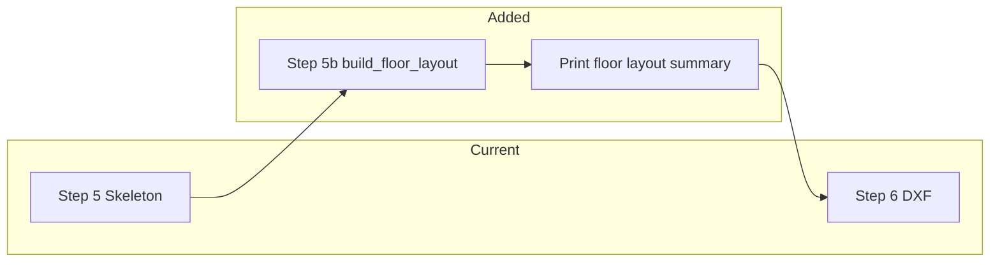

# Phase 4 Pipeline Integration and Demo Milestones

## Current state

- **Pipeline:** [backend/architecture/management/commands/generate_floorplan.py](backend/architecture/management/commands/generate_floorplan.py) runs: Plot → Envelope → Placement → Core validation → **Step 5: generate_floor_skeleton** → Step 6: DXF export (skeleton or presentation). Phase 2 and 3 are **not** in this path; they are used only in sanity commands (`run_composer_tp14`, `phase2_sanity_check`, `phase3_sanity_check`).
- **DXF and presentation:** [backend/dxf_export/exporter.py](backend/dxf_export/exporter.py) and [backend/presentation_engine/drawing_composer.py](backend/presentation_engine/drawing_composer.py) consume **FloorSkeleton** only (unit zones, core, corridor, footprint). They do not use `FloorLayoutContract` or composed units. No change to DXF content is required for the demo.

## Integration design

Insert a **Step 5b: Build floor layout** after Step 5 (skeleton) and before Step 6 (export). On success, compute and print a **floor layout summary**; on failure, fail the pipeline with a clear Phase 4 error.

- **Input to Step 5b:** `skeleton` from Step 5 (already validated: not `NO_SKELETON`, generator did not raise).
- **Call:** `build_floor_layout(skeleton, floor_id="L0", module_width_m=None)` from [backend/residential_layout/floor_aggregation.py](backend/residential_layout/floor_aggregation.py).
- **On success:** Store the returned `FloorLayoutContract`; print a short summary (see below); continue to Step 6 unchanged (Step 6 still receives only `skeleton`).
- **On failure:** Catch `FloorAggregationError` and `FloorAggregationValidationError`; call `_fatal(5b, "Floor layout failed: ...")` (or equivalent) so the command exits with a clear message. Do not export DXF when Phase 4 fails.

**Floor layout summary (console):** One block after the existing "[5] Floor Skeleton" line, e.g.:

- `[5b] Floor Layout       -- Units: N, Bands: B, Unit area: X sq.m, Efficiency: Y%`
- Optionally one line listing band breakdown (e.g. `Band 0: 3 units; Band 1: 2 units` when B=2).

**Error messages:** Include exception type and reason (e.g. `Band 0 failed at slice 1: UnresolvedLayoutError` or `band_not_in_footprint`) so the user can diagnose.

## Implementation steps

1. **Extend generate_floorplan.py**
  - In `handle()`, after `skeleton = self._step5(pr, cv)` and the existing feasibility print, add:
    - Try: `floor_contract = build_floor_layout(skeleton, floor_id="L0", module_width_m=None)`.
    - Except `FloorAggregationError` and `FloorAggregationValidationError`: call `self._fatal(5b, "Floor layout failed: {msg}")` (use a step label such as `"5b"` or `"5b-FloorLayout"` so it’s distinct from step 5).
  - Add a helper `_step5b_build_floor_layout(skeleton)` that returns `FloorLayoutContract` or raises (so `handle()` stays readable). Optional: `_print_floor_layout_summary(contract)` for the new console block.
  - Step 6 remains unchanged: it still receives only `skeleton`; DXF and presentation logic are untouched.
2. **Imports**
  - In `generate_floorplan.py`, add imports for `build_floor_layout`, `FloorAggregationError`, and `FloorAggregationValidationError` from `residential_layout.floor_aggregation` (or from `residential_layout` if re-exported there).
3. **No new flags for first cut**
  - Always run Phase 4 when Step 5 succeeds. If a need arises to skip Phase 4 (e.g. for debugging), a `--no-floor-layout` flag can be added later.

## Demo milestones

| Milestone                     | Description                                              | Success criterion                                                                                                                                                                                                                                                   |
| ----------------------------- | -------------------------------------------------------- | ------------------------------------------------------------------------------------------------------------------------------------------------------------------------------------------------------------------------------------------------------------------- |
| **M1 — Pipeline integration** | Phase 4 runs inside the main pipeline.                   | Running `generate_floorplan` for any plot that currently reaches Step 6 runs `build_floor_layout` after Step 5; console shows `[5b] Floor Layout` with total_units, bands, and metrics; on Phase 4 failure, command exits with a clear error and no DXF is written. |
| **M2 — Demo plots**           | At least one known-good plot is documented and runnable. | Document (e.g. in command help or a short README) one or two demo plots (e.g. TP14 FP101, FP126). Running `python manage.py generate_floorplan --tp 14 --fp 101 --height 16.5 --export-dir ./out` completes with DXF + floor layout summary and non-zero units.     |
| **M3 — Optional / later**     | Use FloorLayoutContract downstream.                      | Do **not** implement for this demo. Later: feed contract into feasibility (e.g. unit count, BUA) or presentation (composed rooms from contract). Keeps current scope minimal.                                                                                       |

## Out of scope (do not overbuild)

- **No change to DXF or presentation:** Export and presentation continue to use only `FloorSkeleton`. Room splits, walls, and doors remain as today (skeleton- or zone-based).
- **No Phase 5:** No stacking or building-level metrics.
- **No new ingestion:** No PAL DXF ingestion in this work.
- **No `--no-floor-layout`** unless you add it in a follow-up.

## Files to touch

- [backend/architecture/management/commands/generate_floorplan.py](backend/architecture/management/commands/generate_floorplan.py): add Step 5b, `_step5b_build_floor_layout`, `_print_floor_layout_summary`, and exception handling; add imports for `build_floor_layout` and Phase 4 exceptions.

## Testing

- **Manual:** Run `generate_floorplan` for TP14 FP101 and FP126; confirm `[5b] Floor Layout` appears and DXF is still created. Trigger a Phase 4 failure (e.g. use a plot/skeleton that causes a band to fail) and confirm the command exits with a clear message and no DXF.
- **Automated (optional):** Add a small test that builds a minimal skeleton, calls `build_floor_layout`, and asserts on `total_units` and `band_layouts` length; or a test that the command runs without error for a fixture plot. Not strictly required for M1/M2 if manual demo is sufficient.

## Summary

- Single integration point: **generate_floorplan** after Step 5.
- One new step: **5b** — `build_floor_layout(skeleton)`; print summary; on exception, fatal with clear Phase 4 message.
- Demo = run existing command on a known plot and see floor layout summary + DXF; no new commands or DXF behaviour.

