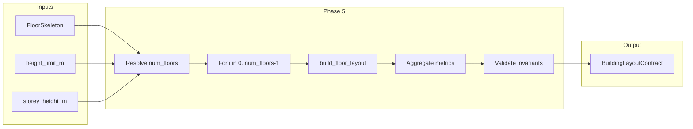

# Phase 5 — Building Aggregation Layer: Architectural Plan

## 1. High-Level Architecture

Phase 5 is a **single-purpose stacking layer** that consumes Phase 4 only. It does not call composer (Phase 2) or repetition (Phase 3) directly. It takes one `FloorSkeleton`, a height limit, and a storey height; determines the number of floors; calls `build_floor_layout(skeleton, floor_id=...)` once per floor; aggregates the resulting `FloorLayoutContract` instances into a `BuildingLayoutContract`.




**Data flow:**

- **Input:** One `FloorSkeleton` (unchanged; same 2D layout for every floor), `height_limit_m: float`, `storey_height_m: float`, optional `building_id: str`, optional `module_width_m: float | None`, optional `first_floor_contract: Optional[FloorLayoutContract]`.
- **Per floor:** When `first_floor_contract` is provided, use it as floor 0 (append to `floors`) and call `build_floor_layout` only for `i` in `1..num_floors-1`. When not provided, call `build_floor_layout` for `i` in `0..num_floors-1`. No mutation of skeleton or of returned `FloorLayoutContract`; contracts are stored by reference.
- **Output:** One `BuildingLayoutContract` containing the list of floor contracts and building-level metrics.

**Clarifications:**

- Phase 5 **consumes Phase 4 only.** It never calls `repeat_band`, `derive_unit_local_frame`, or `resolve_unit_layout` directly.
- **No mutation of FloorLayoutContract.** Each contract returned by `build_floor_layout` is stored as-is in `BuildingLayoutContract.floors`. Unit polygons remain per-floor, per-unit; no merging across floors.
- **Same skeleton for every floor.** Vertical stacking is modelled by repeating the same 2D floor layout; no vertical geometry transformation, no variable floor heights, no podium or stilt logic.

**Contract dependency (Phase 4 — unit_id):** Phase 5 assumes that **FloorLayoutContract guarantees per-floor unit_id uniqueness** by using a `floor_id` prefix. Specifically, Phase 4 sets `unit_id = f"{floor_id}_{band_id}_{slice_index}"` for each unit. Phase 5 does not assign or validate unit_ids; it relies on this convention so that unit_ids are unique across the building (e.g. "L0_0_0", "L1_0_0"). **If Phase 4 changes its unit_id logic**, Phase 5’s guarantee of unique unit_id across floors would silently break. This is a documented contract dependency: Phase 4 must not change the unit_id format without coordinating with Phase 5.

---

## 2. BuildingLayoutContract Definition

**Module:** [backend/residential_layout/building_aggregation.py](backend/residential_layout/building_aggregation.py)

```python
@dataclass
class BuildingLayoutContract:
    building_id: str
    floors: list[FloorLayoutContract]
    total_floors: int
    total_units: int
    total_unit_area: float
    total_residual_area: float
    building_efficiency: float
    building_height_m: float
```

**Field semantics:**


| Field                 | Type                      | Definition                                                                                                                                                                                                               |
| --------------------- | ------------------------- | ------------------------------------------------------------------------------------------------------------------------------------------------------------------------------------------------------------------------ |
| `building_id`         | str                       | Caller-provided identifier for the building (e.g. `"B0"`, `""`).                                                                                                                                                         |
| `floors`              | list[FloorLayoutContract] | One contract per floor, order preserved (floor index i corresponds to `floors[i]` with `floor_id` typically `f"L{i}"`).                                                                                                  |
| `total_floors`        | int                       | `len(floors)`.                                                                                                                                                                                                           |
| `total_units`         | int                       | Sum of `f.total_units` for all `f` in `floors`.                                                                                                                                                                          |
| `total_unit_area`     | float                     | Sum of `f.unit_area_sum` for all `f` in `floors`.                                                                                                                                                                        |
| `total_residual_area` | float                     | Sum of `f.total_residual_area` for all `f` in `floors`.                                                                                                                                                                  |
| `building_efficiency` | float                     | `total_unit_area / (footprint_area * total_floors)` when `total_floors > 0` and footprint area > 0; else `0.0`. Footprint area is taken from the skeleton (same for all floors): e.g. `skeleton.footprint_polygon.area`. |
| `building_height_m`   | float                     | `total_floors * storey_height_m`.                                                                                                                                                                                        |


**Clarifications:**

- **Floors stored individually.** No merging of unit polygons across floors. Each `FloorLayoutContract` in `floors` remains a separate object with its own `all_units`, `band_layouts`, and polygons.
- **FloorLayoutContract objects reused.** Phase 5 does not copy or deep-copy floor contracts; it stores the list of references returned by `build_floor_layout`.
- **building_efficiency formula:** `building_efficiency = total_unit_area / (footprint_area_sqm * total_floors)` when `total_floors > 0` and `footprint_area_sqm > 0`; otherwise `0.0`. This is total habitable unit area over total built slab area (footprint × number of floors). No FSI or envelope recomputation.

**Efficiency assumption (contract semantics):** Phase 5 assumes **identical slab footprint for all floors**. There are no void floors, no mechanical-only floors, no terrace or setback reductions at higher floors. The denominator (footprint × total_floors) is correct only under this assumption. If a future change introduces per-floor footprint variation (e.g. setbacks), the meaning of `building_efficiency` would break and the formula must be redefined; Phase 5 does not support that.

---

## 3. Floor Count Logic

**Deterministic rule (Option A):**

```
num_floors = floor(height_limit_m / storey_height_m)
```

- **height_limit_m:** Provided by the caller (e.g. from feasibility or from the pipeline’s building height). Represents the maximum building height in metres allowed or desired. Phase 5 does not infer it from envelope or plot.
- **storey_height_m:** Passed explicitly. Phase 5 does **not** infer storey height from templates, room heights, or any other source. Typical value in the 2.8–3.3 m range; caller responsibility.
- **If num_floors <= 0:** Return an empty building: `BuildingLayoutContract` with `floors=[]`, `total_floors=0`, `total_units=0`, `total_unit_area=0.0`, `total_residual_area=0.0`, `building_efficiency=0.0`, `building_height_m=0.0`. No call to `build_floor_layout`. This is not a failure; it is a valid outcome.

**Constraints:**

- No podium logic (no special treatment of ground floor).
- No stilt logic.
- No variable floor heights; every floor uses the same `storey_height_m` for the height contribution.
- No rounding other than `floor` for `num_floors` (integer floors only).

---

## 4. Aggregation Algorithm

**Public API:**

```text
build_building_layout(
    skeleton: FloorSkeleton,
    height_limit_m: float,
    storey_height_m: float,
    building_id: str = "",
    module_width_m: float | None = None,
    first_floor_contract: Optional[FloorLayoutContract] = None,
) -> BuildingLayoutContract
```

**Step-by-step deterministic algorithm:**

1. **Resolve number of floors**
  - `num_floors = max(0, floor(height_limit_m / storey_height_m))`.
  - If `num_floors == 0`: return `BuildingLayoutContract(building_id=building_id, floors=[], total_floors=0, total_units=0, total_unit_area=0.0, total_residual_area=0.0, building_efficiency=0.0, building_height_m=0.0)`.
2. **Build floor layouts (strict order; reuse first floor when provided)**
  - Initialize `floors: list[FloorLayoutContract] = []`.
  - **If `first_floor_contract` is not None:** Append `first_floor_contract` to `floors` (this is floor 0). Then for `i` in `range(1, num_floors)`:
    - `floor_id = f"L{i}"`.
    - Call `floor_contract = build_floor_layout(skeleton, floor_id=floor_id, module_width_m=module_width_m)`.
    - On **FloorAggregationError** or **FloorAggregationValidationError**: wrap in `BuildingAggregationError` (include floor index `i` and cause), then re-raise. Do not return a partial building.
    - Append `floor_contract` to `floors`.
  - **Else:** For `i` in `range(num_floors)`:
    - `floor_id = f"L{i}"`.
    - Call `floor_contract = build_floor_layout(skeleton, floor_id=floor_id, module_width_m=module_width_m)`.
    - On **FloorAggregationError** or **FloorAggregationValidationError**: wrap in `BuildingAggregationError` (include floor index `i` and cause), then re-raise. Do not return a partial building.
    - Append `floor_contract` to `floors`.
  - **Contract reuse rule:** When the pipeline runs Step 5b then Step 5c, the caller must pass the Step 5b result as `first_floor_contract` so floor 0 is not recomputed. This avoids duplicate work and ensures a single contract for floor 0 (no risk of subtle mismatch if non-determinism is introduced later).
3. **Aggregate metrics**
  - `total_floors = len(floors)`.
  - `total_units = sum(f.total_units for f in floors)`.
  - `total_unit_area = sum(f.unit_area_sum for f in floors)`.
  - `total_residual_area = sum(f.total_residual_area for f in floors)`.
  - `footprint_area_sqm = skeleton.footprint_polygon.area`.
  - `building_efficiency = total_unit_area / (footprint_area_sqm * total_floors)` if `total_floors > 0` and `footprint_area_sqm > 0`, else `0.0`.
  - `building_height_m = total_floors * storey_height_m`.
4. **Build contract**
  - Construct `BuildingLayoutContract(building_id=..., floors=floors, total_floors=..., total_units=..., total_unit_area=..., total_residual_area=..., building_efficiency=..., building_height_m=...)`.
5. **Validation (optional but recommended)**
  - Run `_validate_building(contract)` to assert `total_units == sum(f.total_units for f in contract.floors)`, `total_floors == len(contract.floors)`, and `building_height_m == contract.total_floors * storey_height_m`. On failure, raise `BuildingAggregationValidationError`.
6. **Return** `BuildingLayoutContract`.

**No geometry recomputation.** All polygon references come from Phase 4; building layer only does arithmetic over scalars and list aggregation.

---

## 5. Failure Policy

**Rule: If any floor fails, abort the entire building.**

- On **FloorAggregationError** or **FloorAggregationValidationError** from `build_floor_layout(skeleton, floor_id=f"L{i}", ...)`:
  - Do **not** catch and skip floor `i`.
  - Do **not** return a building with `floors = [contract for floors 0..i-1]`.
  - Wrap the exception in **BuildingAggregationError** (message, floor_index=i, cause=original exception), then re-raise.
  - Caller receives no partial `BuildingLayoutContract`.

**Reasoning:**

- **Determinism:** Building is either fully stacked or not; no ambiguous “partial building” state.
- **Contract integrity:** `BuildingLayoutContract` promises “all floors from 0 to num_floors-1”; partial results would break that promise and complicate downstream (e.g. BUA, unit counts).
- **Consistency with Phase 3 and 4:** Phase 3 aborts the band on first slice failure; Phase 4 aborts the floor on first band failure; Phase 5 aborts the building on first floor failure. Same all-or-nothing principle at each layer.
- **Simplicity:** No need to define semantics for “which floors are valid” or to mask or mark failed floors.

**Exception type:**

- `BuildingAggregationError(message: str, floor_index: int, cause: Exception | None = None)`. Raised when `build_floor_layout` raises for a given floor index.

---

## 6. Metrics Formulas


| Metric                  | Formula                                                                                                                                                                                                                                                                                          |
| ----------------------- | ------------------------------------------------------------------------------------------------------------------------------------------------------------------------------------------------------------------------------------------------------------------------------------------------ |
| **total_units**         | `sum(f.total_units for f in floors)`.                                                                                                                                                                                                                                                            |
| **total_unit_area**     | `sum(f.unit_area_sum for f in floors)`.                                                                                                                                                                                                                                                          |
| **total_residual_area** | `sum(f.total_residual_area for f in floors)`.                                                                                                                                                                                                                                                    |
| **building_efficiency** | `total_unit_area / (footprint_area_sqm * total_floors)` if `total_floors > 0` and `footprint_area_sqm > 0`, else `0.0`. Here `footprint_area_sqm = skeleton.footprint_polygon.area`. **Assumption:** Identical slab footprint for all floors (no voids, no mechanical-only floors, no setbacks). |
| **building_height_m**   | `num_floors * storey_height_m` (same as `total_floors * storey_height_m` when no floor failed).                                                                                                                                                                                                  |


No FSI recalculation. No envelope recomputation. No other building-level metrics in this phase.

---

## 7. Module Structure

**New file:** [backend/residential_layout/building_aggregation.py](backend/residential_layout/building_aggregation.py)

**Contents:**

- **BuildingLayoutContract** — dataclass as in Section 2.
- **BuildingAggregationError** — exception (message, floor_index, cause).
- **BuildingAggregationValidationError** — optional; for validation failures in `_validate_building` (e.g. reason `"total_units_consistency"`).
- **build_building_layout(skeleton, height_limit_m, storey_height_m, building_id="", module_width_m=None, first_floor_contract=None) -> BuildingLayoutContract** — single public entry point. When `first_floor_contract` is provided, it is used as floor 0 and Phase 4 is not called for floor 0.
- **_validate_building(contract: BuildingLayoutContract, storey_height_m: float) -> None** — optional internal or test-time validation; raises if invariants fail.

**Dependencies:**

- `build_floor_layout`, `FloorLayoutContract`, `FloorAggregationError`, `FloorAggregationValidationError` from [backend/residential_layout/floor_aggregation.py](backend/residential_layout/floor_aggregation.py).
- `FloorSkeleton` from [backend/floor_skeleton/models.py](backend/floor_skeleton/models.py).

**No dependency on:** Phase 2, Phase 3, strategy engine, presentation, DXF, feasibility (except that caller supplies `height_limit_m` and `storey_height_m`).

**Export:** In [backend/residential_layout/**init**.py](backend/residential_layout/__init__.py) add `build_building_layout`, `BuildingLayoutContract`, `BuildingAggregationError`, and optionally `BuildingAggregationValidationError`.

---

## 8. Validation Rules

**Minimal but strict:**

1. **total_units consistency:** `total_units == sum(f.total_units for f in contract.floors)`. If not, raise `BuildingAggregationValidationError(reason="total_units_consistency")`.
2. **total_floors consistency:** `total_floors == len(contract.floors)`. If not, raise `BuildingAggregationValidationError(reason="total_floors_consistency")`.
3. **building_height_m:** `building_height_m == total_floors * storey_height_m` (with small tolerance for floats). If not, raise `BuildingAggregationValidationError(reason="building_height_consistency")`.
4. **No empty floor in middle:** Not enforced by default; all floors are built in order and if one fails the building is aborted, so there is no “hole” in the list. Optional: assert each `f.total_units >= 0` and that `floors` has length `num_floors` when `num_floors > 0`.

**Avoid:** O(N²) geometry checks, cross-floor polygon intersection tests, or any heavy geometry. Validation is scalar and list-length only.

---

## 9. Test Matrix


| #   | Scenario                             | Input                                                                                                                                | Expected                                                                                                                                                                                                                                                                     |
| --- | ------------------------------------ | ------------------------------------------------------------------------------------------------------------------------------------ | ---------------------------------------------------------------------------------------------------------------------------------------------------------------------------------------------------------------------------------------------------------------------------- |
| 1   | **1 floor**                          | num_floors=1, skeleton valid                                                                                                         | building.total_floors=1, building.floors[0] equals single `build_floor_layout(skeleton, "L0")`; total_units, total_unit_area, total_residual_area equal that floor’s; building_efficiency equals floor efficiency; building_height_m = storey_height_m.                      |
| 2   | **5 floors**                         | num_floors=5, skeleton valid                                                                                                         | building.total_floors=5; total_units = 5 * (units per floor); total_unit_area = 5 * unit_area_sum per floor; total_residual_area = 5 * total_residual_area per floor; building_efficiency = total_unit_area / (footprint_area * 5); building_height_m = 5 * storey_height_m. |
| 3   | **0 floors**                         | height_limit_m < storey_height_m or height_limit_m=0                                                                                 | num_floors=0; return BuildingLayoutContract with floors=[], total_floors=0, total_units=0, total_unit_area=0.0, total_residual_area=0.0, building_efficiency=0.0, building_height_m=0.0. No exception.                                                                       |
| 4   | **Floor 2 fails**                    | num_floors=3, floor 0 and 1 succeed, floor 2 raises (e.g. skeleton that causes Phase 4 to fail on second call due to state, or mock) | build_building_layout raises BuildingAggregationError with floor_index=2; no BuildingLayoutContract returned; no partial list of floors.                                                                                                                                     |
| 5   | **Efficiency formula**               | Known skeleton footprint area, known unit_area_sum per floor, 3 floors                                                               | building_efficiency == (3 * unit_area_sum_per_floor) / (footprint_area * 3) within tolerance.                                                                                                                                                                                |
| 6   | **unit_id uniqueness across floors** | 2 floors                                                                                                                             | All unit_id values in building.floors[0].all_units and building.floors[1].all_units have distinct ids (e.g. "L0_0_0", "L1_0_0"); no duplicate unit_id across the building.                                                                                                   |
| 7   | **building_height_m**                | num_floors=4, storey_height_m=3.0                                                                                                    | building.building_height_m == 12.0.                                                                                                                                                                                                                                          |
| 8   | **First floor fails**                | num_floors=2, build_floor_layout raises for i=0                                                                                      | BuildingAggregationError with floor_index=0; no return.                                                                                                                                                                                                                      |
| 9   | **_validate_building**               | Valid building contract, correct storey_height_m                                                                                     | _validate_building(contract, storey_height_m) does not raise.                                                                                                                                                                                                                |
| 10  | **_validate_building failure**       | Contract with total_units != sum(f.total_units) (e.g. hand-built broken contract)                                                    | _validate_building raises BuildingAggregationValidationError.                                                                                                                                                                                                                |


---

## 10. What Phase 5 Must NOT Do

- **No template logic:** Does not choose or change templates; passes through `module_width_m` to Phase 4 only.
- **No unit mix changes per floor:** Same skeleton and same `module_width_m` for every floor; no variation of layout by floor index.
- **No mirroring floors:** No reflection or symmetry logic; each floor is the same 2D layout.
- **No AI:** Fully deterministic.
- **No geometry changes:** Does not create or modify any polygons; uses only Phase 4 outputs and skeleton.footprint_polygon.area.
- **No DXF changes:** Does not touch export or presentation.
- **No stacking variation:** Same number of floors for the whole building; no podiums, no stilts, no variable storey heights.
- **No podium logic:** Ground floor is not treated differently.
- **No FSI or envelope recomputation:** building_efficiency is a simple ratio as defined; no recalculation of FSI or envelope.

---

## 11. Integration Plan (generate_floorplan)

**Add Step 5c** after Step 5b (floor layout) and before Step 6 (DXF):

- **Inputs available at that point:** `skeleton`, `height` (building height in metres from command args — use as `height_limit_m`), a chosen `storey_height_m` (e.g. constant `DEFAULT_STOREY_HEIGHT_M = 3.0` or from a future config), and the result of Step 5b: `floor_contract` (single-floor layout for "L0").
- **Call:** `building_contract = build_building_layout(skeleton, height_limit_m=height, storey_height_m=storey_height_m, building_id="B0", module_width_m=None, first_floor_contract=floor_contract)`. Passing `first_floor_contract` ensures floor 0 is not recomputed; Phase 5 uses the Step 5b result for floor 0 and calls `build_floor_layout` only for floors 1..N-1.
- **On success:** Call `_print_building_summary(building_contract)` which prints one line: `[5c] Building Layout   -- Floors: N, Total Units: X, Total Unit Area: Y sq.m, Efficiency: Z%`.
- **On BuildingAggregationError:** Catch and call `_fatal(5, "Building layout (Phase 5) failed: floor {floor_index}: {msg}")` (or equivalent step label); do not export DXF.
- **Step 6 (DXF):** Unchanged. Still receives only `skeleton`; no change to DXF or presentation logic. Phase 5 output is for metrics and future use only in this integration step.

**Order of steps:** Step 5 (skeleton) → Step 5b (floor layout for L0) → Step 5c (building layout: pass Step 5b result as `first_floor_contract`, build floors 1..N-1 only). Floor 0 is computed once in 5b and reused in 5c; no architectural redundancy.

## 12. Performance Constraints

- **Time:** O(num_floors × (complexity of build_floor_layout)). Complexity of build_floor_layout is O(total_units on that floor), so overall O(num_floors × units_per_floor) = O(total_units in building). No recursion, no search.
- **Space:** O(num_floors) for the list of floor contracts; each contract already holds references to skeleton polygons and Phase 3 outputs. No duplication of geometry.
- **No recomputation of floor geometry:** Each floor is laid out once; building layer does not recompute or merge polygons.

---

## 13. Edge Cases

- **num_floors = 0:** Return empty building contract; do not call build_floor_layout.
- **storey_height_m <= 0:** Undefined; caller must pass positive storey height. Optionally validate at entry and raise ValueError.
- **height_limit_m < storey_height_m:** num_floors = 0; empty building.
- **First floor (i=0) fails:** Abort immediately; BuildingAggregationError(floor_index=0).
- **Last floor fails:** After successfully building all previous floors, abort on the last; do not return partial building.
- **building_id default:** Empty string if not provided; floor_id values still "L0", "L1", etc.

---

## 14. Summary

- **BuildingLayoutContract:** building_id, floors (list of FloorLayoutContract), total_floors, total_units, total_unit_area, total_residual_area, building_efficiency, building_height_m.
- **Floor count:** `num_floors = max(0, floor(height_limit_m / storey_height_m))`; storey_height_m and height_limit_m explicit; no podium/stilt/variable height.
- **Aggregation:** Optional `first_floor_contract`: when provided, use it for floor 0 and call `build_floor_layout` only for floors 1..N-1; otherwise call for 0..N-1. Pipeline passes Step 5b result as `first_floor_contract` so floor 0 is not recomputed.
- **Failure:** Any floor failure → BuildingAggregationError; no partial building.
- **Integration:** Step 5c in generate_floorplan; pass Step 5b result as `first_floor_contract`; print `[5c] Building Layout -- Floors: N, Total Units: X, ...`; no DXF change.
- **New module:** building_aggregation.py with build_building_layout(..., first_floor_contract=None), BuildingLayoutContract, BuildingAggregationError, and optional _validate_building.
- **Contract dependencies:** Phase 5 assumes Phase 4’s unit_id format (floor_id prefix) for uniqueness across the building; assumes identical slab footprint for all floors for building_efficiency semantics.

No implementation code in this plan; this is the architectural specification for Phase 5 only.