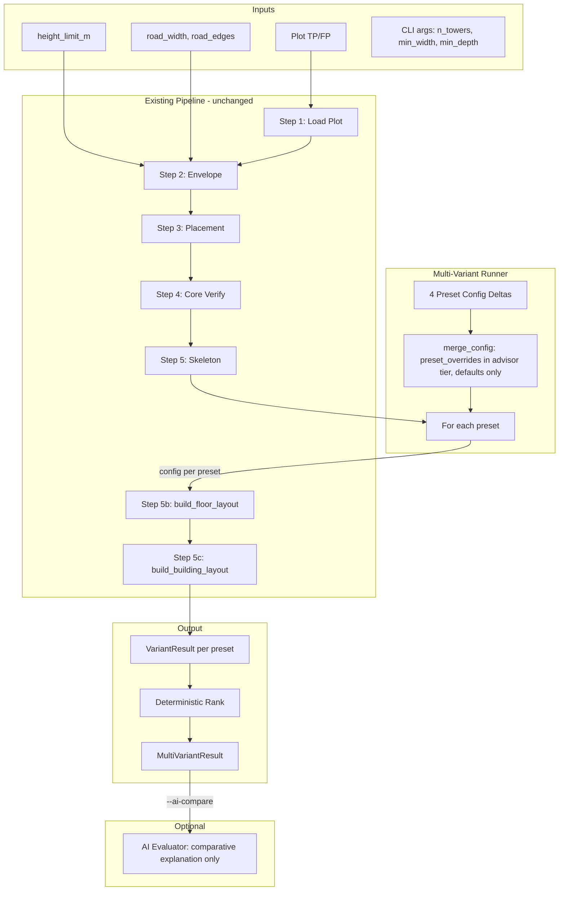

# Phase 6.2 — Multi-Variant Deterministic Runner

## 1. Overview

Phase 6.2 is a **product feature**: an orchestration layer that sits **strictly above** the deterministic engine. It runs the same pipeline (Steps 1–5c from [generate_floorplan.py](backend/architecture/management/commands/generate_floorplan.py)) multiple times with different **preset config deltas**, collects one `BuildingLayoutContract` per preset, compares them with **deterministic ranking** (no AI), and optionally calls the existing AI Evaluator with all variant summaries for **advisory comparison only** (AI does not select winner or rerun the engine).

**Out of scope:** No changes to envelope_engine, placement_engine, floor_skeleton, Phase 2 composer, Phase 3 repetition, Phase 4 floor aggregation, Phase 5 building aggregation, or AI layer core contracts.

---

## 2. Architecture Diagram




**Caching:** Steps 1–5 (through skeleton) are **config-independent** (envelope: plot/height/road; placement: envelope/n_towers/min_dims; skeleton: placement + core_validation). The runner runs Steps 1–5 **once**, then for each preset runs only 5b and 5c with that preset’s merged config (module_width_m, storey_height_m). No geometry duplication in the result; only scalar summaries.

**Skeleton immutability (formal invariant):** Reuse of the same skeleton across presets is safe only if the engine does not mutate it. Phase 6.2 therefore requires: `**build_floor_layout` must not mutate the skeleton.** `**build_building_layout` must not mutate the skeleton.** If either modifies zone objects (e.g. `unit_zones`) in-place, variant contamination occurs and parallel execution later becomes unsafe. **Skeleton and `unit_zones` are treated as immutable in Phase 6.2; any mutation inside 5b/5c must operate on copies or new objects only.** This is a defensive documentation requirement; implementation must enforce or rely on existing engine guarantees.

---

## 3. Data Contracts

### 3.1 VariantResult

```python
@dataclass
class VariantResult:
    preset_name: str                    # SPACIOUS | DENSE | BALANCED | BUDGET
    final_config_used: dict[str, Any]   # Merged config actually passed to pipeline (allowlist keys only)
    building_contract_summary: Optional[ContractSummary]  # From ai_layer.build_contract_summary; None if run failed
    success_flag: bool
    failure_reason: Optional[str]      # None if success_flag True
```

- **No geometry.** Only `ContractSummary` (building_id, total_floors, total_units, total_unit_area, total_residual_area, building_efficiency, building_height_m, floors: list[FloorSummary]).
- `final_config_used` is the merged engine config (subset of `ENGINE_CONFIG_ALLOWED_KEYS`) used for that run.

### 3.2 MultiVariantResult

```python
@dataclass
class MultiVariantResult:
    plot_id: str                       # e.g. "TP14_FP126"
    building_id: str                   # e.g. "B0"
    variants: list[VariantResult]      # One per preset (order preserved)
    ranking: list[str]                 # Preset names in rank order (best first) by deterministic score
    comparison_note: Optional[str]     # Filled only when --ai-compare: AI comparative explanation (advisory)
```

- `ranking` is computed by the deterministic scoring formula (see Section 6). Ties broken by fixed preset order (e.g. SPACIOUS, DENSE, BALANCED, BUDGET).
- Failed variants are excluded from ranking (or ranked last with lowest score); exact rule in Section 6.

---

## 4. Preset Definitions

All presets are **hardcoded** dict deltas over engine defaults. No AI, no randomness. Keys must be from `ENGINE_CONFIG_ALLOWED_KEYS` ([schemas.py](backend/ai_layer/schemas.py)). The engine currently uses only `module_width_m` (from `preferred_module_width`) and `storey_height_m` (from `storey_height_override`); `template_priority_order` is stored in `final_config_used` for audit and future use (orchestrator today has fixed `TEMPLATE_ORDER`).

**Engine default (baseline):**  
`template_priority_order = ["STANDARD_1BHK", "COMPACT_1BHK", "STUDIO"]`, `preferred_module_width = None` (engine default e.g. 3.6), `storey_height_override = None` (e.g. 3.0), no `density_bias` / `constraint_flags`.


| Preset   | template_priority_order                     | preferred_module_width | storey_height_override | density_bias | constraint_flags (optional) |
| -------- | ------------------------------------------- | ---------------------- | ---------------------- | ------------ | --------------------------- |
| SPACIOUS | ["STANDARD_1BHK", "COMPACT_1BHK"]           | 4.2                    | None                   | luxury       | {}                          |
| DENSE    | ["COMPACT_1BHK", "STANDARD_1BHK", "STUDIO"] | 3.2                    | None                   | density      | {}                          |
| BALANCED | (default order)                             | None                   | None                   | balanced     | {}                          |
| BUDGET   | ["COMPACT_1BHK", "STUDIO", "STANDARD_1BHK"] | 3.2                    | 2.85                   | (none)       | prefer_compact: true        |


- **SPACIOUS:** Prefer larger units; wider module; luxury bias.  
- **DENSE:** Compact first, smaller module; density bias.  
- **BALANCED:** No overrides; engine defaults.  
- **BUDGET:** Compact-first, slightly lower storey height (if within engine bounds), prefer_compact flag.

Numeric bounds (from [advisor.py](backend/ai_layer/advisor.py)): `preferred_module_width` in [2.5, 8.0], `storey_height_override` in [2.7, 3.5]. Preset values must lie in these ranges.

**Storage:** New module e.g. `backend/architecture/multi_variant/presets.py` with a single dict:  
`PRESETS: dict[str, dict[str, Any]] = {"SPACIOUS": {...}, "DENSE": {...}, "BALANCED": {}, "BUDGET": {...}}`  
Keys of each value dict are allowlisted only; unknown keys stripped at load.

---

## 5. Orchestration Flow

1. **Parse CLI:** Same as single-run (--tp, --fp, --height, road params, n_towers, min_width, min_depth). Plus `--multi-variant`, optional `--ai-compare`.
2. **If not --multi-variant:** Behaviour unchanged (single run, one config, existing path).
3. **If --multi-variant:**
  a. Run **Steps 1–5 once** (load plot, envelope, placement, core verify, skeleton). On failure, exit with same fatal behaviour as today.  
   b. **For each preset** in fixed order (SPACIOUS, DENSE, BALANCED, BUDGET):  
      - Merge config: `merge_config(hard_constraints=None, user_overrides=None, advisor_suggestion=preset_as_advisor_like, defaults=engine_defaults)`. Preset is converted to a structure that merge accepts (e.g. dict or minimal object with same keys as AdvisorOutput); only allowlisted keys.  
      - Resolve **module_width_m** = merged.get("preferred_module_width") or engine default (e.g. 3.6).  
      - Resolve **storey_height_m** = merged.get("storey_height_override") or DEFAULT_STOREY_HEIGHT_M (3.0).  
      - Run **Step 5b:** `build_floor_layout(skeleton, floor_id="L0", module_width_m=module_width_m)`.  
      - On 5b failure: append `VariantResult(preset_name=..., final_config_used=merged, building_contract_summary=None, success_flag=False, failure_reason=str(exc))`, continue to next preset.  
      - Run **Step 5c:** `build_building_layout(skeleton, height_limit_m=height, storey_height_m=storey_height_m, building_id="B0", module_width_m=module_width_m, first_floor_contract=floor_contract)`.  
      - On 5c failure: same as 5b, record failure, continue.  
      - On success: build `ContractSummary` from `BuildingLayoutContract` (reuse [evaluator.build_contract_summary](backend/ai_layer/evaluator.py) logic), append `VariantResult(..., building_contract_summary=summary, success_flag=True, failure_reason=None)`.  
   c. **Ranking:** Compute deterministic score for each successful variant (Section 6). Sort by score descending; tie-break by fixed preset order. Failed variants appended after successful ones (or assigned worst score).  
   d. **Optional --ai-compare:** Call AI Evaluator **once** with a payload that includes all variant summaries (e.g. concatenated or a single structured summary). AI returns **comparative explanation only**; runner does **not** use AI to choose winner. Store explanation in `MultiVariantResult.comparison_note`.  
   e. Build `MultiVariantResult(plot_id=..., building_id="B0", variants=..., ranking=..., comparison_note=...)`.  
   f. Print output (Section 9) and optionally export (no DXF per variant in minimal design; single DXF can remain single-run only or export one chosen variant).

**Config isolation:** Each preset run gets a fresh merge; no mutable shared state. Same skeleton object (read-only) reused for all 5b/5c calls.

---

## 6. Deterministic Ranking Algorithm

**Inputs per variant:** Only when `success_flag` is True, use `building_contract_summary`: total_units, total_unit_area, total_residual_area, building_efficiency, building_height_m; derive average_unit_area = total_unit_area / total_units if total_units > 0 else 0.

**Relative normalization (scale-independent):** Do not use hardcoded divisors (e.g. /50, /20) that assume a fixed city or project scale. Instead, **normalize within the current run** so ranking is adaptive and stable across different plot sizes and unit counts.

1. Collect metrics over **successful variants only**. Compute:
   - `max_total_units` = max(total_units) across successful variants; if 0, treat as 1.
   - `max_average_unit_area` = max(average_unit_area) across successful variants; if 0, treat as 1.
   - `max_residual_area` = max(total_residual_area) across successful variants; if 0, treat as 1.
2. Per variant, define normalized values (clamp to [0, 1] where relevant):
   - `normalized_total_units` = total_units / max_total_units
   - `normalized_average_unit_area` = average_unit_area / max_average_unit_area
   - `normalized_residual` = total_residual_area / max_residual_area  (lower is better, so use (1 - normalized_residual) for a “higher is better” score component)
   - `building_efficiency` is already in [0, 1] (or small positive); use as-is.

**Preset-specific score (each in [0, 1] or comparable range for tie-break):**

- **SPACIOUS:** Maximize average_unit_area.  
  `score = normalized_average_unit_area`
- **DENSE:** Maximize total_units.  
  `score = normalized_total_units`
- **BALANCED:** Maximize building_efficiency.  
  `score = building_efficiency`
- **BUDGET:** Minimize residual and favor efficiency.  
  `score = 0.5 * (1 - normalized_residual) + 0.5 * building_efficiency`  
  (If max_residual_area was 0, (1 - normalized_residual) = 0; then score = 0.5 * building_efficiency.)

**Tie-break:** Preset order SPACIOUS < DENSE < BALANCED < BUDGET (lower index wins).  
**Failed variants:** Excluded from ranking list, or appended at end in preset order. Ranking list contains only preset names (strings).

**Edge case — one successful variant:** If only one successful variant exists (e.g. three presets failed), ranking contains exactly one element. Normalization is still well-defined: each max_* is that variant’s own value, so normalized values are 1.0 and the single variant is ranked first. No normalization instability occurs.

---

## 7. AI Evaluator Integration (Optional, Read-Only)

- **Trigger:** Only when `--ai-compare` and `--multi-variant` are both set.
- **Input:** One or more variant summaries. **Payload must be compact:** pass only **scalar building-level metrics** (total_units, total_unit_area, total_residual_area, building_efficiency, building_height_m, total_floors) plus preset name per variant. Do **not** include per-floor detail in the comparative payload unless a future `--ai-detailed` flag is added. This keeps token usage bounded (e.g. ~400 tokens per variant → ~1600 + instructions; expanding floor detail would exceed budget).
- **Output:** Use existing `evaluate_building` or a new helper that accepts multiple summaries and asks for a **comparative explanation** (no suggestion types that imply “pick this one”). Response is stored in `MultiVariantResult.comparison_note`.
- **Rules:** AI does **not** select winner; does **not** rerun the engine; output is advisory only. Deterministic ranking is the only source of truth for “best” preset.

---

## 8. Performance

- **Steps 1–5 run once.** Steps 5b and 5c run 4 times (one per preset). So cost is 1× (envelope + placement + skeleton) + 4× (floor layout + building layout). No change to envelope/placement/skeleton logic.
- **Parallel execution:** **No** in v1. Runs are sequential to avoid any risk of shared mutable state and to keep determinism and logging simple. Parallel can be revisited later with explicit “no shared mutable state” and deterministic ordering of results.
- **Caching:** Skeleton (and envelope, placement) reused across presets; no recomputation. Safe because skeleton depends only on plot, height, road, n_towers, min_width, min_depth—none of which vary by preset. Config only affects 5b and 5c.
- **Time complexity:** O(1) presets (4) × O(bands × units) per run → O(bands × units) total, same order as single run up to constant 4.

---

## 9. Failure Policy

- **One preset fails:** Record failure in that variant’s `VariantResult` (success_flag=False, failure_reason set). Continue to other presets. Ranking uses only successful variants; failed ones listed last or in a separate “failed” list.
- **All presets fail:** `MultiVariantResult` still returned; `variants` list has all four with success_flag=False; `ranking` empty or failed presets in preset order. Runner does not raise; caller can check `all(not v.success_flag for v in result.variants)`.
- **Step 1–5 failure (plot/envelope/placement/skeleton):** Fatal as today; no multi-variant result (runner exits with same _fatal behaviour).
- No variant failure may crash the entire runner; all exceptions in 5b/5c are caught per preset and converted to `VariantResult` with failure_reason.

---

## 10. CLI Integration

- **Extend** [generate_floorplan.py](backend/architecture/management/commands/generate_floorplan.py):
  - Add `--multi-variant` (store_true, default False). When True, run multi-variant flow; when False, keep current single-run behaviour.
  - Add `--ai-compare` (store_true, default False). Meaningful only when `--multi-variant` is True; when set, call AI Evaluator for comparative explanation and set `comparison_note`.
- **Output format (stdout), when --multi-variant:**
  - After runs, print lines like:
    - `[MULTI] Preset: SPACIOUS — Units: X | Floors: Y | Efficiency: Z%` (or `FAILED: <reason>`)
    - Same for DENSE, BALANCED, BUDGET.
  - Then: `[MULTI] Ranking: 1. <preset> 2. <preset> ...`
  - If `--ai-compare`: print `[MULTI] AI comparison: <comparison_note>`.
- **Default single-run behaviour:** Unchanged when `--multi-variant` is not set (no extra flags, same code path as today).

---

## 11. Test Matrix


| Test                  | Description                                                                                                                                                                    |
| --------------------- | ------------------------------------------------------------------------------------------------------------------------------------------------------------------------------ |
| All 4 succeed         | One plot; all presets produce BuildingLayoutContract; ranking has 4 entries; scores differ by preset.                                                                          |
| One preset fails      | Force one preset to fail (e.g. invalid config or mock 5b/5c raise); other three succeed; ranking length 3; failed variant has success_flag=False and non-empty failure_reason. |
| All fail              | Mock 5b or 5c to always raise; all four VariantResults have success_flag=False; ranking empty or only failed names.                                                            |
| Ranking stable        | Same plot/height/params; run twice; ranking list identical.                                                                                                                    |
| Deterministic output  | Same inputs; two full runs; MultiVariantResult.variants[i].building_contract_summary (when success) identical (same scalars).                                                  |
| AI evaluator disabled | --multi-variant without --ai-compare; comparison_note is None; no OpenAI call.                                                                                                 |
| AI evaluator enabled  | --multi-variant --ai-compare; comparison_note is set (or error logged and comparison_note None); ranking still from deterministic score only.                                  |
| Config isolation      | Verify final_config_used per variant matches preset merge; no cross-preset config leakage.                                                                                     |
| Skeleton reuse        | Unit test: run multi-variant; assert Steps 1–5 executed once (e.g. via mock or counter), 5b/5c executed 4 times.                                                               |


---

## 12. Rollout Strategy

1. **Implement** preset definitions and merge adapter (preset dict → merge-compatible input; resolve module_width_m, storey_height_m).
2. **Implement** VariantResult and MultiVariantResult in a new module (e.g. `backend/architecture/multi_variant/contracts.py`).
3. **Implement** runner function: one run of Steps 1–5, then loop over presets (5b + 5c), collect VariantResults, compute ranking, build MultiVariantResult.
4. **Integrate** into generate_floorplan: gate on --multi-variant, call runner, print [MULTI] lines and optional comparison_note.
5. **Add** --ai-compare path: build payload from all variant summaries, call Evaluator, attach result to comparison_note.
6. **Add** tests from matrix (all 4 succeed, one fail, all fail, ranking stable, deterministic, AI on/off, config isolation, skeleton reuse).
7. **Document** in command help and optionally in VIEWING_POSTGIS_DATA or a short multi-variant README.

---

## 13. Constraints (Recap)

- Determinism: same inputs and presets → same ranking and same contract summaries.
- No geometry mutation: skeleton and envelope/placement outputs are read-only across variant runs.
- No cross-variant contamination: each run uses only its merged config and its own BuildingLayoutContract.
- Config isolation: per-run merge from preset + defaults only; no shared mutable config.
- Merge precedence: In multi-variant mode, preset delta occupies the **advisor precedence layer** only (no real AI Advisor; no user overrides; no hard constraints). So: `merge_config(hard_constraints=None, user_overrides=None, advisor_suggestion=preset_overrides, defaults=engine_defaults)`. Presets are not advisor suggestions—they are deterministic preset_overrides passed in the advisor slot for merge only. In multi-variant runs, advisor-tier is used exclusively for presets; no AI Advisor suggestions apply.
- No AI inside engine: AI only used for optional comparison text; ranking is purely deterministic.

---

## 14. Advanced Considerations (Optional, Design Only)

- **N presets:** Preset list could be loaded from config or registry (still deterministic, no AI-generated presets).
- **User-defined presets:** CLI or API could accept a preset name or path to a JSON delta; validated against allowlist and bounds before run.
- **Comparison history:** Persist MultiVariantResult (e.g. plot_id, timestamp, ranking, variant summaries) to DB or file for analytics.
- **Dashboard:** UI could show ranking, metrics table, and comparison_note; no implementation in this phase.
- **Variant diff summary:** Optional structured delta between two variants (e.g. total_units difference, efficiency difference) for display only; no implementation in this phase.

No implementation of the above; design only.