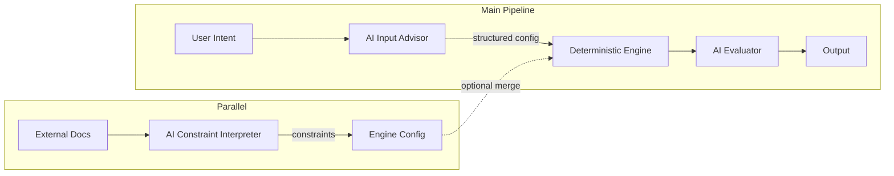

# Phase 6 — AI Layer Architecture (Design Only)

## 1. High-Level AI Architecture

### Flow Diagram




- **User Intent** (natural language) is the only human input that goes through the BEFORE layer. The AI Input Advisor converts it into a **strict JSON config** (template order, density bias, optional overrides). This config is **suggested** only; the engine applies it only after deterministic validation.
- **Deterministic Engine** remains the single authority: Plot → Envelope → Placement → Skeleton → Floor (Phase 4) → Building (Phase 5). It consumes **engine config** (from CLI/DB/defaults, optionally merged with AI Advisor output and/or Constraint Interpreter output). The engine never calls the AI; the **orchestration layer** (e.g. `generate_floorplan` or a new runner) decides whether to call AI and how to merge suggestions.
- **AI Evaluator** runs AFTER the engine produces `BuildingLayoutContract`. It receives a **serialized summary** of the contract (and plot metrics) and returns natural language explanation + structured optimization suggestions (e.g. "Try compact-first", "Increase module width"). It does **not** modify the contract or re-run the engine; it only suggests.
- **Parallel path:** External documents (regulations, RAH scheme, Jantri, market text) are processed by the **Constraint Interpreter** into a structured constraint object. That object can be merged into **Engine Config** (e.g. max_height, FSI caps, affordable_unit_percentage) before the engine runs. The interpreter runs independently of the main request flow (e.g. on document upload or scheduled refresh).

**Clarifications:**

- AI **never touches geometry**. No polygon creation, no skeleton mutation, no envelope or placement geometry. All geometry is produced solely by the deterministic envelope, placement, and residential_layout modules.
- AI outputs **structured configuration suggestions** (JSON). These are validated and optionally applied by the orchestration layer; the engine receives only validated, typed parameters.
- The **deterministic engine remains authoritative**. If AI is disabled or fails, the engine runs with defaults or existing config. No branch inside the engine code depends on AI.

---

## 2. BEFORE Layer — AI Input Advisor

**Purpose:** Map natural language user goals into a structured engine configuration that the pipeline can consume (template priority, module width hint, density bias, optional overrides). The engine does not interpret natural language; the Advisor bridges that gap.

**Input:**

- **User natural language:** Single string (e.g. "Maximize luxury units", "Affordable housing project", "Target RAH scheme", "Minimize construction cost").
- **Plot metadata (read-only):** Plot ID, TP/FP, area_sqm, validation_status. No geometry, no polygons. Only scalar metadata to keep prompts small and avoid leakage.

**Output (strict JSON schema):**


| Field                     | Type       | Description                                                               | Validation                                                  |
| ------------------------- | ---------- | ------------------------------------------------------------------------- | ----------------------------------------------------------- |
| `template_priority_order` | `string[]` | Ordered list of template keys, e.g. `["COMPACT_1BHK", "STANDARD_1BHK"]`   | Must be subset of allowed template names; engine validates. |
| `preferred_module_width`  | `number    | null`                                                                     | Suggested module width in metres                            |
| `storey_height_override`  | `number    | null`                                                                     | Optional storey height (m)                                  |
| `density_bias`            | `"luxury"  | "density"                                                                 | "balanced"`                                                 |
| `constraint_flags`        | `object`   | Optional flags, e.g. `{"prefer_compact": true, "max_units_per_floor": 8}` | Keys and types fixed by schema; unknown keys discarded.     |


**Validation rules:**

- Schema validation (e.g. JSON Schema or Pydantic) before any use. Invalid or extra fields are stripped; missing optional fields default to null/omitted.
- **No New Config Keys Rule**  
  [Added in Revision — No Unknown Keys]

  AI **cannot introduce unknown config keys**. Only keys defined in the engine config schema (allowlist) are accepted. Any key returned by the Advisor (or present in Evaluator `optional_config_delta`) that is **not** in the allowlist must be **stripped** before merge or pass-through. The engine must never receive a key it does not recognize. This applies to Advisor output and to any config deltas suggested by the Evaluator; the Constraint Interpreter output schema is already fixed. Prevents scope creep and ensures the engine contract remains stable.
- **Deterministic override rules:** Engine (or orchestration) must apply bounds: e.g. `preferred_module_width` clamped to [2.5, 8.0]; `template_priority_order` filtered to known templates. If the engine does not support a suggested key, it is ignored.

**Fallback if AI fails:**

- On timeout, API error, or invalid JSON: **discard** AI output. Orchestration uses **default config** (e.g. default template order, default module width, no overrides). Pipeline proceeds without blocking.

**Contract:** AI must never directly execute engine logic. It only produces a **config suggestion** object. The orchestration layer is responsible for merging with defaults and passing the final config into the engine.

---

## 3. AFTER Layer — AI Evaluator / Optimizer

**Purpose:** Analyze the resulting `BuildingLayoutContract` (and context) and return advisory insights and optimization suggestions in natural language and structured form. Used for explanations and for suggesting follow-up runs (e.g. "Try increasing module width").

**Input:**

- **BuildingLayoutContract (serialized summary):** Do not send full contract (contains geometry references and large lists). Send a **summary** only: `building_id`, `total_floors`, `total_units`, `total_unit_area`, `total_residual_area`, `building_efficiency`, `building_height_m`, and per-floor: `floor_id`, `total_units`, `unit_area_sum`, `efficiency_ratio_floor`. No polygons, no unit lists, no room geometries.
- **Plot metrics:** `area_sqm`, `validation_status` (optional).
- **Strategy metadata (optional):** What config was used (e.g. template_priority_order, density_bias) so the AI can suggest alternatives.

**Output:**

- **Natural language explanation:** One or two sentences (e.g. "Layout achieves 4 floors, 12 units, 72% efficiency; suitable for mid-density.").
- **Structured optimization suggestions:** JSON array of suggestions, each with:
  - `suggestion_type`: Must be one of a **closed enum** (see below). AI must not invent new suggestion types; unknown types must be discarded by the validator.
  - `reason`: Short string.
  - `optional_config_delta`: Minimal key-value hints (e.g. `{"preferred_module_width": 6.0}`) for a possible next run. Engine never applies these automatically; user or orchestration may apply.

**Suggestion Type Enumeration (Recommended)**  
[Added in Revision — Closed Suggestion Vocabulary]

Define `suggestion_type` as a **closed enum**. Allowed values only:

- `increase_module_width`
- `decrease_module_width`
- `try_compact_first`
- `try_standard_first`
- `reduce_floors`
- `increase_floors`
- `adjust_density_bias`
- `no_change`

AI must not invent new suggestion types. Any response containing a `suggestion_type` not in this list must have that suggestion **discarded** by the response validator; other valid suggestions in the array may be kept. This prevents infinite adapter code and keeps the evaluation layer stable. Marked as **recommended but strongly advised** for production.

**Input serialization:**

- Contract summary: fixed flat structure, stringified numbers, no nesting beyond one level for floors. Token budget: e.g. max 800 tokens for the whole input block.
- **Token optimization:** Omit optional fields if not needed; abbreviate floor list if total_floors > 10 (e.g. first 3 + last 2 + "… N floors total").

**Safety guardrails:**

- AI must not receive geometry, unit polygons, or skeleton data. Response must not contain coordinates or polygon definitions.
- **Structured output schema:** Response must be valid JSON with required keys `explanation` (string) and `suggestions` (array of objects with `suggestion_type`, `reason`, optional `optional_config_delta`). Invalid JSON → discard; return a fixed fallback message ("Evaluation unavailable; layout built successfully.").

**Contract:** The Evaluator does not modify geometry, does not mutate engine outputs, and does not override validation. It only **suggests**; no automatic re-run or config application.

---

## 4. PARALLEL Layer — Constraint Interpreter

**Purpose:** Turn raw regulatory text, zoning text, RAH scheme summaries, Jantri rates, or market reports into a **structured constraint object** that can be merged into engine config (max_height, FSI caps, affordable_unit_percentage, parking requirements, cost_bias). This layer runs in parallel to the main pipeline (e.g. on document ingestion or periodic refresh).

**Input:**

- Raw text documents (pasted text, extracted PDF text, or short policy/market summaries). Max length per document (e.g. 12k characters) to control cost and latency.

**Output (structured constraint object):**

- `max_height` (number | null)
- `FSI_cap` (number | null)
- `affordable_unit_percentage` (number | null, 0–100)
- `parking_requirements` (e.g. slots per unit or per sqm; structure TBD)
- `cost_bias` (e.g. "low" | "medium" | "high" or similar enum)
- Optional: `min_setback_m`, `max_coverage_ratio`, etc., as schema is extended.
- For every numeric constraint extracted: **`<field>_source_excerpt`** (string, see Source Traceability below).

All fields optional; missing means "no constraint from document".

**Explicit Numeric Extraction Rule**  
[Added in Revision — Hallucination Controls]

The Interpreter may extract **only** numeric values that appear **verbatim** in the text or are **directly derivable** from it (e.g. "2.5" in "FSI = 2.5"). No inferred numeric values are allowed. No estimation. If the regulation uses **qualitative wording only** (e.g. "high FSI allowed", "generous height"), the interpreter **must return null** for that field.

**Example:**

- Input text: "High FSI permitted in this zone."
- Correct output: `"FSI_cap": null` (no number stated).
- Incorrect output: `"FSI_cap": 4.0` (invented).

**Source Traceability Requirement**  
[Added in Revision — Hallucination Controls]

For every numeric constraint extracted, the output **must** include a corresponding **source excerpt** field: `<field>_source_excerpt`. Example:

```json
{
  "FSI_cap": 2.5,
  "FSI_cap_source_excerpt": "Clause 4.2: Maximum permissible FSI = 2.5"
}
```

Rules:

- If a numeric value is present for a field → `_source_excerpt` for that field is **required**. The excerpt must be a short verbatim or near-verbatim slice of the source text that supports the number.
- If the value is null → no `_source_excerpt` for that field.
- The engine (or storage layer) must store the source excerpt for auditability. If a numeric value is present but its `_source_excerpt` is missing or empty → **discard that constraint** (treat as invalid for that field).

This makes hallucination auditable, keeps the regulatory layer defensible, and prevents silent AI inference. This is a **mandatory contract** for the Constraint Interpreter.

**Conditional Constraint Clause Handling**  
[Added in Revision — Conditional Constraint Edge Case]

The Interpreter **must not resolve conditional logic**. If a numeric constraint is **conditional** on plot area, zone, category, or any other criterion, the system must not treat it as an unconditional value.

- **Rule:** If the regulation states a condition (e.g. "Maximum FSI: 2.5 **for residential plots under 2000 sqm**"), the Interpreter must include the **full conditional text** in `_source_excerpt` and **must not simplify** it to a bare number or short phrase. Do not reduce to "FSI = 2.5" or "Clause 4.2: FSI 2.5"; the excerpt must retain the condition (e.g. "Maximum FSI: 2.5 for residential plots under 2000 sqm").
- **Rationale:** Otherwise the system may apply an unconditional 2.5 to all plots, including those over 2000 sqm, which would be incorrect. The downstream engine or orchestration is responsible for evaluating the condition (e.g. comparing plot area to 2000 sqm) before applying the cap; the Interpreter only extracts and preserves the full clause for auditability and correct application.
- **Example:** Regulation text: "Maximum FSI: 2.5 for residential plots under 2000 sqm." Correct extraction: `FSI_cap = 2.5`, `FSI_cap_source_excerpt = "Maximum FSI: 2.5 for residential plots under 2000 sqm."` (full sentence). Incorrect: excerpt shortened to "FSI 2.5" or "Clause 4.2: 2.5" with the condition dropped.

Add this as an **explicit mandatory rule** for the Constraint Interpreter.

**Design choices:**

- **RAG:** Optional. For large corpus (many PDFs), use RAG to retrieve relevant chunks before calling the LLM; for single-document or short text, direct prompt is sufficient. Recommendation: start without RAG; add RAG in a later phase if document volume and query complexity justify it.
- **Embeddings:** Optional. Use only if implementing RAG or similarity search over constraints; not required for single-document summarization.
- **Hallucination prevention:** (1) Strict JSON schema; (2) instruct model to output "null" or omit when not stated in the text; (3) **Explicit Numeric Extraction Rule** (no inferred or estimated numbers; qualitative-only wording → null); (4) **Source Traceability** (required `_source_excerpt` for every extracted number; missing excerpt → discard constraint); (5) optional: human validation gate for first-time document types or when confidence is low.
- **Human validation:** Require human validation when: (a) document type is new or unspecified, (b) extracted constraints exceed safe bounds (e.g. FSI > 5), or (c) confidence score (if implemented) is below threshold. Validated constraints are then allowed to be merged into engine config.

**Contract:** Interpreter output is **suggested constraints**. Orchestration or engine config layer must validate and clamp (e.g. max_height within legal range) before use. No automatic application to live runs without validation.

---

## 5. AI Integration Strategy

**New module structure:**

- `backend/ai_layer/` (new package)
  - `advisor.py` — BEFORE layer: user intent → structured config suggestion.
  - `evaluator.py` — AFTER layer: BuildingLayoutContract summary → explanation + suggestions.
  - `constraint_mapper.py` — PARALLEL layer: raw text → structured constraints.
  - `schemas.py` — JSON schemas, Pydantic models, or dataclasses for inputs/outputs of all three.
  - `client.py` — Shared OpenAI (or other provider) client: timeout, retries, rate limit, logging. No API keys in code; env vars only.
  - `config.py` — Feature flags (e.g. `AI_ADVISOR_ENABLED`, `AI_EVALUATOR_ENABLED`, `AI_CONSTRAINT_INTERPRETER_ENABLED`), model names, token limits.

**How the engine calls AI:**

- The **engine** (residential_layout, envelope_engine, placement, etc.) does **not** call the AI. The **orchestration** (e.g. `generate_floorplan` command or a future API view) does:
  1. Optionally call **Input Advisor** with user intent + plot metadata; receive config suggestion; merge with defaults and constraint interpreter output; validate; then call engine with final config.
  2. Run the deterministic pipeline (Steps 1–5c as today).
  3. Optionally call **Evaluator** with contract summary; log or return explanation and suggestions.
- **Constraint Interpreter** is invoked separately (e.g. when a document is uploaded or on a schedule); its output is stored (e.g. in DB or cache) and merged into config when the orchestration builds the engine run.

**Config Merge Precedence (Deterministic Rule)**  
[Added in Revision — Config Merge Rule]

Merge must be **deterministic**: same inputs always produce the same final config. No stochastic behavior. The orchestration layer applies the following **merge order** (highest priority first):

1. **Hard Constraints (Regulatory / Constraint Interpreter output)** — Values from the Constraint Interpreter (or other regulatory source) define upper/lower bounds and caps. These always win when in conflict.
2. **Explicit User Overrides (CLI / API request parameters)** — User-supplied parameters override AI suggestions and defaults.
3. **AI Advisor Suggestions** — Advisor output is applied only where no hard constraint or user override exists.
4. **Engine Defaults** — Any remaining unset field is filled from engine defaults.

**Conflict resolution rules:**

- Hard constraints always win. If a hard constraint specifies e.g. `max_module_width = 4.0`, no source may supply a module width above 4.0 in the final config.
- Explicit user overrides override AI suggestions. If the user passes `--module-width 5.0`, that value is used (subject to hard constraints); AI-suggested `preferred_module_width` is ignored for that field.
- AI suggestions override defaults. Where neither hard constraint nor user override applies, use the Advisor suggestion if present and valid.
- If any value violates hard constraints, it must be **clamped or rejected**. The engine must never receive a value that exceeds a regulatory cap or bound.
- If AI suggests a value outside allowed bounds (e.g. template name not in allowlist, number outside [min, max]), **discard that suggestion** for the field; use user override or default instead.
- Engine must never receive invalid config. Final config must pass schema and bounds validation before being passed to the engine.

**Example:**

- Hard constraint (from Constraint Interpreter): `max_module_width = 4.0`
- AI Advisor suggests: `preferred_module_width = 6.5`
- Result: `module_width = 4.0` (clamped to hard constraint; AI suggestion discarded for this field).

**Field-Level Merge Semantics**  
[Added in Revision — List vs Scalar Override Rules]

Merge is **per-field** and deterministic.

- **Scalar fields** (e.g. `preferred_module_width`, `storey_height_override`, `density_bias`): The highest-precedence source that provides a value for that field wins. Lower-precedence values for the same field are ignored. After selection, apply bounds/clamping; then set the final config field.
- **List fields** (e.g. `template_priority_order`): The highest-precedence source that provides a **non-empty** value for that field **replaces** the entire list. There is no element-wise merge (no concatenation or interleaving of lists from different sources). If the winning source has an empty list or null, fall through to the next source or default. Final list must be validated (e.g. filtered to allowed template names).
- **Nested or object fields** (e.g. `constraint_flags`): Treat as a single value: the highest-precedence non-null object **replaces** the field. No deep merge of keys from multiple sources. Unknown keys within the object are stripped by schema validation.

Same inputs must always yield the same final value per field. No stochastic or order-dependent merge beyond the defined precedence.

This is a **mandatory architectural rule**. All orchestration code that merges config must implement this precedence and conflict resolution.

**Optionality:**

- All AI calls guarded by feature flags and try/except. If disabled or failing, orchestration skips the call and uses defaults; pipeline continues.

**Timeout policies:**

- Advisor: 10 s; Evaluator: 15 s; Constraint Interpreter: 30 s (longer text). On timeout, treat as failure and use fallback.

**Rate limiting:**

- Per API key: e.g. max 60 requests/min for Advisor and Evaluator; 10/min for Interpreter. Return 429-style handling; orchestration treats as failure and uses fallback.

**Caching:**

- Cache Advisor output by (normalized user intent hash + plot_id) for a short TTL (e.g. 5 min) to avoid duplicate calls for same request.
- Cache Evaluator output by (contract summary hash) optional; less critical.
- Cache Constraint Interpreter output by (document hash) until document is updated.

---

## 6. Prompt Engineering Design

**Common rules:**

- System prompt: role ("You are an advisory assistant for a deterministic architectural layout engine. You never generate geometry or coordinates. You only output valid JSON."), output format (JSON only), and prohibition of inventing values not in the input.
- User prompt: template with placeholders (e.g. `USER_GOAL`, `PLOT_SUMMARY`, `CONTRACT_SUMMARY`). No user-controlled free text in system prompt to avoid injection.
- **Strict JSON output:** Use provider's structured output (e.g. OpenAI JSON mode or function calling) when available; otherwise require a single JSON object only (see **Output discipline** below).
- **Output discipline (Strict validation rule)**  
  [Added in Revision — Prompt Output Discipline]

  For Advisor and Evaluator (and Interpreter where applicable), the prompt must explicitly state:

  - "Respond with a **single JSON object** and **nothing else**."
  - "Do not include reasoning chains, markdown, or explanatory text outside the JSON."
  - "Do not include comments."
  - "No code blocks."

  **Validation:** Any response that contains non-JSON text (e.g. leading/trailing prose, markdown fences, "Here is the JSON:", or code blocks) must be treated as **invalid** and **discarded**. No attempt to parse or strip mixed-format responses; the validator must expect a single parseable JSON object from the first character to the last. If the raw response cannot be parsed as exactly one JSON object, use fallback. This is a **strict validation rule**.
- **Response validation:** Parse JSON; validate against schema. If invalid or missing required keys → discard and use fallback (default config or fixed message). No retry with same response; optional one retry with "Output valid JSON only."
- **Retry policy:** At most one retry on network/timeout; no retry on invalid JSON (to avoid loops).
- **Fallback behavior:** Documented per layer (default config for Advisor; "Evaluation unavailable" for Evaluator; empty constraint object for Interpreter).

**Per-layer prompts:**

- **Advisor:** System: role + "Output a JSON object with keys: template_priority_order (array of strings), preferred_module_width (number or null), storey_height_override (number or null), density_bias (one of luxury, density, balanced), constraint_flags (object). Respond with a single JSON object and nothing else. Do not include reasoning chains, markdown, or explanatory text outside the JSON. Do not include comments. No code blocks." User: "User goal: {USER_GOAL}. Plot: area_sqm={AREA}, tp_scheme={TP}, fp_number={FP}. Return only the JSON object."
- **Evaluator:** System: role + "Output a JSON object with keys: explanation (string), suggestions (array of objects with suggestion_type, reason, optional_config_delta). Respond with a single JSON object and nothing else. Do not include reasoning chains, markdown, or explanatory text outside the JSON. Do not include comments. No code blocks." User: "Layout summary: {CONTRACT_SUMMARY}. Return only the JSON object."
- **Constraint Interpreter:** System: role + "Extract constraints from the following text. Output JSON with keys: max_height, FSI_cap, affordable_unit_percentage, parking_requirements, cost_bias, and for each numeric value the corresponding _source_excerpt. Use null for missing. Do not invent numbers. If a constraint is conditional (e.g. on plot area, zone, or category), include the full conditional text in _source_excerpt; do not simplify or drop the condition. Respond with a single JSON object and nothing else. No markdown, comments, or text outside JSON." User: "Document:\n{DOCUMENT_TEXT}"

---

## 7. Safety and Determinism Safeguards

- **Validation gate:** All AI-suggested config (Advisor or merged constraints) must pass the same deterministic validation and bounds checks that CLI/DB config would. Invalid or out-of-range values are clamped or ignored; never passed through.
- **No AI-based geometry:** No code path in envelope_engine, placement, floor_skeleton, or residential_layout may call the AI or use AI output to create or modify polygons, skeletons, or layouts.
- **No AI access to skeleton polygons:** AI receives only scalar summaries and metadata (area, counts, efficiency). No coordinates or geometry are ever sent to the model.
- **No AI dependency in core pipeline:** The core pipeline (Steps 1–5c) can run with zero AI calls. All AI is invoked from the orchestration layer before (Advisor) or after (Evaluator), or in a separate path (Interpreter).
- **AI failure must not crash the engine:** Every AI call wrapped in try/except; on any exception or invalid response, orchestration uses fallback (defaults or fixed message) and continues. No exception propagation from ai_layer to engine.

---

## 8. Performance and Cost Optimization

- **Token limits:** Cap input to Advisor (e.g. 500 tokens), Evaluator (800 tokens for contract summary), Interpreter (4000 tokens per document). Reject or truncate beyond that.
- **Contract summarization:** BuildingLayoutContract → summary: only scalar fields + truncated floor list; no unit IDs or geometry. Target < 600 tokens.
- **Caching:** As in Section 5; cache Advisor by intent+plot; cache Interpreter by document hash.
- **Batch evaluation:** Evaluator can be called in batch for multiple runs (e.g. same plot, different configs) in one request to reduce round-trips; design optional batch endpoint with array of summaries and array of responses.
- **Rate limit handling:** On 429, back off (e.g. 60 s) and retry once; then treat as failure and fallback.
- **Toggle:** AI layer can be turned off via feature flags so the main pipeline runs with no extra latency or cost.

---

## 9. Failure Policy


| Scenario                                                                   | Behavior                                                                                                                                          |
| -------------------------------------------------------------------------- | ------------------------------------------------------------------------------------------------------------------------------------------------- |
| OpenAI (or provider) API fails (5xx, network)                              | Catch exception; use fallback (default config / "Evaluation unavailable" / empty constraints); do not retry beyond one optional retry; log error. |
| Response is invalid JSON                                                   | Discard response; do not parse; use fallback; optional one retry with "Output valid JSON only."                                                   |
| Suggestion conflicts with constraints                                      | Orchestration validates merged config; conflicting or out-of-range values are clamped or dropped; engine receives valid config only.              |
| Model hallucinates invalid config (e.g. template name that does not exist) | Schema and engine-side validation filter unknown templates and out-of-range numbers; invalid keys/values ignored.                                 |
| Timeout                                                                    | Same as API failure; fallback and log.                                                                                                            |


Deterministic safety is preserved: the engine never sees invalid or unvalidated config; it always receives a valid, bounded configuration.

---

## 10. Implementation Phasing Strategy

- **Phase 6.1 — AFTER layer only (lowest risk):** Implement Evaluator only. Pipeline runs as today; after BuildingLayoutContract is produced, optionally call Evaluator with summary and display explanation + suggestions. No change to engine inputs; read-only analysis. Delivers immediate value (explanations, suggestions) with minimal risk.
- **Phase 6.2 — BEFORE layer:** Add Input Advisor. Orchestration accepts optional "user intent" string; calls Advisor; merges result with defaults; validates and passes to engine. Feature-flagged; default off until validated.
- **Phase 6.3 — PARALLEL Constraint Interpreter:** Add document ingestion (or paste); run Interpreter; store structured constraints; merge into config when building engine run. Optional human validation gate for new document types or out-of-range values.

**Rollout order:** 6.1 → 6.2 → 6.3. Each phase is independently toggleable and testable without the others.

---

## 11. What the AI Layer Must NOT Do

- **No geometry slicing or polygon mutation:** AI must not generate, modify, or interpret polygon coordinates, skeleton edges, or unit footprints.
- **No direct layout generation:** AI does not replace the composer, repetition, floor aggregation, or building aggregation; it only advises on inputs or comments on outputs.
- **No bypassing validation:** All suggested config and constraints go through the same validation and clamping as non-AI config.
- **No new config keys:** AI must not introduce config keys that are not in the engine schema allowlist; unknown keys are stripped (see **No New Config Keys Rule** in Section 2).
- **No hidden side effects:** AI must not write to DB (except optionally logging suggestions), change global state, or affect other requests. Stateless except for caching.
- **No replacing deterministic logic:** No AI inside the core pipeline; no AI-decided "which template" or "how many units" inside the engine—only pre-run config suggestion and post-run evaluation.

---

## 12. OpenAI API Design

- **Model choice:** Prefer **GPT-4o-mini** for Advisor and Evaluator (cost and latency); use **GPT-4o** or equivalent for Constraint Interpreter if document complexity warrants. Model name configurable via env (e.g. `OPENAI_ADVISOR_MODEL`, `OPENAI_EVALUATOR_MODEL`, `OPENAI_INTERPRETER_MODEL`).
- **Temperature:** 0.0 or 0.1 for all calls to maximize determinism and reduce hallucination.
- **JSON-only response:** Use OpenAI JSON mode (`response_format: { type: "json_object" }`) where supported; otherwise strict prompt and parse with validation.
- **Structured output mode:** Prefer structured output (e.g. function calling with a single function that returns the schema) when available to reduce malformed JSON.
- **Retry logic:** One retry on 5xx or timeout with exponential backoff (e.g. 2 s). No retry on 4xx (except 429 with backoff once).
- **Timeout:** Request-level timeout 10–30 s depending on layer (see Section 5).
- **API key:** From environment variable only (e.g. `OPENAI_API_KEY`); never in code or in logs. Log only model name and token usage (no request/response bodies in production logs if they could contain PII).

---

## References (Existing Code)

- Pipeline and contracts: [backend/architecture/management/commands/generate_floorplan.py](backend/architecture/management/commands/generate_floorplan.py) (Steps 1–5c), [backend/residential_layout/building_aggregation.py](backend/residential_layout/building_aggregation.py) (`BuildingLayoutContract`), [backend/residential_layout/floor_aggregation.py](backend/residential_layout/floor_aggregation.py) (`FloorLayoutContract`, `build_floor_layout`).
- Deterministic engine entry points: `build_floor_layout`, `build_building_layout`; config today: `module_width_m`, `storey_height_m`, template resolution in [backend/residential_layout/orchestrator.py](backend/residential_layout/orchestrator.py).

