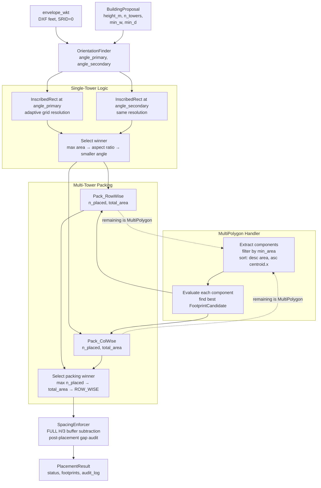

# Building Placement Engine — Hardened Technical Design

## A. Orientation Strategy

### Problem with the old design

The old design picks only one angle θ from the MBR's longest edge. But the perpendicular (θ+90°) may yield a larger inscribed rectangle — this depends on the actual polygon shape, not just the MBR.

### New approach: Dual-Orientation Evaluation

```
1. convex_hull.minimum_rotated_rectangle()  →  mbr
2. Longest edge of mbr  →  angle_primary  (θ)
3. angle_secondary = θ + 90°
4. Run InscribedRectangle for BOTH angles → candidate_θ, candidate_θ90
5. Select winner by rule:
     a. Larger footprint area wins
     b. Tie: compare aspect ratio; prefer the one closer to 2:1 (most practical slab shape)
     c. Tie: prefer the smaller angle value (deterministic absolute tie-break)
```

**Why 2:1 aspect ratio preference?** A 10m × 5m footprint is more usable than a 14m × 3.6m footprint of equal area. Favouring 2:1 reduces extreme slab shapes.

**Auditability**: Store `orientation_label: "PRIMARY" | "PERPENDICULAR"` and both tested widths/depths in `FootprintCandidate`.

**OrientationResult dataclass (revised):**

```python
@dataclass
class OrientationResult:
    angle_primary_deg: float        # longer MBR edge
    angle_secondary_deg: float      # = angle_primary + 90
    mbr_polygon: Polygon
    mbr_long_dim_dxf: float
    mbr_short_dim_dxf: float
```

---

## B. Grid Resolution Strategy

### Problem with fixed 0.5 ft

- On tiny envelopes (< 200 sq.ft) → wasteful cells, no accuracy gain
- On large envelopes (> 5,000 sq.ft) the 0.5 ft grid is fine but the current plan never checks the upper bound

### Adaptive Formula

```
bbox_max = max(rotated_envelope.bounds width, rotated_envelope.bounds height)

TARGET_CELLS_PER_AXIS = 200         # constant

resolution_dxf = bbox_max / TARGET_CELLS_PER_AXIS

resolution_dxf = clamp(resolution_dxf,
                       MIN_RESOLUTION_DXF = 0.25 ft,
                       MAX_RESOLUTION_DXF = 2.00 ft)
```

This formula guarantees:

- Grid is always at most **200 × 200 = 40,000 cells** (safely fast for DP)
- Grid is never finer than **0.25 ft** (prevents tiny-polygon blowup)
- Grid is never coarser than **2.0 ft** (~60 cm, acceptable for architectural placement)

**Worked examples:**


| Envelope area (sq.ft) | Approx bbox (ft) | Adaptive resolution (ft) | Grid cells |
| --------------------- | ---------------- | ------------------------ | ---------- |
| 300                   | 25 × 20          | 0.25 (clamped min)       | 100 × 80   |
| 1,000                 | 45 × 35          | 0.25 (clamped min)       | 180 × 140  |
| 3,000                 | 75 × 55          | 0.375                    | 200 × 147  |
| 10,000                | 115 × 87         | 0.575 → clamp 0.575      | 200 × 151  |


Store `grid_resolution_dxf` in `FootprintCandidate` for audit.

---

## C. Single-Tower Placement Algorithm

Single-tower placement is separated into its own function: `find_single_footprint(envelope_polygon, building_height_m, min_width_m, min_depth_m) -> FootprintCandidate | None`

```
ALGORITHM: find_single_footprint

Input: envelope_polygon, min_width_dxf, min_depth_dxf

Step 1 — Pre-check
    if envelope_polygon.area < MIN_FOOTPRINT_AREA_SQFT:
        return None  (NO_FIT)

Step 2 — Orientation discovery
    Get angle_primary, angle_secondary from OrientationFinder

Step 3 — Evaluate orientation θ (primary)
    resolution = adaptive_resolution(envelope_polygon)
    candidate_θ = _inscribed_rect_at_angle(envelope_polygon, angle_primary, resolution)

Step 4 — Evaluate orientation θ+90° (secondary)
    candidate_θ90 = _inscribed_rect_at_angle(envelope_polygon, angle_secondary, resolution)

Step 5 — Select better candidate
    winner = select_better(candidate_θ, candidate_θ90)
      - Larger area wins
      - Tie: prefer aspect ratio closest to 2:1
      - Tie: prefer smaller angle_deg

Step 6 — Validate winner
    if winner.width_dxf < min_width_dxf: return None
    if winner.depth_dxf < min_depth_dxf: return None
    if winner.area_sqft < MIN_FOOTPRINT_AREA_SQFT: return None

Step 7 — Containment check
    winner.footprint_polygon = winner.footprint_polygon.intersection(envelope_polygon)
    if not winner.footprint_polygon.is_valid: return None

    return winner
```

**FootprintCandidate dataclass (new):**

```python
@dataclass
class FootprintCandidate:
    footprint_polygon: Polygon
    area_sqft: float
    width_dxf: float
    depth_dxf: float
    width_m: float
    depth_m: float
    orientation_angle_deg: float
    orientation_label: str            # "PRIMARY" | "PERPENDICULAR"
    grid_resolution_dxf: float
    source_component_index: int       # 0 for single polygon; index in MultiPolygon
```

---

## D. Multi-Tower Packing Strategy

### Problem with old sequential-greedy

Sequential greedy always places Tower 1 first, then Tower 2 in whatever remains. This biases toward placing towers along one axis without testing the perpendicular layout. For two towers that nearly fill the envelope, one axis packing may work where the other does not.

### New approach: Evaluate Row-Wise AND Column-Wise Packing

For each packing iteration (up to `n_towers`), two parallel strategies are evaluated:

```
MODE A — "along principal axis" (row-wise):
  - Place Tower 1 using find_single_footprint()
  - Compute strip_gap = Tower1_footprint.buffer(spacing_dxf)
  - Subtract from envelope: remaining_A = envelope.difference(strip_gap)
  - Place Tower 2 in remaining_A using find_single_footprint()

MODE B — "across principal axis" (column-wise):
  - Same Tower 1 placement
  - Same strip_gap subtraction
  - BUT: before calling find_single_footprint on remaining_B,
    FORCE the perpendicular orientation angle
    (swap primary/secondary in the find_single_footprint call)
```

**Actually:** The orientation for each tower within packing is still discovered independently per remaining polygon — the "row-wise vs column-wise" distinction comes from comparing the TWO full outcomes. Mode A and Mode B both use the full dual-orientation test internally. What differs is whether we use the SAME exclusion zone direction vs. rotate it. This is equivalent to running packing mode on all `n_towers` towers and comparing the total_area_sqft of both runs.

**Revised cleaner framing:**

```
Pack_RowWise:
    remaining = envelope
    for i in range(n_towers):
        c = find_single_footprint(remaining, ...)
        if c is None: break
        footprints_row.append(c)
        remaining = remaining.difference(c.footprint_polygon.buffer(spacing_dxf))
        remaining = handle_multipolygon(remaining)

Pack_ColWise:
    remaining = envelope
    for i in range(n_towers):
        c = find_single_footprint(remaining, force_angle=secondary_angle, ...)
        if c is None: break
        footprints_col.append(c)
        remaining = remaining.difference(c.footprint_polygon.buffer(spacing_dxf))
        remaining = handle_multipolygon(remaining)

# Selection:
winner = argmax(n_placed, then total_area_sqft, then "ROW_WISE")
```

Store `packing_mode: "ROW_WISE" | "COL_WISE"` in `BuildingPlacement` for audit.

---

## E. Spacing Enforcement — Corrected Buffer Logic

### The Bug in the Old Design (CRITICAL)

Old code:

```
exclusion_zone = footprint.buffer(spacing_dxf / 2)   ← WRONG
```

This creates a buffer of `spacing_dxf/2` around Tower A. Tower B's nearest face can be placed right at the edge of this buffer — meaning Tower B's face is `spacing_dxf/2` away from Tower A's face. But H/3 requires the full `spacing_dxf` gap.

### Correct Buffer Logic

```
spacing_dxf = max(building_height_m / 3, min_spacing_m) * METRES_TO_DXF

exclusion_zone = tower_footprint.buffer(spacing_dxf)   ← FULL buffer

remaining = remaining.difference(exclusion_zone)
```

After this subtraction, the nearest point of `remaining` to `tower_footprint` is exactly `spacing_dxf`. Any footprint placed inside `remaining` therefore has a face-to-face gap of at least `spacing_dxf`. This is geometrically correct.

### Post-Placement Verification (SpacingEnforcer)

After all towers are placed, run an independent check on every adjacent pair:

```
for each pair (i, j), i < j:
    gap_dxf = footprint_i.distance(footprint_j)   # Shapely nearest-point distance
    gap_m = gap_dxf * DXF_TO_METRES
    required_m = max(building_height_m / 3, min_spacing_m)
    status = "PASS" if gap_m >= required_m else "FAIL"
```

**Audit log entry format (per pair):**

```json
{
  "pair": [0, 1],
  "gap_dxf": 18.04,
  "gap_m": 5.50,
  "required_m": 5.50,
  "buffer_applied_dxf": 18.04,
  "status": "PASS",
  "gdcr_clause": "GDCR Table 6.25",
  "formula": "H(16.5m) / 3 = 5.50m"
}
```

Note: A `FAIL` here after using the correct full-buffer packing indicates a geometry edge case (e.g., the buffer subtraction missed a corner due to floating point). This must be recorded but should not occur in normal operation. The placement `status` is set to `TOO_TIGHT` if any spacing FAIL is detected.

---

## F. MultiPolygon Handling — Component-Wise Evaluation

### Problem with "take largest component"

After subtracting the exclusion zone, the remaining space may be a MultiPolygon. The largest component by area is not guaranteed to yield the largest inscribed rectangle.

Example: Component A is 400 sq.ft but elongated (20ft × 20ft). Component B is 350 sq.ft but square (25ft × 14ft). A rectangle of 12m × 6m (needed for two bedrooms) fits better in B.

### New approach: Evaluate All Components

```
FUNCTION handle_multipolygon(geom, min_area_sqft) -> List[Polygon]:
    if geom is Polygon: return [geom]
    components = [g for g in geom.geoms if g.area >= min_area_sqft]
    # Deterministic ordering: by area descending, tie-break by centroid.x ascending
    components.sort(key=lambda g: (-g.area, g.centroid.x))
    return components[:MAX_COMPONENTS]   # cap at 10 to bound complexity

FUNCTION find_best_in_multipolygon(components, ...) -> FootprintCandidate | None:
    best = None
    for idx, component in enumerate(components):
        candidate = find_single_footprint(component, ...)
        if candidate is None: continue
        candidate.source_component_index = idx
        if best is None or candidate.area_sqft > best.area_sqft:
            best = candidate
    return best
```

**Constants:**

- `MAX_COMPONENTS = 10` — upper bound to prevent complexity blowup
- `MIN_COMPONENT_AREA_SQFT = MIN_FOOTPRINT_AREA_SQFT` — discard tiny slivers

**Deterministic ordering guarantee:** Sorting by `(-area, centroid.x)` is fully deterministic for any fixed geometry. Same input always produces the same component ordering.

---

## G. Performance Constraints


| Parameter                           | Limit                                                     | Rationale                                                     |
| ----------------------------------- | --------------------------------------------------------- | ------------------------------------------------------------- |
| `TARGET_CELLS_PER_AXIS`             | 200                                                       | Grid ≤ 40,000 cells. Max histogram DP is O(W×H). Fast.        |
| `MIN_RESOLUTION_DXF`                | 0.25 ft                                                   | Prevents blowup on tiny envelopes                             |
| `MAX_RESOLUTION_DXF`                | 2.0 ft                                                    | Maintains ~60cm architectural precision                       |
| `MAX_COMPONENTS`                    | 10                                                        | Bounds MultiPolygon evaluation cost                           |
| `MAX_TOWERS`                        | 4                                                         | Caps packing loop; more than 4 towers on a TP plot is unusual |
| Packing modes evaluated             | 2                                                         | ROW_WISE + COL_WISE, both run once                            |
| Orientations tested per footprint   | 2                                                         | θ and θ+90° always tested                                     |
| Total grid evaluations (worst case) | 2 modes × 4 towers × 10 components × 2 orientations = 160 | All < 1ms each. Total < 160ms.                                |


**10,000 sq.ft plot estimate:**

- Envelope bbox ≈ 115ft × 87ft
- Adaptive resolution ≈ 0.575 ft → grid ≈ 200 × 151
- Single DP pass: O(30,200) — trivial
- 160 evaluations: ~5ms total

---

## H. Revised Folder Structure

No folder changes needed. Internal decomposition changes:

```
backend/placement_engine/
├── __init__.py
├── models.py
├── geometry/
│   ├── __init__.py                ← constants, exceptions, FootprintCandidate dataclass
│   ├── orientation_finder.py      ← OrientationResult, dual MBR angle extraction
│   ├── inscribed_rectangle.py     ← adaptive grid + max histogram DP (single polygon)
│   ├── multipolygon_handler.py    ← NEW: component extraction, ordering, evaluation
│   ├── spacing_enforcer.py        ← FULL H/3 buffer logic + post-placement gap audit
│   └── packer.py                  ← ROW_WISE vs COL_WISE packing comparison
├── services/
│   ├── __init__.py
│   └── placement_service.py       ← PlacementResult orchestrator
└── management/
    └── commands/
        └── compute_placement.py
```

`inscribed_rectangle.py` is now a pure function operating on a **single polygon**. MultiPolygon decomposition is handled by `multipolygon_handler.py` before calling it.

---

## I. Revised Data Flow




---

## J. Updated Models

**BuildingPlacement (revised):**

```python
class BuildingPlacement(models.Model):
    envelope              = ForeignKey(PlotEnvelope, CASCADE, related_name="placements")
    status                = CharField(max_length=20)  # VALID / TOO_TIGHT / NO_FIT / INVALID_INPUT / ERROR
    n_towers_requested    = IntegerField()
    n_towers_placed       = IntegerField()
    building_height_m     = FloatField()
    spacing_required_m    = FloatField()
    spacing_required_dxf  = FloatField()
    orientation_primary_deg   = FloatField(null=True)
    orientation_secondary_deg = FloatField(null=True)
    packing_mode          = CharField(max_length=20, null=True)  # "ROW_WISE" | "COL_WISE"
    grid_resolution_dxf   = FloatField(null=True)
    placement_audit       = JSONField()
    computed_at           = DateTimeField(auto_now_add=True)
```

**FootprintRecord (revised):**

```python
class FootprintRecord(models.Model):
    placement                   = ForeignKey(BuildingPlacement, CASCADE, related_name="footprints")
    tower_index                 = IntegerField()
    footprint_geom              = PolygonField(srid=0)
    footprint_area_sqft         = FloatField()
    footprint_width_dxf         = FloatField()
    footprint_depth_dxf         = FloatField()
    footprint_width_m           = FloatField()
    footprint_depth_m           = FloatField()
    orientation_angle_deg       = FloatField()
    orientation_label           = CharField(max_length=15)  # "PRIMARY" | "PERPENDICULAR"
    source_component_index      = IntegerField(default=0)   # MultiPolygon component used
    grid_resolution_dxf         = FloatField()
    min_spacing_to_adjacent_dxf = FloatField(null=True)
    min_spacing_to_adjacent_m   = FloatField(null=True)
    spacing_status              = CharField(max_length=10)  # "PASS" | "FAIL" | "NA"
```

---

## K. Revised PlacementResult Dataclass

```python
@dataclass
class PlacementResult:
    status: str
    n_towers_requested: int
    n_towers_placed: int
    building_height_m: float
    spacing_required_m: float
    spacing_required_dxf: float
    orientation_primary_deg: float | None
    orientation_secondary_deg: float | None
    packing_mode: str | None            # "ROW_WISE" | "COL_WISE"
    grid_resolution_dxf: float | None

    footprints: list                    # List[FootprintCandidate]
    placement_audit: list               # spacing check dicts per pair
    error_message: str = ""
```

---

## L. Status Values (unchanged)


| Status          | Meaning                                                               |
| --------------- | --------------------------------------------------------------------- |
| `VALID`         | All n_towers placed with spacing satisfied                            |
| `TOO_TIGHT`     | Fewer towers placed than requested, or spacing FAIL detected post-hoc |
| `NO_FIT`        | Not even 1 tower can fit                                              |
| `INVALID_INPUT` | n_towers < 1 or building_height_m <= 0                                |
| `ERROR`         | Unexpected geometry exception                                         |


---

## M. Edge Case Handling (revised)


| Case                                          | Detection                                     | Handling                                                      |
| --------------------------------------------- | --------------------------------------------- | ------------------------------------------------------------- |
| Narrow envelope                               | footprint_width < min_width                   | `NO_FIT` before grid step                                     |
| Envelope smaller than min footprint           | envelope.area < MIN_FOOTPRINT_AREA_SQFT       | `NO_FIT` pre-check                                            |
| Perpendicular beats primary orientation       | candidate_θ90.area > candidate_θ.area         | Winner is selected, label = "PERPENDICULAR"                   |
| MultiPolygon after exclusion zone subtraction | isinstance(remaining, MultiPolygon)           | multipolygon_handler evaluates all valid components           |
| All components too small                      | All component areas < MIN_FOOTPRINT_AREA_SQFT | `TOO_TIGHT`, n_placed = placed so far                         |
| Spacing FAIL after full-buffer packing        | gap_m < H/3                                   | Audit entry marked FAIL; status = TOO_TIGHT                   |
| n_towers=2, only 1 fits                       | Second inscribed rect returns None            | TOO_TIGHT, n_placed = 1                                       |
| Extreme aspect ratio                          | winner.width/depth > 4:1                      | Allowed but stored in audit; future constraint hook available |
| Very small grid (bbox_max < 5ft)              | resolution = MIN_RES = 0.25 ft                | Grid ≤ 20×20 — handled correctly                              |


---

## N. GDCR.yaml Change Required

```yaml
inter_building_margin:
  reference: "Table 6.25"
  taller_building_rule: true
  formula: "H / 3"
  minimum_spacing_m: 3.0
  applies_to: "parallel_facing_walls"
```

`SpacingEnforcer` loads this via the existing `get_gdcr_config()` loader.

---

## O. Implementation Sequence

1. Extend `GDCR.yaml` with numeric H/3 formula under `inter_building_margin`
2. Create `placement_engine` app, register in `INSTALLED_APPS`
3. Write `geometry/__init__.py` — constants (`METRES_TO_DXF`, `MIN_FOOTPRINT_AREA_SQFT`, `MAX_COMPONENTS`, bounds) + `FootprintCandidate` dataclass + typed exceptions
4. Write `geometry/orientation_finder.py` — `OrientationResult`, dual angle extraction from MBR
5. Write `geometry/inscribed_rectangle.py` — adaptive resolution grid rasterize + max histogram DP on a SINGLE polygon
6. Write `geometry/multipolygon_handler.py` — component extraction, filtering, deterministic ordering, best-candidate evaluation
7. Write `geometry/spacing_enforcer.py` — FULL H/3 buffer computation + post-placement pair gap audit
8. Write `geometry/packer.py` — ROW_WISE vs COL_WISE packing comparison, calls `find_single_footprint` and `multipolygon_handler`
9. Write `models.py` — `BuildingPlacement` + `FootprintRecord`
10. Write `services/placement_service.py` — `PlacementResult` orchestrator
11. Write `compute_placement` management command with `--export-geojson` flag
12. Run `makemigrations` + `migrate`
13. Test: FP 101 single tower, FP 101 two towers, large TP14 plot, NO_FIT case, orientation determinism

