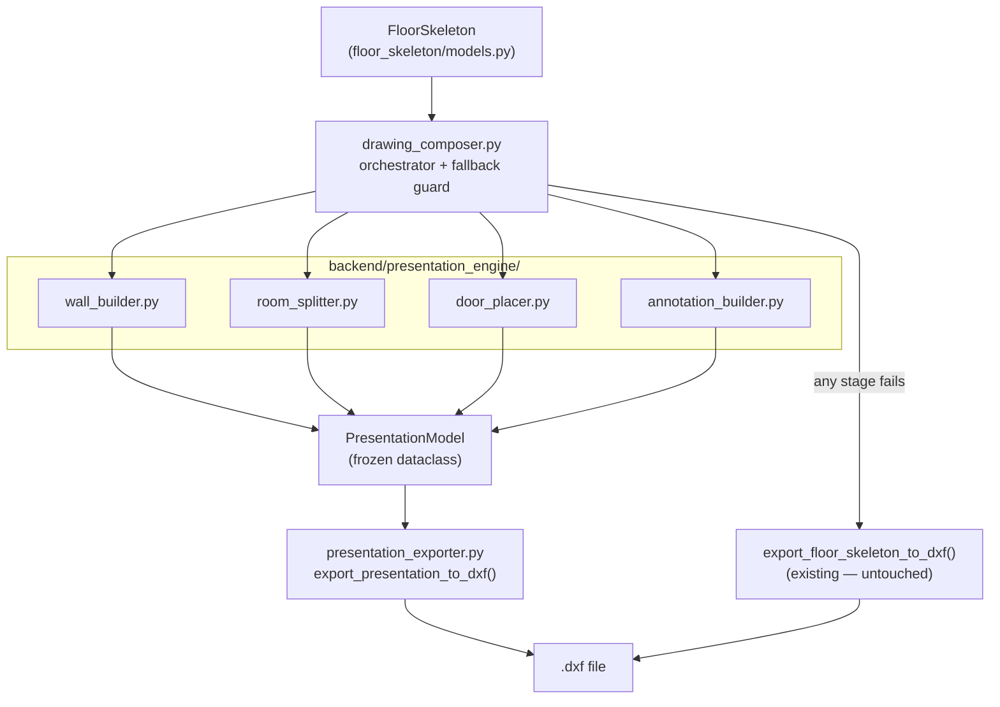

# Presentation Engine — Hardened Technical Design

## Pipeline Position




The existing `[backend/dxf_export/exporter.py](backend/dxf_export/exporter.py)` is **never modified**. A parallel `presentation_exporter.py` is added inside `backend/dxf_export/`. The `generate_floorplan` command gains `--presentation` flag; the existing codepath is the fallback.

---

## 1. Module Structure

```
backend/presentation_engine/
├── __init__.py
├── models.py              # PresentationModel + WallGeometry + RoomGeometry + DoorSymbol
├── wall_builder.py        # Double-line external/core walls;
```

