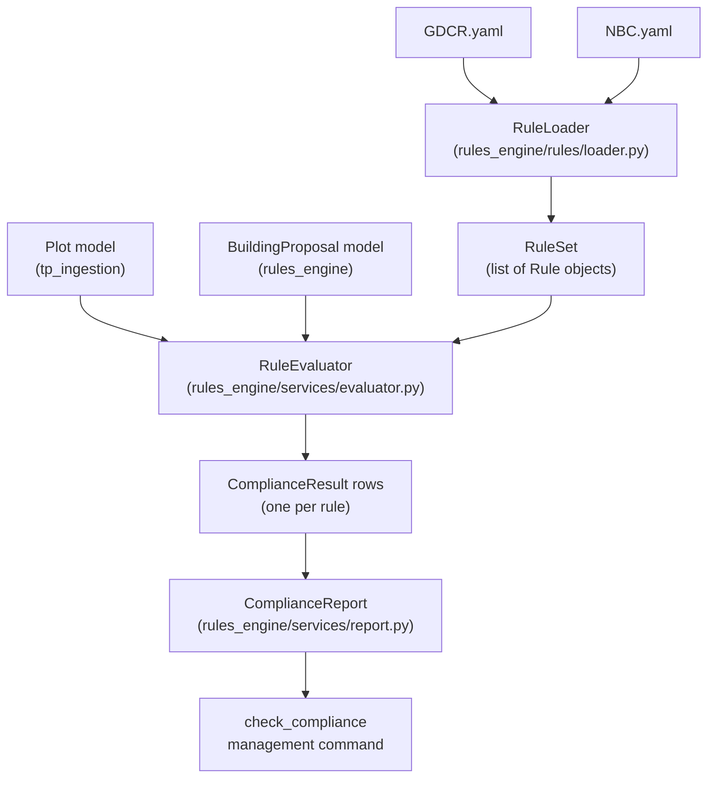

# Rules Engine — Complete Build Plan

## What the YAML files contain

**GDCR.yaml** covers 12 rule categories:

- `land_area_rules` — net plot area formula
- `access_rules` — minimum road width (9m for DW3), height cap if road <9m
- `fsi_rules` — base 1.8, chargeable 0.9, max 2.7, incentive 4.0 near 36m/45m roads
- `height_rules` — road width → max height table (10 / 16.5 / 30 / 45 / 70m)
- `road_side_margin` / `side_rear_margin` — height-based margin lookup tables
- `ots_rules` — open-to-sky dimension check
- `architectural_elements` — boundary wall, ramp, paving limits
- `lift_requirement` — required if height > 10m
- `ventilation` — window ratio 1/6 of floor area
- `fire_safety` — refuge area trigger at 25m, NOC at 15m
- `environmental` — solar heating trigger at 500 sqm BUA
- `staircase` — tread/riser/width rules

**NBC.yaml** (Part 4 — Fire & Life Safety) covers:

- High-rise classification threshold (15m)
- Egress: exits count, travel distance (sprinklered/non-sprinklered), corridor width
- Staircase widths (low rise 1.0m / high rise 1.5m)
- Door minimum width (0.9m)
- High-rise: firefighting shaft, fire lift (both above 15m), refuge area (above 60m)
- Compartmentation and structural fire resistance ratings

---

## Data flow




---

## New Django app: `rules_engine`

### File structure

```
backend/rules_engine/
├── __init__.py
├── models.py
├── rules/
│   ├── __init__.py
│   ├── base.py          ← Rule, RuleResult dataclasses
│   ├── loader.py        ← YAML → Rule objects
│   ├── gdcr_rules.py    ← one evaluator function per GDCR category
│   └── nbc_rules.py     ← one evaluator function per NBC category
├── services/
│   ├── __init__.py
│   ├── evaluator.py     ← orchestrates all rule evaluations
│   └── report.py        ← formats + prints compliance report
└── management/commands/
    ├── __init__.py
    └── check_compliance.py
```

The YAML files stay at `/code/GDCR.yaml` and `/code/NBC.yaml`; `loader.py` resolves them relative to `BASE_DIR`.

---

## Models (`rules_engine/models.py`)

**BuildingProposal** — captures what the architect is proposing for a specific FP plot:

```python
class BuildingProposal(models.Model):
    plot           = ForeignKey(Plot, on_delete=CASCADE)
    road_width     = FloatField()          # adjacent road width in metres
    building_height = FloatField()         # proposed height in metres
    total_bua      = FloatField()          # total built-up area sq.ft (all floors)
    num_floors     = IntegerField()
    ground_coverage = FloatField()         # ground floor footprint sq.ft
    has_basement   = BooleanField(default=False)
    is_sprinklered = BooleanField(default=False)
    created_at     = DateTimeField(auto_now_add=True)
```

**ComplianceResult** — one row per rule per proposal:

```python
class ComplianceResult(models.Model):
    proposal       = ForeignKey(BuildingProposal, on_delete=CASCADE)
    rule_id        = CharField(max_length=100)   # e.g. "gdcr.fsi.base"
    rule_source    = CharField(max_length=10)    # "GDCR" | "NBC"
    category       = CharField(max_length=50)    # "fsi" | "height" | "margins" etc.
    description    = TextField()
    status         = CharField(max_length=20)    # PASS | FAIL | NA | MISSING_DATA
    required_value = FloatField(null=True)
    actual_value   = FloatField(null=True)
    note           = TextField(blank=True)
    evaluated_at   = DateTimeField(auto_now_add=True)
```

---

## Rule object (`rules/base.py`)

```python
@dataclass
class Rule:
    rule_id:         str
    source:          str            # "GDCR" | "NBC"
    category:        str
    description:     str
    required_inputs: List[str]      # keys that must be present in inputs dict

@dataclass
class RuleResult:
    rule_id:        str
    status:         str             # PASS | FAIL | NA | MISSING_DATA
    required_value: Optional[float]
    actual_value:   Optional[float]
    note:           str
```

---

## Rule categories and evaluators

### GDCR rules (`gdcr_rules.py`)


| Rule ID                         | Inputs needed                   | Logic                                   |
| ------------------------------- | ------------------------------- | --------------------------------------- |
| `gdcr.access.road_width`        | `road_width`                    | `road_width >= 9`                       |
| `gdcr.fsi.base`                 | `plot_area`, `total_bua`        | `total_bua / plot_area <= 1.8`          |
| `gdcr.fsi.max`                  | `plot_area`, `total_bua`        | `total_bua / plot_area <= 2.7`          |
| `gdcr.height.max`               | `road_width`, `building_height` | lookup in `road_width_height_map`       |
| `gdcr.margin.side_rear`         | `building_height`               | lookup in `height_margin_map`           |
| `gdcr.lift.required`            | `building_height`               | if height > 10m → lift must be declared |
| `gdcr.fire.refuge_area`         | `building_height`               | height > 25m → refuge required          |
| `gdcr.fire.noc`                 | `building_height`               | height > 15m → fire NOC required        |
| `gdcr.staircase.tread_riser`    | `tread_mm`, `riser_mm`          | tread>=250, riser<=190                  |
| `gdcr.ventilation.window_ratio` | `window_area`, `floor_area`     | ratio >= 1/6                            |
| `gdcr.env.solar`                | `total_bua`                     | if BUA > 500 sqm → solar required       |
| `gdcr.boundary_wall.height`     | `wall_height_road_side`         | <= 1.5m                                 |


### NBC rules (`nbc_rules.py`)


| Rule ID                      | Inputs needed                        | Logic                          |
| ---------------------------- | ------------------------------------ | ------------------------------ |
| `nbc.classification`         | `building_height`                    | high-rise if height >= 15m     |
| `nbc.egress.exits`           | `num_exits`                          | >= 2                           |
| `nbc.egress.travel_distance` | `travel_distance`, `is_sprinklered`  | <= 30m or 22.5m                |
| `nbc.egress.corridor_width`  | `corridor_width`                     | >= 1.0m                        |
| `nbc.staircase.width`        | `building_height`, `stair_width`     | 1.0m low-rise / 1.5m high-rise |
| `nbc.door.width`             | `door_width`                         | >= 0.9m                        |
| `nbc.high_rise.fire_lift`    | `building_height`                    | required if >= 15m             |
| `nbc.high_rise.refuge_area`  | `building_height`, `refuge_area_pct` | required above 60m             |
| `nbc.compartmentation`       | `fire_door_rating`                   | >= 120 min                     |


---

## Management command: `check_compliance`

```
python manage.py check_compliance \
    --fp-number 101 \
    --tp-scheme TP14 \
    --city Surat \
    --road-width 12 \
    --building-height 16.5 \
    --total-bua 14000 \
    --num-floors 4 \
    --ground-coverage 3500 \
    [--sprinklered] \
    [--save]        ← persist BuildingProposal + ComplianceResult to DB
```

Output is a formatted compliance table:

```
Rule ID                    Status   Required   Actual   Note
gdcr.fsi.base              PASS     1.80       1.75
gdcr.height.max            PASS     16.5       16.5
gdcr.margin.side_rear      PASS     3.0 m      --       Declare in drawing
nbc.egress.exits           PASS     2          2
nbc.staircase.width        PASS     1.0 m      --
...
```

---

## Implementation sequence

1. Create `rules_engine` app, register in `INSTALLED_APPS`
2. Write `rules/base.py` — `Rule`, `RuleResult` dataclasses
3. Write `rules/loader.py` — reads GDCR.yaml + NBC.yaml, returns `Dict[str, Rule]`
4. Write `rules/gdcr_rules.py` — one evaluator function per rule ID
5. Write `rules/nbc_rules.py` — one evaluator function per rule ID
6. Write `services/evaluator.py` — loops all rules, calls evaluators, returns `List[RuleResult]`
7. Write `services/report.py` — formats results as table + summary
8. Write `models.py` — `BuildingProposal`, `ComplianceResult`
9. Write `management/commands/check_compliance.py`
10. `makemigrations` + `migrate`
11. Test with FP 101 (Surat TP14) as the sample plot

