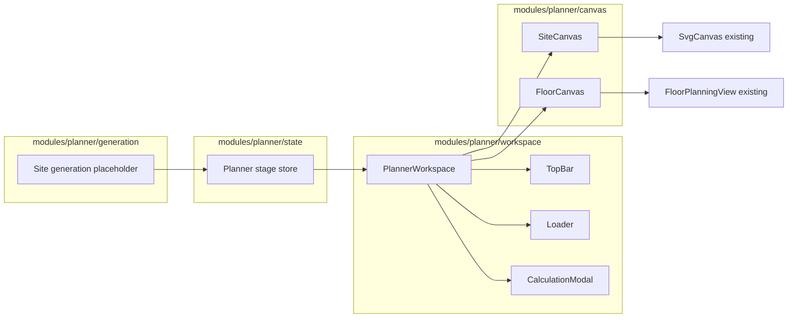

# AI Planner Two-Stage Workspace Redesign

## Current state

- **Main planner UI** lives in `[frontend/src/app/(protected)/planner/page.tsx](frontend/src/app/(protected)`/planner/page.tsx): top bar (PlotDropdown, StepNavigation, PlanGenerationControls, etc.), sidebars, and a canvas that switches by `planningStep` (`site` | `floor` | `unit`) between `PlannerCanvas`, `FloorPlanningView`, and `UnitInteriorView`.
- **Canvas renderer**: `[PlannerCanvas](frontend/src/modules/planner/components/PlannerCanvas.tsx)` uses `[SvgCanvas](frontend/src/modules/planner/components/visualization/SvgCanvas.tsx)` and composes layers (PlotLayer, SetbackLayer, TowerLayer, RoadLayer, etc.) for the site plan; `[FloorPlanningView](frontend/src/modules/planner/components/FloorPlanningView.tsx)` also uses SvgCanvas for floor layout. Both must be reused—no new rendering engine.
- **State**: `[plannerStore](frontend/src/state/plannerStore.ts)` (Zustand) holds `planningStep`, `selectedPlotId`, `inputs`, `scenarios`, `activeScenarioId`, `selectedTowerIndex`, etc. Plan generation uses `useGeneratePlan` / `usePlanJobStatus` / `usePlanGeometry` from `[usePlannerData](frontend/src/modules/planner/hooks/usePlannerData.ts)`.
- **Workspace entry**: `[/planner/workspace/[mode]](frontend/src/app/(protected)`/planner/workspace/[mode]/page.tsx) loads `[PlannerWorkspace](frontend/src/modules/planner/workspace/PlannerWorkspace.tsx)` with a profile; the current PlannerWorkspace is a generic tool-sidebar layout and does not use the real site/floor canvases.

## Target architecture

## 1. Planner stage store (`modules/planner/state`)

- **New store** (e.g. `plannerStageStore.ts`) with a single `stage` and setter:
  - `input` — plot/params selected, no plan yet
  - `site-generating` — plan job running
  - `site-generated` — site plan ready, canvas showing site
  - `floor-design` — user clicked “Next: Floor Design”, floor canvas active
- Option A: New dedicated store that other code reads (e.g. workspace, top bar). Option B: Add `plannerStage` to existing `plannerStore` and keep one source of truth. Recommend **Option B** (extend `plannerStore`) to avoid syncing two stores with job completion and step transitions.
- Transitions: `input` → (Generate Plan) → `site-generating` → (job done) → `site-generated` → (user selects tower) → **Next: Floor Design enabled** → (click Next) → `floor-design`. Resetting plot or starting a new plan can set back to `input` and clear `site-generated`/`floor-design` as needed.
- **Tower selection**: After site is generated, the user must select a tower before floor design. Use existing `selectedTowerIndex` in plannerStore. Flow: site-generated → user clicks tower footprint in SiteCanvas → highlight tower and set `selectedTowerIndex` → "Next: Floor Design" button becomes enabled → click Next → stage `floor-design`. FloorCanvas then receives the selected tower (FloorPlanningView already uses `selectedTowerIndex`).
- **Tower selection stability (optional, long-term)**: Index-based `selectedTowerIndex` works but can break if tower order changes. Prefer `**selectedTowerId`** (e.g. from `feature.properties.towerId`) so selection stays stable when geometry updates. Not required for initial implementation; worth adding when refactoring.

## 2. Module layout

Create under `frontend/src/modules/planner/`:

- `**workspace/`** — `PlannerWorkspace.tsx` (redesigned), top bar component, loader component, calculation modal. PlannerWorkspace renders the correct view by stage and mode (see below).
- **canvas/** — Two thin wrappers that delegate to existing renderer:
  - **SiteCanvas**: uses SvgCanvas; renders existing site layers (plot, roads, setbacks, tower footprints, parking); supports tower click selection; highlights selected tower; sets `selectedTowerIndex`; handles `geometryModel` null/empty safely; shows “Coming Soon” "Coming Soon" for non–high-rise modes.
  - **FloorCanvas**: wraps FloorPlanningView (which uses SvgCanvas); lazy-loaded via `dynamic()`; handles null/empty geometry safely.
- `**generation/`** — Placeholder site generation: function or hook that (for high-rise) calls existing `useGeneratePlan` / `startPlanJob` and updates stage to `site-generating`; on job completion (existing polling) set stage to `site-generated`. Other modes can no-op and show “Coming Soon” from SiteCanvas.
- `**state/`** — Contains the planner stage store (or re-export of the slice in plannerStore). No duplication of plot/inputs/scenarios—keep using existing plannerStore for those.

Existing `components/` (PlannerCanvas, FloorPlanningView, SvgCanvas, layers, PlotDropdown, DevelopmentInputs, etc.) remain; SiteCanvas and FloorCanvas **import and reuse** them.

## 3. PlannerWorkspace behavior and layout

- **Layout (minimal)**: Top bar + canvas area only. **No sidebars.** See diagram in plan; all stage-based rendering **only in PlannerWorkspace.tsx**.
- **Entry**: Still used by `app/(protected)/planner/workspace/[mode]/page.tsx` with `profile` (e.g. high-rise, private-residence).
- **By stage**:
  - `input`: Show location/plot selector and input parameters; canvas area can be empty or a minimal “Select plot and parameters, then Generate Plan” message. **Do not show** calculation tools or detailed data.
  - `site-generating`: Show **Loader** (spinner + progress bar + stage description) in the canvas area; top bar can keep Menu, Location, Input, Generate Plan (disabled or “Generating…”).
  - `site-generated`: Show **SiteCanvas** with current geometry; top bar adds **Next: Floor Design**, **Calculation**, **Export**.
  - `floor-design`: Show **FloorCanvas** (existing floor layout); same post-generation top bar (Next can be hidden or repurposed; Calculation and Export remain).
- **By mode**: Only **high-rise** runs real site generation and shows real SiteCanvas. Other modes: in the canvas area show **“Coming Soon”** (and optionally keep stage as `input` so Generate Plan does nothing or shows “Coming Soon” for that mode).

## 4. Top bar

- **Always**: Menu (existing or placeholder), **Location selector** (reuse PlotDropdown or equivalent), **Input** (opens inputs panel/sidebar), **Generate Plan** (triggers site generation for high-rise; disabled when no plot/params or when generating).
- **After site plan is generated** (stage `site-generated` or `floor-design`): **Next: Floor Design** (only when stage is `site-generated` **and** `selectedTowerIndex !== null`; click sets stage to `floor-design`), **Calculation** (opens modal), **Export** (reuse SVG export). Hide or disable Calculation and Export until stage is at least `site-generated`.

## 5. Calculation modal

- **Trigger**: “Calculation” button in top bar (visible only when stage is `site-generated` or `floor-design`).
- **Content** (placeholder values for now): plot area, FSI, built-up area, tower coverage, parking requirement, fire compliance, staircase width, lift core calculations. Simple key-value list or table in a modal dialog; no logic beyond display.

## 6. Loader

- Shown when stage is `site-generating`.
- Contains: **loading spinner**, **real-time progress bar** (use existing `jobStatus.progress` from `usePlanJobStatus`), **stage description** (e.g. “Generating site plan…”). Reuse or mirror the loading UX already in PlannerCanvas (spinner + progress bar + text).

## 7. Null geometry handling (critical)

During generation, `geometryModel === null` until the job completes. Canvases and workspace must handle four states without throwing or rendering invalid trees:

- **loading** — job running, no geometry yet → show Loader in canvas area (PlannerWorkspace handles this by not rendering SiteCanvas with null geometry when stage is `site-generating`).
- **error** — job failed → show error message in canvas area (e.g. "Generation failed. Try again.").
- **empty** — no plot selected or no features → show empty state message (e.g. "Select plot and generate plan" or "No geometry").
- **generated** — geometry available → render SiteCanvas/FloorCanvas with `geometryModel`.

**Implementation**: In PlannerWorkspace, when stage is `site-generated` or `floor-design`, guard: only render SiteCanvas/FloorCanvas when `geometryModel != null && geometryModel.features?.length > 0`; otherwise show empty or error state. SiteCanvas and FloorCanvas components should also accept `geometryModel | null` and render a safe fallback (empty/loading message) when null rather than passing null into SvgCanvas (which may assume a valid model). This prevents React errors and undefined access.

## 8. Data flow and reuse

- **Plot and inputs**: Continue using `plannerStore` (selectedPlotId, inputs, setSelectedPlotId, setInputs). Input button toggles existing inputs panel/sidebar (or a minimal version of it).
- **Site plan job**: Keep using `useGeneratePlan`, `usePlanJobStatus`, `usePlanGeometry`; when job completes, set stage to `site-generated`. When starting the job, set stage to `site-generating`.
- **Geometry**: SiteCanvas and FloorCanvas receive `geometryModel` from existing `usePlanGeometry(activeScenarioId)` (and loading/progress from job status). No new data layer.
- **Floor design**: When stage is `floor-design`, pass geometry and `selectedTowerIndex` into FloorCanvas → FloorPlanningView. Floor canvas is **lazy-loaded** via `dynamic()` so it is not loaded until the user clicks Next: Floor Design.

## 9. File-level plan

| Area                  | Action                                                                                                                                                                                                                                              |
| --------------------- | --------------------------------------------------------------------------------------------------------------------------------------------------------------------------------------------------------------------------------------------------- |
| **State**             | Add `plannerStage` and `setPlannerStage` to `plannerStore` (or create `modules/planner/state/plannerStageStore.ts` and sync with job status in workspace).                                                                                          |
| **Canvas**            | Add `modules/planner/canvas/SiteCanvas.tsx` (SvgCanvas + layers, interactive tower selection, null handling, “Coming Soon” for non–high-rise). Add `modules/planner/canvas/FloorCanvas.tsx` (wraps FloorPlanningView, lazy-loaded via `dynamic()`). |
| **Generation**        | Add `modules/planner/generation/useSitePlanGeneration.ts` (or similar): calls existing useGeneratePlan, drives stage transitions and “Coming Soon” for non–high-rise.                                                                               |
| **Workspace**         | Redesign `PlannerWorkspace.tsx`: by stage render input view / Loader / SiteCanvas / FloorCanvas; by mode show “Coming Soon” for non–high-rise. Compose new TopBar, Loader, CalculationModal.                                                        |
| **Top bar**           | New component (e.g. `PlannerTopBar.tsx`): Menu, Location, Input, Generate Plan; when stage ≥ site-generated add Next: Floor Design (enabled only when `selectedTowerIndex !== null`), Calculation, Export.                                          |
| **Loader**            | New component (e.g. `GenerationLoader.tsx`) in workspace: spinner, progress bar, stage description; consume job progress from existing hooks.                                                                                                       |
| **Calculation modal** | New component (e.g. `CalculationModal.tsx`) in workspace: dialog with placeholder list (plot area, FSI, built-up area, tower coverage, parking, fire, staircase, lift core).                                                                        |
| **Routing**           | Keep `planner/workspace/[mode]/page.tsx`. Redirect `/planner` and `/planner/site-plan` to `/planner/workspace/high-rise` (Option A). Optionally add a single “AI Planner” entry that redirects to `workspace/high-rise` if you want one default.    |

## 10. Rules compliance

- **No calculations before plan generated**: Calculation button and modal are only visible/enabled when stage is `site-generated` or `floor-design`. Input view does not show calculation tools or detailed metrics.
- **Reuse canvas only**: SiteCanvas and FloorCanvas use existing SvgCanvas and existing PlannerCanvas layers / FloorPlanningView; no new rendering engine.
- **High-rise only for site**: Site generation and real SiteCanvas only for high-rise; other modes show “Coming Soon” in the canvas area.

## 11. Legacy planner and cleanup

- **Redirect old planner (recommended)**: Redirect `/planner` and `/planner/site-plan` to `/planner/workspace/high-rise` (e.g. via Next.js redirect or `redirect()` in `planner/page.tsx`) so only one planner is maintained.
- **StepNavigation**: Not used in new workspace; flow is stage + “Next: Floor Design” button only.

## 12. Implementation order

Implement in this order:

1. **Add `plannerStage` to plannerStore** — Stage type and setter; sync with job start/completion.
2. **SiteCanvas wrapper** — Reuse SvgCanvas + layers; tower click → `setSelectedTowerIndex`; null/empty handling; "Coming Soon" for non–high-rise.
3. **PlannerWorkspace stage switching** — Top bar + canvas only. By stage: input → empty; site-generating → loader; site-generated → SiteCanvas; floor-design → FloorCanvas (lazy). Null geometry guards (§7).
4. **Then**: TopBar, Loader, CalculationModal.

---

Summary: Introduce a **planner stage** (input → site-generating → site-generated → floor-design), implement **SiteCanvas** and **FloorCanvas** that reuse SvgCanvas and existing layers/FloorPlanningView, add **PlannerWorkspace** logic and **TopBar / Loader / CalculationModal**, and keep all data and generation on top of existing plannerStore and plan job hooks. High-rise uses real generation and canvases; other modes show “Coming Soon.”