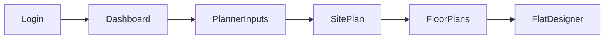

## Minimal Dashboard & Planner UI Plan

### 1. Information Architecture & Routing

- **Route structure**
  - Keep the marketing site at `/` as-is (`Home` in `[frontend/src/app/page.tsx](frontend/src/app/page.tsx)`).
  - Use protected app routes under `(protected)` for authenticated tools:
    - `/dashboard` → minimal dashboard overview (default after login).
    - `/planner/inputs` → Step 1: plot inputs & pre-calculations.
    - `/planner/site-plan` → Step 2: full-screen site plan canvas with side calculations.
    - `/planner/floor-plans` → Step 3: tower-wise floor planning view.
    - `/planner/flat/[flatId]` (or `/planner/unit-design`) → Step 4: single-flat designer.
    - `/admin/users`, `/settings`, `/profile` keep existing or upcoming pages.
  - Clicking `Planner` from the nav always routes to `/planner/inputs` and the flow advances with `Next`/`Back` CTA buttons between steps.
- **Navigation flow**
  - Default authenticated landing: `/dashboard`.
  - Top GlassSurface nav exposes high-level destinations only: **Dashboard, Planner, User Management, Settings, Profile**.
  - Within `/planner/`*, a secondary inline stepper (1–4) shows current step and progress.

### 2. Shared App Shell with GlassSurface Navigation

- **Protected layout**
  - Update `[frontend/src/app/(protected)/layout.tsx](frontend/src/app/(protected)/layout.tsx)` to provide a shared shell for all authenticated pages:
    - Background: reuse the soft gradient/cream background + subtle noise from `home.css` (`.home-wrapper`, `.marquee-section`, `.faq-list` styling) for consistency.
    - Margin/padding: constrain content within a max-width container similar to `home-wrapper` sections, not full-bleed template.
- **GlassSurface top nav**
  - Create a compact nav bar component (e.g. `TopNavGlass`) using `GlassSurface` (`[frontend/src/components/GlassSurface.jsx](frontend/src/components/GlassSurface.jsx)`):
    - Fixed at top center, width ~60–70% of viewport, modest height (e.g. 64–72px), high border radius.
    - Inside, horizontally centered pill-style menu with items:
      - `Dashboard`, `Planner`, `User Management`, `Settings`, `Profile`.
    - Each item is a simple text label with small dot/underline for active route; no heavy icons.
    - Use Next `Link` components to route to the relevant protected pages.
    - Background uses the existing glass blur, on a cream backdrop, matching the FAQ section vibe.
- **Shell content area**
  - Below the GlassSurface, provide a vertical spacing offset so pages scroll under a fixed nav cleanly.
  - Wrap page content in a soft card-style container (subtle rounded corners, shadow similar to `.faq-list` and `.faq-item`).

### 3. Minimal Dashboard Redesign (`/dashboard`)

- **Current state**
  - `[frontend/src/app/(protected)/dashboard/page.tsx](frontend/src/app/(protected)/dashboard/page.tsx)` uses a bento grid template with many cards (stats, reminders, projects, team, progress, time tracker) and strong orange/black accents.
- **Target look & feel**
  - Visual inspiration: FAQ and stats sections on the home page in `[frontend/src/app/home.css](frontend/src/app/home.css)` — cream backgrounds, soft cards, ample whitespace, minimal chrome.
  - Use a **single-column or simple two-column layout** with 3–4 key elements max:
    - **Welcome + context** (heading + 1–2 lines) at top.
    - **KPI strip**: 3–4 small, soft cards for: Active plots, Generated plans, Pending reviews, Last run.
    - **Planner CTA**: a large, friendly card inviting user to “Start a new plan” (routes to `/planner/inputs`).
    - Optional: a compact “Recent plots” list or last 3 plan runs in a simple table-like card.
  - Remove template-y sections like generic “Team Collaboration”, “Time Tracker”, and the busy analytics

